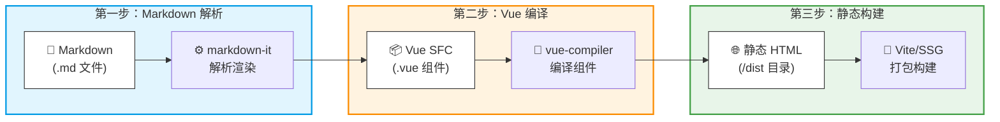
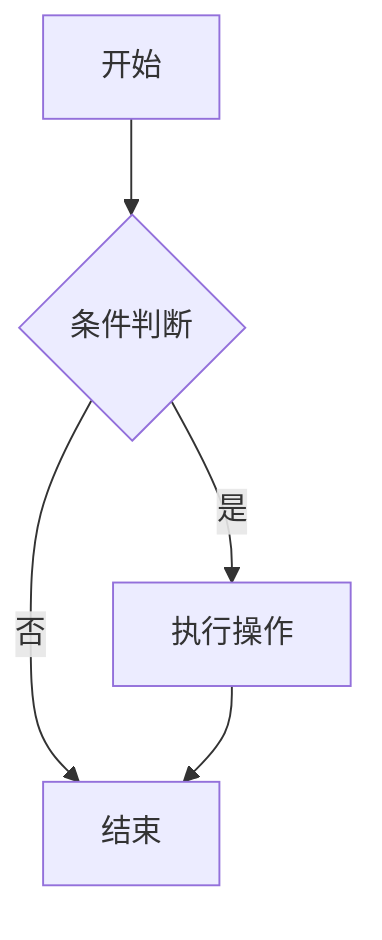
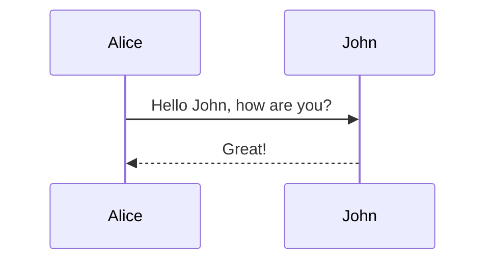
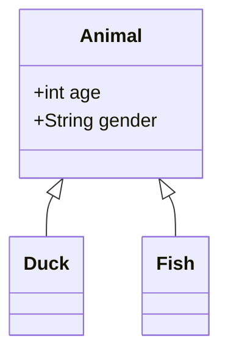

reco 风格没有实现 mermaid 渲染，直接使用 **mdenhance** 又会发现 vuepress 版本对不上，那我们就自己手搓一个吧✋️

## VuePress 的渲染逻辑

首先我们要了解一下 VuePress 的渲染逻辑：



也就是说我们可以简单理解为 **md 文件 → vue → 静态 web** 这样的渲染过程。

在这个流程中，我们有两个关键切入点：

1. **Markdown 解析阶段**：通过 `extendsMarkdown` 拦截 fence 代码块
2. **Vue 客户端增强阶段**：通过 `clientConfigFile` 注册全局组件

## 两种方案

VuePress 其实为插件制作提供了很多接口，针对 Mermaid 渲染主要有两种方案：

| 方案           | 渲染时机                                                     | 优点                     | 缺点                 |
| -------------- | ------------------------------------------------------------ | ------------------------ | -------------------- |
| **构建时渲染** | `extendsMarkdown` 中直接mermaid.render()生成 SVG，在第一阶段就完成svg图的生成 | SSR 友好、SEO 好、无闪烁 | 构建慢、主题切换困难 |
| **运行时渲染** | 第一阶段拦截完成后做成一个**Component**组件，第二阶段利用客户端组件enhance vue挂载这个的Component并调用mermaid.render()完成渲染 | 构建快、支持动态特性     | 有 FOUC、需客户端 JS |

> vuepress的接口说明文档：[插件 API | VuePress](https://v2.vuepress.vuejs.org/zh/reference/plugin-api.html)

考虑到我们的需求（文档站、主题可能切换、构建速度），**选择运行时渲染方案**更合适。

## 插件实现

### **安装依赖**

首先需要安装 `mermaid` 包：

```bash
# npm
npm install mermaid

# pnpm
pnpm add mermaid

# yarn
yarn add mermaid
```

安装完成可以到package.json查看是否已经完成安装：

```json
  "dependencies": {
    "mermaid": "^11.12.2",
    ......
  }
```

### 目录结构

```
.vuepress/
├── plugins/
│   ├── mermaid.ts          # 插件主文件（Node 端）
│   └── mermaid.client.ts   # 客户端增强文件（Browser 端）
└── config.ts               # VuePress 配置文件
```

### 插件主文件

```typescript
// .vuepress/plugins/mermaid.ts
import type { Plugin } from '@vuepress/core'
import { path } from '@vuepress/utils'

export const mermaidPlugin: Plugin = {
  name: 'mermaid-plugin',

  // 扩展 Markdown 渲染规则
  extendsMarkdown: (md) => {
    const defaultFence = md.renderer.rules.fence
    
    md.renderer.rules.fence = (...args) => {
      const [tokens, idx] = args
      const token = tokens[idx]
      
      // 检查代码块的语言标识是否为 'mermaid'
      if (token.info?.trim() === 'mermaid') {
        const code = encodeURIComponent(token.content)
        return `<MermaidDiagram code="${code}" />`
      }
      
      return defaultFence?.(...args) || ''
    }
  },

  // 指定客户端配置文件路径
  clientConfigFile: path.resolve(__dirname, './mermaid.client.ts'),
}

export default mermaidPlugin
```

**关键点说明：**

- `extendsMarkdown`：在 Markdown 解析阶段拦截 ````mermaid` 代码块
- `encodeURIComponent`：对代码内容进行编码，防止特殊字符破坏 HTML 属性
- `clientConfigFile`：指向客户端增强文件，用于注册全局组件

### 客户端增强文件

```typescript
// .vuepress/plugins/mermaid.client.ts
import { defineClientConfig } from '@vuepress/client'
import { h, defineComponent } from 'vue'
import mermaid from 'mermaid'

// 初始化 mermaid 配置
mermaid.initialize({
  startOnLoad: false,      // 不自动渲染，手动控制
  theme: 'default',        // 默认主题
  securityLevel: 'loose'   // 宽松模式（注意安全风险）
})

// 定义 MermaidDiagram 组件
const MermaidDiagram = defineComponent({
  props: ['code'],
  
  async mounted() {
    try {
      const decoded = decodeURIComponent(this.code)
      const id = `mermaid-${Date.now()}-${Math.random().toString(36).slice(2)}`
      const { svg } = await mermaid.render(id, decoded)
      this.$el.innerHTML = svg
    } catch (err) {
      console.error('Mermaid render error:', err)
      this.$el.innerHTML = '<pre style="color:red">Mermaid 图表渲染失败</pre>'
    }
  },

  render() {
    return h('div', {
      class: 'mermaid-diagram',
      style: { textAlign: 'center' }
    })
  },
})

// 注册全局组件
export default defineClientConfig({
  enhance({ app }) {
    app.component('MermaidDiagram', MermaidDiagram)
  }
})
```

**关键点说明：**

- `startOnLoad: false`：禁用自动渲染，避免与手动渲染冲突
- **唯一 ID 生成**：增加了 `Math.random()` 确保快速连续渲染时 ID 不冲突
- **错误处理**：渲染失败时显示友好提示，不影响页面其他内容
- `defineClientConfig`：VuePress 2.x 的客户端配置标准方式

### 配置文件集成

```typescript
// .vuepress/config.ts
import { defineUserConfig } from "vuepress"
import recoTheme from "vuepress-theme-reco"
import { viteBundler } from '@vuepress/bundler-vite'
import { mermaidPlugin } from './plugins/mermaid'

export default defineUserConfig({
  title: "SaltFishGC`s Blog",
  bundler: viteBundler(),
  plugins: [
    mermaidPlugin
  ],
  theme: recoTheme({
    // reco 主题配置...
  })
})
```

## 使用示例

在 Markdown 文件中直接使用：

~~~markdown

~~~

渲染效果：


### 更多图表类型

**序列图：**

~~~markdown

~~~

**类图：**

~~~markdown

~~~

## 样式定制

如果想让图表适配 reco 主题的深色模式，可以添加 CSS 变量：

```css
/* .vuepress/styles/index.css */
.mermaid-diagram {
  margin: 1.5rem 0;
  padding: 1rem;
  background: var(--code-bg-color, #f6f8fa);
  border-radius: 8px;
}

/* 深色模式适配 */
[data-theme="dark"] .mermaid-diagram {
  background: #2d2d2d;
}
```

配合 mermaid 主题切换：

```typescript
// 在 mermaid.client.ts 中监听主题变化
import { useDarkMode } from '@vuepress/client'

const isDark = useDarkMode()
watch(isDark, (val) => {
  mermaid.initialize({
    theme: val ? 'dark' : 'default'
  })
  // 重新渲染所有图表...
})
```

## 注意事项

| 问题           | 解决方案                                        |
| -------------- | ----------------------------------------------- |
| **ID 冲突**    | 使用 `Date.now() + Math.random()` 生成唯一 ID   |
| **SSR 警告**   | 确保 mermaid 只在 `mounted` 中调用（客户端）    |
| **构建报错**   | 检查 mermaid 是否正确安装 `npm install mermaid` |
| **样式不继承** | 通过 CSS 变量或全局样式覆盖                     |
| **主题切换**   | 监听主题变化后重新调用 `mermaid.render()`       |

## 总结

这个插件的核心思路是：

1. **Markdown 阶段**：拦截 `mermaid` 代码块，替换为自定义组件标签
2. **客户端阶段**：注册全局组件，在 `mounted` 钩子中调用 mermaid 渲染
3. **运行时渲染**：平衡了构建速度和动态特性需求

相比直接使用现成插件，手搓的好处是：

- ✅ 完全控制渲染逻辑
- ✅ 适配特定主题风格
- ✅ 无版本兼容问题
- ✅ 代码精简，无冗余依赖

