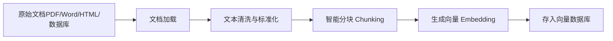
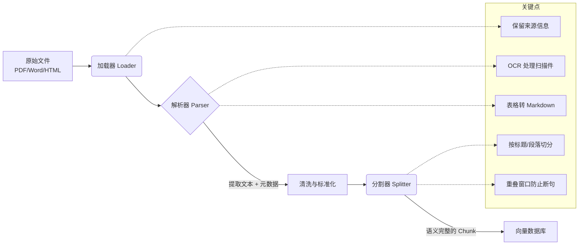

## 提示词Prompt

说明文档：[AI Services | LangChain4j 中文文档](https://docs.langchain4j.info/tutorials/ai-services#systemmessage)

### 系统提示词SystemMessage

```java
@AiService(
        wiringMode = EXPLICIT,
        chatModel = "qwenChatModel",
        chatMemoryProvider = "chatMemoryProvider"
)
public interface Assistant {
    @SystemMessage("你是只兔娘，必须在说完每句话之后带上口癖！")
    String chat(@MemoryId Integer memoryId, @UserMessage String userMessage);
}
```

硬编码的提示词，和用户自己写的效果其实没多大差别，优先级高一点。

### 需要加入的提示词示例

```java
@SystemMessage("""
当前时间：{{current_time}}  
用户昵称：{{userName}}  

小绒要根据时间主动打招呼！  
- 早上（5:00–11:59）：说“早安”  
- 中午（12:00–13:59）：说“午安”  
- 下午（14:00–18:59）：说“下午好”  
- 晚上（19:00–23:59）：说“晚上好”  
- 深夜（0:00–4:59）：说“这么晚了还不睡吗…”  

然后回答问题，句尾加口癖！
""")
String chat(@UserId String userName, @UserMessage String userMessage);
```

总之根据需求来即可

### 资源加载提示词

```java
@Target({TYPE, METHOD})
@Retention(RUNTIME)
public @interface SystemMessage {
	...
    String fromResource() default "";
}
```

可以将txt的url作为参数导入：

```java
@AiService(
        wiringMode = EXPLICIT,
        chatModel = "qwenChatModel",
        chatMemoryProvider = "chatMemoryProvider"
)
public interface Assistant {
    @SystemMessage(fromResource = "prompt/demo.txt")
    String chat(@MemoryId Integer memoryId, @UserMessage String userMessage);
}
```

路径从classpath开始（resources文件夹下）

### Langchain4j的常用Prompt占位符

| 占位符写法             | 说明                                                 | 如何生效                              | 示例值                |
| ---------------------- | ---------------------------------------------------- | ------------------------------------- | --------------------- |
| `{{current_date}}`     | 当前日期（格式：`yyyy-MM-dd`）                       | 自动注入，无需额外参数                | `2026-03-03`          |
| `{{current_time}}`     | 当前时间（格式：`HH:mm:ss`）                         | 自动注入                              | `17:05:23`            |
| `{{current_datetime}}` | 完整日期时间（格式：`yyyy-MM-dd HH:mm:ss`）          | 自动注入                              | `2026-03-03 17:05:23` |
| `{{it}}`               | 用户输入消息的简写（仅在 `@UserMessage` 模板中可用） | 自动绑定到方法参数                    | `"你好呀"`            |
| `{{userMessage}}`      | 用户消息（需方法参数名匹配）                         | 方法参数名为 `userMessage` 时自动绑定 | `"今天天气怎么样？"`  |
| `{{memoryId}}`         | 会话/记忆 ID                                         | 方法参数带 `@MemoryId` 注解时自动绑定 | `1001`                |
| `{{userId}}`           | 用户 ID（如果配置了 `UserId`）                       | 方法参数带 `@UserId` 注解             | `"user_abc"`          |
| `{{conversationId}}`   | 对话 ID                                              | 方法参数带 `@ConversationId` 注解     | `"conv_xyz"`          |
| `{{anyParamName}}`     | 任意自定义参数                                       | 方法参数名与占位符一致（区分大小写）  | —                     |

### 用户提示词UserMessage

```java
@AiService(
        wiringMode = EXPLICIT,
        chatModel = "qwenChatModel",
        chatMemoryProvider = "chatMemoryProvider"
)
public interface Assistant {
    @UserMessage("我很帅")
    String chat(@MemoryId Integer memoryId, @UserMessage String userMessage);
}
```

| 特性                     | `@SystemMessage`                           | `@UserMessage`                                |
| :----------------------- | :----------------------------------------- | :-------------------------------------------- |
| **作用**                 | 告诉 AI **它是谁、该怎么说话、有什么规则** | 代表 **用户当前输入的问题或指令**             |
| **位置**                 | 通常在对话开头（系统提示）                 | 在用户每次提问时传入                          |
| **内容示例**             | “你是只兔娘，每句话结尾要加‘呐～’”         | “今天天气怎么样？”                            |
| **是否可变**             | 一般固定（或带少量动态变量如时间）         | 每次调用都不同                                |
| **LangChain4j 中的写法** | 写在方法上（`@SystemMessage("..."`)        | 标注在方法参数上（`@UserMessage String msg`） |
| **对模型的影响**         | **长期约束行为**（即使多轮对话也持续生效） | **触发本次回复**（模型基于它生成答案）        |

### 注解声明参数注入

```java
@SystemMessage("Given a name of a country, answer with a name of it's capital")
@UserMessage("{{country}}")
String chat(@V("country") String country);
```

使用`@V("country")`来声明该参数注入Prompt，并在Prompt中使用{{}}来完成注入

同理可用于Prompt的外部引入（txt文件）


## 函数调用

### 项目准备

在开始正式的做AI项目中最重要的预制菜方法调用之前，我们先做一个场景样例：

```
你的名字是“硅谷小智”，你是一家名为“北京协和医院”的智能客服。
你是一个训练有素的医疗顾问和医疗伴诊助手。
你态度友好、礼貌且言辞简洁。

1、请仅在用户发起第一次会话时，和用户打个招呼，并介绍你是谁。

2、作为一个训练有素的医疗顾问：
请基于当前临床实践和研究，针对患者提出的特定健康问题，提供详细、准确且实用的医疗建议。请同时考虑可能的病
因、诊断流程、治疗方案以及预防措施，并给出在不同情境下的应对策略。对于药物治疗，请特别指明适用的药品名
称、剂量和疗程。如果需要进一步的检查或就医，也请明确指示。

3、作为医疗伴诊助手，你可以回答用户就医流程中的相关问题，主要包含以下功能：
AI分导诊：根据患者的病情和就医需求，智能推荐最合适的科室。
AI挂号助手：实现智能查询是否有挂号号源服务；实现智能预约挂号服务；实现智能取消挂号服务。

4、你必须遵守的规则如下：
在获取挂号预约详情或取消挂号预约之前，你必须确保自己知晓用户的姓名（必选）、身份证号（必选）、预约科室
（必选）、预约日期（必选，格式举例：2025-04-14）、预约时间（必选，格式：上午 或 下午）、预约医生（可
选）。
当被问到其他领域的咨询时，要表示歉意并说明你无法在这方面提供帮助。

5、请在回答的结果中适当包含一些轻松可爱的图标和表情。

6、今天是 {{current_date}}。
```

有了这样的提示词，我们接下来就开始为其准备聊天接口：

```java
@AiService(
        wiringMode = EXPLICIT,
        chatModel = "qwenChatModel",
        chatMemoryProvider = "chatMemoryProviderXiaozhi")
public interface XiaozhiAgent {
    @SystemMessage(fromResource = "prompt/zhaozhi-prompt-template.txt")
    String chat(@MemoryId Long memoryId, @UserMessage String userMessage);
}
```

聊天记忆配置：

```java
@Configuration
public class MemoryConfig {

    @Autowired
    private MyMemoryStore myMemoryStore;

    @Bean
    public ChatMemoryProvider chatMemoryProviderXiaozhi() {
        return memoryId -> MessageWindowChatMemory.builder()
                .id(memoryId)
                .maxMessages(20)
                .chatMemoryStore(myMemoryStore)
                .build();
    }
}
```

然后准备一个对外开放的接口：

```java
@Tag(name = "AI接口")
@RestController
@RequestMapping("/ai")
@RequiredArgsConstructor
public class AIController {

    private final XiaozhiAgent assistant;

    @Operation(summary = "聊天")
    @PostMapping("/chat")
    public String chat(@RequestBody ChatForm chatForm) {
        return assistant.chat(chatForm.getMemoryId(), chatForm.getUserMessage());
    }
}
```

那么现在我们就基本完成了基础项目的准备。


### Tool工具

说明文档：[工具（函数调用） | LangChain4j 中文文档](https://docs.langchain4j.info/tutorials/tools#tool)

先前我们学的基本都是对于llm的基本调用，其实简单的脚本就能实现，我们在实际项目中的业务比较复杂，如果不提供比较好的一些额外工具协助AI完成任务，那就可能会产生严重错误！

Langchain4j为我们提供了一系列协助AI判断的预制接口，先来看看Tool工具：

有一个被称为"工具"或"函数调用"的概念。 它允许 LLM 在必要时调用一个或多个可用的工具，通常由开发者定义。 工具可以是任何东西：网络搜索、调用外部 API 或执行特定代码片段等。 LLM 实际上不能自己调用工具；相反，它们在响应中表达调用特定工具的意图（而不是以纯文本形式响应）。 作为开发者，我们应该使用提供的参数执行这个工具，并将工具执行的结果反馈回来。

例如，我们知道 LLM 本身在数学计算方面并不擅长。 如果您的用例涉及偶尔的数学计算，您可能希望为 LLM 提供一个"数学工具"。 通过在请求中向 LLM 声明一个或多个工具， 如果它认为合适，它可以决定调用其中一个工具。 给定一个数学问题和一组数学工具，LLM 可能会决定为了正确回答问题， 它应该首先调用提供的数学工具之一。

那么就先来做一个简单的计算器：

```java
@Component
public class CalculatorTool {

    @Tool
    public Long sum(Long a, Long b) {
        return a + b;
    }

    @Tool
    public Long minus(Long a, Long b) {
        return a - b;
    }

    @Tool
    public Long multiply(Long a, Long b) {
        return a * b;
    }

    @Tool
    public Long divide(Long a, Long b) {
        return a / b;
    }
}
```

> 注意需要@Component注入应用上下文中，不然无法调用

然后将生成的Bean注入到配置中：

```java
@AiService(
        wiringMode = EXPLICIT,
        chatModel = "qwenChatModel",
        chatMemoryProvider = "chatMemoryProviderXiaozhi",
        tools = {"calculatorTool"}
)
public interface XiaozhiAgent {

    @SystemMessage(fromResource = "prompt/zhaozhi-prompt-template.txt")
    String chat(@MemoryId Long memoryId, @UserMessage String userMessage);
}
```

> 注意注入的是Bean名称，首字母小写

这时AI就可以根据被@Tool注解的方法名称来决定在何时进行相关方法的调用了。但是这显然不够，只是通过方法名称来判断是否调用还是太容易出错了。

### Tool的额外注解

实际上Langchain4j也为我们提供了额外说明的接口，只需要在@Tool后写清即可：

```java
@Retention(RUNTIME)
@Target({METHOD})
public @interface Tool {

    /**
     * Name of the tool. If not provided, method name will be used.
     *
     * @return name of the tool.
     */
    String name() default "";

    /**
     * Description of the tool.
     * It should be clear and descriptive to allow language model to understand the tool's purpose and its intended use.
     *
     * @return description of the tool.
     */
    String[] value() default "";
}
```

简单试一试：

```java
@Tool(name = "加法器", value = "用于计算两个数字的和")
public Long sum(Long a, Long b) {
    return a + b;
}
```

不仅仅是方法，参数同样也可以使用注解进一步说明：方法参数可以选择使用 `@P` 注解，`@P` 注解有 2 个字段

- `value`：参数描述。必填字段。
- `required`：参数是否必需，默认为 `true`。可选字段。

```java
@Tool(name = "加法器", value = "用于计算两个数字的和")
public Long sum(
        @P(value = "第一个数字", required = true) Long a, 
        @P(value = "第二个数字", required = true) Long b
) {
    return a + b;
}
```

同时，Langchain4j还提供了`@ToolMemoryId`用于传递**上下文隔离ID**，如果说我们需要让AI检测用户的一些情况，当触发一些条件比如有犯罪倾向时就会使用这个Tool并传入上下文隔离ID，后端根据这个ID找到对应用户信息进行报警，非常好用：

```java
@Tool(name = "加法器", value = "用于计算两个数字的和")
public Double sum(
        @ToolMemoryId Long memoryId,
        @P(value = "第一个数字", required = true) Double a,
        @P(value = "第二个数字", required = true) Double b
) {
    return a + b;
}
```

说明文档：[工具（函数调用） | LangChain4j 中文文档](https://docs.langchain4j.info/tutorials/tools#toolmemoryid)


### 项目中应用Tool

先来做一个**自助挂号**吧，首先准备好数据库以及调用接口：

```sql
CREATE DATABASE `guiguxiaozhi`;
USE `guiguxiaozhi`;
CREATE TABLE `appointment` (
`id` BIGINT NOT NULL AUTO_INCREMENT,
`username` VARCHAR(50) NOT NULL,
`id_card` VARCHAR(18) NOT NULL,
`department` VARCHAR(50) NOT NULL,
`date` VARCHAR(10) NOT NULL,
`time` VARCHAR(10) NOT NULL,
`doctor_name` VARCHAR(50) DEFAULT NULL,
PRIMARY KEY (`id`)
);
```

```xml
<!-- Mysql Connector -->
<dependency>
    <groupId>com.mysql</groupId>
    <artifactId>mysql-connector-j</artifactId>
</dependency>
<!--mybatis-plus 持久层-->
<dependency>
    <groupId>com.baomidou</groupId>
    <artifactId>mybatis-plus-spring-boot3-starter</artifactId>
    <version>${mybatis-plus.version}</version>
</dependency>
```

```yml
spring:
  datasource:
    username: root
    password: 165831
    url: jdbc:mysql://localhost:3306/guiguxiaozhi?useUnicode=true&characterEncoding=UTF-8&serverTimezone=Asia/Shanghai&useSSL=false
    driver-class-name: com.mysql.cj.jdbc.Driver
# MyBatis-Plus 配置
mybatis-plus:
  # Mapper XML 文件位置（可选，如果使用注解方式可不配）
  mapper-locations: classpath*:mapper/**/*.xml

  # 实体扫描包（可选，MP 会自动扫描 @TableName 注解的类）
  type-aliases-package: com.sgg.langchain4jsgg.entity

  # 全局配置
  global-config:
    db-config:
      # 主键策略（默认 ASSIGN_ID，即雪花算法）
      id-type: assign_id
      # 表名前缀（如 entity 为 User，实际表为 t_user）
      table-prefix: t_
      # 逻辑删除字段值配置（已删除 = 1，未删除 = 0）
      logic-delete-value: 1
      logic-not-delete-value: 0

  # MyBatis 原生配置（如日志、驼峰等）
  configuration:
    # 开启驼峰命名自动映射（如 user_name → userName）
    map-underscore-to-camel-case: true
    # 打印 SQL 日志（开发环境可用，生产慎用）
    log-impl: org.apache.ibatis.logging.stdout.StdOutImpl
```

然后准备接口：

```java
@Data
@AllArgsConstructor
@NoArgsConstructor
@TableName("appointment")
public class Appointment {
    @TableId(type = IdType.AUTO)
    private Long id;
    private String username;
    private String idCard;
    private String department;
    private String date;
    private String time;
    private String doctorName;
}
```

```java
@Mapper
public interface AppointmentMapper extends BaseMapper<Appointment> {
}
```

```java
public interface AppointmentService extends IService<Appointment> {
    Appointment getOne(Appointment appointment);
}
```

```java
@Service
public class AppointmentServiceImpl extends ServiceImpl<AppointmentMapper, Appointment> implements AppointmentService {

    /**
     * 查询订单是否存在
     * @param appointment 订单信息
     * @return 订单
     */
    @Override
    public Appointment getOne(Appointment appointment) {
        LambdaQueryWrapper<Appointment> queryWrapper = new LambdaQueryWrapper<>();
        queryWrapper.eq(Appointment::getUsername, appointment.getUsername());
        queryWrapper.eq(Appointment::getIdCard, appointment.getIdCard());
        queryWrapper.eq(Appointment::getDepartment, appointment.getDepartment());
        queryWrapper.eq(Appointment::getDate, appointment.getDate());
        queryWrapper.eq(Appointment::getTime, appointment.getTime());
        return baseMapper.selectOne(queryWrapper);
    }
}
```

那么现在我们就将一个业务接口封装好了，开始在Tool中调用吧！

```java
@Component
@RequiredArgsConstructor
public class ServiceTools {

    private final AppointmentService appointmentService;

    @Tool(name = "查询是否有号源", value="根据科室名称，日期，时间和医生查询是否有号源，并返回给用户")
    public boolean queryDepartment(
            @P(value = "科室名称") String name,
            @P(value = "日期") String date,
            @P(value = "时间，可选值：上午、下午") String time,
            @P(value = "医生名称", required = false) String doctorName
    ) {
        System.out.println("查询是否有号源");
        System.out.println("科室名称：" + name);
        System.out.println("日期：" + date);
        System.out.println("时间：" + time);
        System.out.println("医生名称：" + doctorName);
        //TODO 维护医生的排班信息：
        //如果没有指定医生名字，则根据其他条件查询是否有可以预约的医生（有返回true，否则返回false）；
        //如果指定了医生名字，则判断医生是否有排班（没有排版返回false）
        //如果有排班，则判断医生排班时间段是否已约满（约满返回false，有空闲时间返回true）

        return true;
    }

    @Tool(name="预约挂号", value = "根据参数，先执行工具方法queryDepartment查询是否可预约，并直接给用户回答是否可预约，并让用户确认所有预约信息，用户确认后再进行预约。")
    public String bookAppointment(Appointment appointment){
        //查找数据库中是否包含对应的预约记录
        Appointment appointmentDB = appointmentService.getOne(appointment);
        if(appointmentDB == null){
            appointment.setId(null);//防止大模型幻觉设置了id
            if(appointmentService.save(appointment)){
                return "预约成功，并返回预约详情";
            }else{
                return "预约失败";
            }
        }
        return "您在相同的科室和时间已有预约";
    }

    @Tool(name="取消预约挂号", value = "根据参数，查询预约是否存在，如果存在则删除预约记录并返回取消预约成功，否则返回取消预约失败")
    public String cancelAppointment(Appointment appointment){
        Appointment appointmentDB = appointmentService.getOne(appointment);
        if(appointmentDB != null){
            //删除预约记录
            if(appointmentService.removeById(appointmentDB.getId())){
                return "取消预约成功";
            }else{
                return "取消预约失败";
            }
        }
        //取消失败
        return "您没有预约记录，请核对预约科室和时间";
    }

}
```

然后把他注入到agent配置当中：

```java
@AiService(
        wiringMode = EXPLICIT,
        chatModel = "qwenChatModel",
        chatMemoryProvider = "chatMemoryProviderXiaozhi",
        tools = {"serviceTools"}
)
public interface XiaozhiAgent {

    @SystemMessage(fromResource = "prompt/zhaozhi-prompt-template.txt")
    String chat(@MemoryId Long memoryId, @UserMessage String userMessage);
}
```

那么现在只要AI判断正确就可以完成挂号了！


## RAG

大型语言模型（LLM）虽然在通用知识、语言理解和生成方面表现出色，但在实际应用中仍存在一些关键局限。**RAG（Retrieval-Augmented Generation，检索增强生成）** 正是为了弥补这些不足而被广泛采用。

**典型应用场景**

- 智能客服（基于产品文档）
- 企业知识助手（查询内部 Wiki/数据库）
- 法律/医疗咨询（引用法规或病历）
- 实时新闻摘要
- 技术支持（结合最新 API 文档）

[所有支持的嵌入存储比较表 | LangChain4j 中文文档](https://docs.langchain4j.info/integrations/embedding-stores/)

### 引入依赖

**引入依赖**使得agent能够检索外部知识库：

```xml
<dependency>
    <groupId>dev.langchain4j</groupId>
    <artifactId>langchain4j-easy-rag</artifactId>
</dependency>
```

### 简要介绍

RAG通过 **“先检索、再生成”** 的两阶段机制，将外部知识动态注入大语言模型（LLM）的推理过程，从而辅助其生成更准确、可靠、时效性强的回答。下面是 RAG 如何具体“辅助”的详细说明：

**RAG 的工作流程（核心步骤）**

步骤 1：**用户提问 → 查询理解**

- 用户输入一个问题（例如：“如何重置我的账户密码？”）。
- 系统对问题进行预处理（如分词、嵌入向量化等），准备用于检索。

步骤 2：**检索（Retrieval）→ 从外部知识库找相关文档**

- 使用**向量检索**（如 FAISS、Pinecone、Elasticsearch）或**关键词匹配**，在预先构建好的**知识库**（如公司 FAQ、产品手册、数据库、网页等）中查找与问题最相关的若干片段（称为“上下文”或“证据”）。

- 示例检索结果：

  ```text
  [文档片段1]：用户可通过登录页面点击“忘记密码”，输入注册邮箱后按指引重置。
  [文档片段2]：密码重置链接有效期为1小时，请及时操作。
  ```

步骤 3：**构造提示（Prompt Engineering）**

- 将原始问题 + 检索到的相关文档片段，组合成一个新的提示（prompt）输入给 LLM：

  ```
  请根据以下信息回答用户问题：
  
  【参考信息】
  - 用户可通过登录页面点击“忘记密码”，输入注册邮箱后按指引重置。
  - 密码重置链接有效期为1小时，请及时操作。
  
  【用户问题】
  如何重置我的账户密码？
  
  【回答】
  ```

步骤 4：**生成（Generation）→ LLM 基于上下文作答**

- LLM 利用其语言能力，

  结合检索到的真实信息

  ，生成自然、准确、简洁的回答：

  > 您可以前往登录页面，点击“忘记密码”，然后输入您的注册邮箱。系统会发送一个重置链接到您的邮箱，该链接在1小时内有效，请尽快完成操作。

----

**RAG 是如何“辅助” LLM 的？（关键作用）**

| 辅助维度                | 说明                                                         |
| ----------------------- | ------------------------------------------------------------ |
| ✅ **补充知识**          | LLM 本身不知道你公司的密码策略，但 RAG 从内部文档中“告诉”它。 |
| ✅ **约束生成范围**      | LLM 被强制基于检索内容回答，避免自由发挥导致幻觉。           |
| ✅ **提升准确性**        | 回答直接来自权威文档，而非模型“猜测”。                       |
| ✅ **支持私有/动态数据** | 无需重新训练模型，只需更新知识库即可改变行为。               |
| ✅ **可追溯来源**        | 可记录使用了哪些文档，便于审计或展示引用（如“根据《用户指南》第5章…”）。 |

----

**技术实现中的关键组件**

1. **知识库（Knowledge Source）**  
   - 结构化或非结构化数据：PDF、网页、数据库、Confluence、Notion 等。
   - 需要预先进行**文本切分**（chunking）和**向量化**（embedding）。
2. **检索器（Retriever）**  
   - 常用：Dense Retrieval（基于语义，如 Sentence-BERT）、Sparse Retrieval（如 BM25）。
   - 目标：找到与问题语义最相关的 top-k 文档片段。
3. **生成器（Generator）**  
   - 通常是 LLM（如 GPT、Llama、Qwen 等）。
   - 接收“问题 + 检索结果”作为输入，输出最终答案。
4. **可选增强**  
   - 重排序（Re-ranking）：对检索结果进一步精排。
   - 多跳检索（Multi-hop）：复杂问题需多次检索。
   - 查询改写（Query Rewriting）：优化检索关键词。

------
**举个对比例子**

| 场景                                       | 仅用 LLM                                         | LLM + RAG                                                    |
| ------------------------------------------ | ------------------------------------------------ | ------------------------------------------------------------ |
| 用户问：“我们公司今年的年假政策有变化吗？” | ❌ LLM 不知道“你们公司”是谁，只能泛泛而谈或编造。 | ✅ RAG 从 HR 最新政策文档中检索到：“2025年起，年假从10天增至12天”，并据此回答。 |

> **RAG 就像给 LLM 配了一个“实时查阅资料的助手”**：
> 当 LLM 遇到不确定、过时或私有的问题时，RAG 会立刻去翻“权威资料”，把关键信息摘出来递给 LLM，让它“照着资料回答”，而不是靠记忆瞎猜。

这种机制极大提升了 LLM 在企业级、专业领域和实时场景中的**实用性、安全性和可信度**，因此成为当前构建可靠 AI 应用的**标准范式**之一。

### 做一个RAG



**RAG** **过程分为** **2** **个不同的阶段：索引和检索。**

----

在**索引阶段**，对知识库文档进行预处理，可实现检索阶段的高效搜索。

以下是索引阶段的简化图：

加载知识库文档 ==> 将文档中的**文本分段** ==> 利用**向量大模型**将分段后的**文本转换成向量** ==> 将向量**存入向量数据库**

**为什么要进行文本分段？**

大语言模型（LLM）的上下文窗口有限，所以整个知识库可能无法全部容纳其中。

- 你在提问中提供的信息越多，大语言模型处理并做出回应所需的时间就越长。
- 你在提问中提供的信息越多，花费也就越多。
- 提问中的无关信息可能会干扰大语言模型，增加产生幻觉（生成错误信息）的几率。

我们可以通过将知识库分割成更小、更易于理解的片段来解决这些问题。

----

在**检索阶段**，我们通过向量模型**将用户查询转换成向量** ==> 在向量数据库中根据用户查询进行**相似度匹配** ==> 将用户查询和向量数据库中匹配到的相关内容一起交给LLM处理



三种元器件的作用：

| 元件名称                            | 核心作用 (一句话)                                            | 输入 (Input)                                    | 输出 (Output)                                                | 关键处理逻辑                                                 | ERP 场景下的特殊价值                                         |
| :---------------------------------- | :----------------------------------------------------------- | :---------------------------------------------- | :----------------------------------------------------------- | :----------------------------------------------------------- | :----------------------------------------------------------- |
| **1. 文档加载器** (Document Loader) | **“搬运工”** 负责从各种存储介质中读取文件，并提取基础元数据。 | 文件路径 / URL / 二进制流 (如 `erp_manual.pdf`) | **原始文档对象** (包含原始字节流或初步提取的文本 + 文件名/路径等元数据) | • 识别文件格式 (PDF, Word, Excel) • 建立文件与内存对象的映射 • 提取基础 Metadata (文件名、创建时间) | • 统一入口：无论 ERP 文档是存在本地磁盘、S3 还是数据库，都能统一读入。 • **注意**：此时通常还未处理复杂的内部结构（如 PDF 内的表格）。 |
| **2. 解析器** (Document Parser)     | **“翻译官”** 负责将不同格式的“乱码”转换为干净的、统一的纯文本，并提取深层结构。 | 原始文档对象 (来自 Loader)                      | **清洗后的文本文档** (纯净的 String 文本 + 丰富的结构化元数据) | • **格式转换**：PDF→Text, Word→Text • **OCR 识别**：扫描件图片→文字 • **表格提取**：将 Excel/PDF 表格转为 Markdown/JSON • **去噪**：删除页眉、页脚、乱码、特殊符号 | • **救命环节**：ERP 中有大量**参数表、科目对照表**。解析器必须把表格转成 Markdown，否则 LLM 无法理解“科目代码”与“名称”的对应关系。 • 修复 PDF 常见的“硬换行”问题，把断句连成通顺段落。 |
| **3. 分割器** (Text Splitter)       | **“切菜师”** 负责将长文本切分成适合 LLM 上下文窗口的小块 (Chunks)，同时保持语义完整。 | 清洗后的文本文档 (来自 Parser)                  | **文本片段列表 (List of Chunks)** (每个 Chunk 约 500-1000 tokens，带独立元数据) | • **切分策略**：按字符数、按段落、**按标题层级**、按语义 • **重叠窗口 (Overlap)**：保留前后部分内容，防止切断上下文 • **元数据继承**：确保每个小块都知道自己来自哪一页、哪个章节 | • **精准检索的关键**：ERP 操作通常是分步骤的（如“第一步...第二步...”）。分割器需确保**一个完整的操作流程在一个 Chunk 内**，避免把“点击保存”和“保存按钮说明”切开，导致检索时信息缺失。 |

1. **Loader 关注“文件本身”**：解决“怎么把文件读进来”的问题。它不关心文件里面写了什么，只关心文件格式和来源。
2. **Parser 关注“内容质量”**：解决“怎么把内容读懂”的问题。它负责把复杂的格式（如嵌套表格、图片文字）变成大模型能看懂的纯文本。**这是 ERP RAG 中最容易出错的环节（尤其是表格）。**
3. **Splitter 关注“检索粒度”**：解决“怎么让模型用得爽”的问题。它决定了检索时返回的信息块大小。切大了噪音多，切小了没上下文。

#### 项目样例

说了这么多其实我们要做的就是调用Langchain4j的几个工具的接口将pdf，docs，md等其他部门提供的说明文件**解析处理**为**向量**并存储到我们自制的**agent**当中去，那么就来看一个简单的样例吧：

首先对数据进行解析处理做成向量：

```java
@Bean
public ContentRetriever contentRetrieverXiaozhi() {
    //使用FileSystemDocumentLoader读取指定目录下的知识库文档
    //并使用默认的文档解析器对文档进行解析
    Document document1 = FileSystemDocumentLoader.loadDocument("E:/knowledge/医院信息.md");
    Document document2 = FileSystemDocumentLoader.loadDocument("E:/knowledge/科室信息.md");
    Document document3 = FileSystemDocumentLoader.loadDocument("E:/knowledge/神经内科.md");
    List<Document> documents = Arrays.asList(document1, document2, document3);

    //使用内存向量存储
    InMemoryEmbeddingStore<TextSegment> embeddingStore = new InMemoryEmbeddingStore<>();

    //使用默认的文档分割器
    EmbeddingStoreIngestor.ingest(documents, embeddingStore);

    //从嵌入存储（EmbeddingStore）里检索和查询内容相关的信息
    return EmbeddingStoreContentRetriever.from(embeddingStore);
}
```

然后交给agent：

```java
@AiService(
        wiringMode = EXPLICIT,
        chatModel = "qwenChatModel",
        chatMemoryProvider = "chatMemoryProviderXiaozhi",
        tools = {"serviceTools"},
        contentRetriever = "contentRetrieverXiaozhi"
)
public interface XiaozhiAgent {

    @SystemMessage(fromResource = "prompt/zhaozhi-prompt-template.txt")
    String chat(@MemoryId Long memoryId, @UserMessage String userMessage);
}
```


## 向量存储以及模型

使用默认的InMemoryEmbeddingStore以及读取分割器效果不够理想，我们还需要专门的文本转化为向量的模型来实现操作让RAG检索更加准确：

### Text Embedding文本解析为向量模型

**Text Embedding 模型**就是那个负责**把文字变成向量（一串数字）的专用模型**。它是整个向量检索系统的“翻译官”。它的核心任务只有一个：**将任意长度的文本（句子、段落、文章）转换成一个固定长度的向量（Vector）。**

- **输入**：一段文字，例如“今天天气真好”。
- **处理**：模型理解这句话的语义（不仅仅是字面意思，还包括情感、上下文）。
- **输出**：一串固定长度的数字，例如 `[0.12, -0.56, 0.89, ..., 0.03]`（通常是 768 维、1024 维或 1536 维）。

**关键特性：**

- **语义相似性**：如果两段文字意思相近（例如“我喜欢猫”和“我爱猫咪”），它们生成的向量在数学空间里的**距离会非常近**。
- **语义差异性**：如果两段文字意思相反或无关（例如“我喜欢猫”和“今天下雨了”），它们的向量距离会很远。

**和LLM的区别**

| 特性         | Text Embedding 模型                 | 大语言模型 (LLM)                                        |
| :----------- | :---------------------------------- | :------------------------------------------------------ |
| **主要功能** | **翻译/编码**：把文字变成数字向量。 | **生成/推理**：根据输入生成新的文字、回答问题、写代码。 |
| **输出形式** | 一串数字（向量），人类看不懂。      | 自然语言文本，人类能看懂。                              |
| **计算速度** | 非常快，成本低。                    | 相对较慢，成本高（尤其是生成长文时）。                  |
| **典型用途** | 搜索、推荐、去重、聚类。            | 对话、写作、逻辑推理、总结。                            |
| **例子**     | `bge-m3`, `text-embedding-3-large`  | `GPT-4`, `Qwen-Max`, `Llama 3`                          |

**比喻：**

- **Text Embedding 模型** 像是**图书管理员**，它不读书给你听，但它能给每本书贴上一个精确的“坐标标签”，让你能快速找到相似的书。
- **LLM** 像是**作家或学者**，你给它资料，它能读懂并写出新的文章或回答你的问题。

### 依赖与配置

这里使用阿里的那一套，只需要引入百炼社区的依赖就行：

```xml
<dependency>
    <groupId>dev.langchain4j</groupId>
    <artifactId>langchain4j-community-dashscope-spring-boot-starter</artifactId>
</dependency>
```

```yml
langchain4j:
  community:
    dashscope:
      chat-model:
        api-key: ${ALIBAILIAN_APIKEY}
        model-name: qwen3-plus
      embedding-model:
        api-key: ${ALIBAILIAN_APIKEY}
        model-name: text-embedding-v3
```

然后只管用即可，Langchain4j自动帮我们将配置信息的实现类注入到一个接口里面了：

```java
@Autowired
private EmbeddingModel embeddingModel;
```


### pinecone向量数据库

InMemoryEmbeddingStore存储需要占用内存，无法支持分布式服务，我们可以考虑使用外置的向量数据库pinecone：

| 特性         | InMemoryEmbeddingStore (内存存储)                  | Pinecone (云端向量数据库)                        |
| :----------- | :------------------------------------------------- | :----------------------------------------------- |
| **存储介质** | **RAM (内存)**                                     | **磁盘 + 内存混合 (云端集群)**                   |
| **持久性**   | **无**。程序重启或崩溃，数据**全部丢失**。         | **有**。数据永久保存，随时可查。                 |
| **数据规模** | **小**。受限于单机内存大小（通常几万到几十万条）。 | **极大**。支持亿级甚至十亿级向量。               |
| **查询速度** | **极快** (微秒级)，因为就在内存里，无网络开销。    | **快** (毫秒级)，但受网络延迟影响。              |
| **并发能力** | **低**。通常只服务于单个进程/应用。                | **高**。支持成千上万个用户同时查询。             |
| **部署难度** | **零**。代码里直接实例化，无需配置服务器。         | **中**。需要注册账号、创建索引、配置 API Key。   |
| **成本**     | **免费** (消耗本机内存资源)。                      | **收费**。按用量或节点规格付费。                 |
| **高级功能** | 基础搜索 (相似度匹配)。                            | 过滤元数据、稀疏向量混合搜索、自动备份、监控等。 |
| **典型框架** | LangChain, LlamaIndex 等框架内置组件。             | 独立的 SaaS 服务，需通过 SDK 连接。              |

官网：[The vector database to build knowledgeable AI | Pinecone](https://www.pinecone.io/)

**在官网完成注册拿到api后**就可以开始个人免费试用了：

### 依赖与配置

```xml
<dependency>
    <groupId>dev.langchain4j</groupId>
    <artifactId>langchain4j-pinecone</artifactId>
</dependency>
```

现在Langchain4j尚未给pinecone的sdk做自动配置，所以不能再yml里面直接写配置，需要自己做个Bean：

```java
@Autowired
private EmbeddingModel embeddingModel;

@Bean
public EmbeddingStore<TextSegment> embeddingStore() {
    //创建向量存储
    EmbeddingStore<TextSegment> embeddingStore = PineconeEmbeddingStore.builder()
            .apiKey(System.getenv("PINECONE_API_KEY"))
            .index("xiaozhi-index")//如果指定的索引不存在，将创建一个新的索引
            .nameSpace("xiaozhi-namespace") //如果指定的名称空间不存在，将创建一个新的名称空间
            .createIndex(PineconeServerlessIndexConfig.builder()
                    .cloud("AWS") //指定索引部署在 AWS 云服务上。
                    .region("us-east-1") //指定索引所在的 AWS 区域为 us-east-1。
                    .dimension(embeddingModel.dimension()) //指定索引的向量维度，该维度与 embeddedModel 生成的向量维度相同。
                    .build())
            .build();
    return embeddingStore;
}
```

**然后我们把之前拿到的pinecone的api注册到系统的变量中**（记得把IDEA关了再开加载一下），就可以将文本解析模型获取到的向量数据存储起来了：

```java
@Autowired
private EmbeddingModel embeddingModel;

@Autowired
private EmbeddingStore embeddingStore;

@Test
void testEmbedding() {
    TextSegment textSegment = TextSegment.from("我是limi");
    embeddingStore.add(embeddingModel.embed(textSegment).content());
}
```


### 其他向量数据库

当然其实也可以考虑使用本地部署的，毕竟数据给别人了，而且还要钱：

**Qdrant**

- **特点**：基于 Rust 编写，性能极高，内存占用低。它是目前对开发者最友好的开源向量数据库之一。
- **部署方式**：原生支持 Docker，一行命令即可启动。
- **调用方式**：提供标准的 REST API 和 gRPC，也有 Python/JS/Go 等语言的 SDK。
- 优势：
  - **过滤功能强大**：支持复杂的元数据过滤（Payload filtering）。
  - **云原生**：天然支持集群部署，但也非常适合单机运行。
  - **无依赖**：不需要安装 Java 或 Python 环境，二进制文件或 Docker 直接跑。
- **适用场景**：生产环境、高并发搜索、需要复杂过滤的场景。

```bash
# 一键 Docker 启动 Qdrant
docker run -p 6333:6333 -p 6334:6334 qdrant/qdrant
# 启动后，访问 http://localhost:6333 即可看到 Dashboard，API 端口为 6333
```

**Milvus**

- **特点**：由国产团队（Zilliz）开发，是全球最流行的开源向量数据库之一。专为海量数据（亿级）设计，架构非常成熟。
- **部署方式**：通常使用 `docker-compose` 部署（因为它包含多个组件：协调器、数据节点、查询节点等）。也有轻量版 `Milvus Lite` 适合嵌入式。
- **调用方式**：提供完善的 SDK (Python, Java, Go, Node.js) 和 RESTful API。
- 优势：
  - **扩展性极强**：单机能跑，也能轻松扩展到大规模集群。
  - **生态丰富**：与 LangChain, LlamaIndex 集成度极高。
  - **功能全**：支持混合搜索、时间旅行（Time Travel）等高级特性。
- **缺点**：架构较重，对于只是存几万条数据的小项目来说，资源占用稍大。

```bash
# 使用 docker-compose 启动 Milvus (需下载 compose 文件)
wget https://raw.githubusercontent.com/milvus-io/milvus/master/deployments/docker/standalone/docker-compose.yml
docker compose up -d
```

**Chroma (最简单/适合 AI 应用)**

- **特点**：专为 LLM 应用设计，主打“简单”。它的 Server 模式允许你把它当作一个独立服务运行。
- **部署方式**：可以通过 Python pip 安装后以 Server 模式运行，也有 Docker 镜像。
- **调用方式**：提供 Python/JS SDK 和 REST API。
- 优势：
  - **极简**：API 设计非常符合 AI 开发者的直觉。
  - **轻量**：适合中小型数据集。
  - **内置 Embedding**：甚至可以直接在数据库层面处理一些简单的嵌入逻辑（虽然通常还是由应用层做）。
- **注意**：早期版本主要作为嵌入式库，现在的 `chroma-server` 模式已经非常稳定，支持远程连接。

```bash
# Docker 启动 Chroma Server
docker run -p 8000:8000 chromadb/chroma
# API 地址：http://localhost:8000
```

**PostgreSQL + pgvector (最省事/复用现有设施 )**

- **特点**：这不是独立的数据库，而是 PostgreSQL 的一个**插件**。
- **部署方式**：只要你有一个 PostgreSQL 数据库，安装 `pgvector` 插件即可。
- **调用方式**：直接使用 SQL 语句 (`SELECT * FROM items ORDER BY embedding <-> '[...]' LIMIT 5;`) 或通过任何 PG 客户端驱动。
- 优势：
  - **无需新组件**：如果你已经在用 PG，这是零成本方案。
  - **事务支持**：向量操作可以和业务数据（用户信息、订单等）在同一个事务中保证 ACID。
  - **生态通用**：任何会写 SQL 的人都会用。
- **缺点**：超大规模（亿级）下的检索性能不如专用的向量数据库（如 Milvus/Qdrant）。

| 需求场景                           | 推荐方案     | 理由                                                         |
| :--------------------------------- | :----------- | :----------------------------------------------------------- |
| **追求高性能、生产级、易维护**     | **Qdrant**   | Rust 编写速度快，Docker 部署极简单，API 友好，资源占用合理。 **(首选)** |
| **数据量极大 (千万/亿级)、企业级** | **Milvus**   | 架构成熟，扩展性强，专门解决大规模问题。                     |
| **快速原型、LLM 应用、轻量级**     | **Chroma**   | 专为 AI 设计，上手最快，社区活跃。                           |
| **不想引入新数据库、已有 PG**      | **pgvector** | 复用现有设施，运维成本最低，支持 SQL 事务。                  |
| **需要关键词+向量混合搜索**        | **Weaviate** | 混合搜索能力强，模块化设计灵活。                             |


## 项目整合

### 说明文档解析并上传向量数据库

```java
@Test
void testEmbedding() {
    //使用FileSystemDocumentLoader读取指定目录下的知识库文档
    //并使用默认的文档解析器对文档进行解析
    Document document1 = FileSystemDocumentLoader.loadDocument("E:/knowledge/医院信 息.md");
    Document document2 = FileSystemDocumentLoader.loadDocument("E:/knowledge/科室信 息.md");
    Document document3 = FileSystemDocumentLoader.loadDocument("E:/knowledge/神经内 科.md");
    List<Document> documents = Arrays.asList(document1, document2, document3);
    
    //文本向量化并存入向量数据库：将每个片段进行向量化，得到一个嵌入向量
    EmbeddingStoreIngestor
            .builder()
            .embeddingStore(embeddingStore)
            .embeddingModel(embeddingModel)
            .build()
            .ingest(documents);
}
```

### Agent调用外部向量RAG

```java
@Component
public class AgentConfig {
    
    @Autowired
    private EmbeddingModel embeddingModel;

    @Autowired
    private EmbeddingStore embeddingStore;

    @Bean
    public ContentRetriever contentRetrieverXiaozhi() {
        // 创建一个 EmbeddingStoreContentRetriever 对象，用于从嵌入存储中检索内容
        return EmbeddingStoreContentRetriever
                .builder()
                // 设置用于生成嵌入向量的嵌入模型
                .embeddingModel(embeddingModel)
                // 指定要使用的嵌入存储
                .embeddingStore(embeddingStore)
                // 设置最大检索结果数量，这里表示最多返回 1 条匹配结果
                .maxResults(1)
                // 设置最小得分阈值，只有得分大于等于 0.8 的结果才会被返回
                .minScore(0.8)
                // 构建最终的 EmbeddingStoreContentRetriever 实例
                .build();
    }
}
```

生成RAG的知识检索器Bean：contentRetrieverXiaozhi，注入给Agent：

```java
@AiService(
        wiringMode = EXPLICIT,
        chatModel = "qwenChatModel",
        chatMemoryProvider = "chatMemoryProviderXiaozhi",
        tools = {"serviceTools"},
        contentRetriever = "contentRetrieverXiaozhi"
)
public interface XiaozhiAgent {

    @SystemMessage(fromResource = "prompt/zhaozhi-prompt-template.txt")
    String chat(@MemoryId Long memoryId, @UserMessage String userMessage);
}
```

现在就彻底完成所有操作了！


## 流式输出

**流式输出（Streaming）** 是大模型（LLM）应用体验的**灵魂**。如果没有它，大模型应用的体验会像回到了 20 年前的拨号上网时代。简单来说，流式输出就是：**模型生成一个字，前端就显示一个字**，而不是等模型把整段话写完再一次性展示。

要想实现其实也很简单，只需要使用webflux就行。

> **`Mono` 或 `Flux` 可以通过多种协议传输**，包括：
>
> 1. **HTTP (普通请求)**：返回 JSON。
> 2. **SSE (Server-Sent Events)**：最适合 LLM 流式输出。
> 3. **WebSocket**：适合双向交互（如聊天室、游戏）。
> 4. **RSocket**：一种更高效的二进制协议。
> 5. **甚至不通过网络**：只是在内存中处理异步数据。

### 依赖与配置

```xml
<dependency>
    <groupId>org.springframework.boot</groupId>
    <artifactId>spring-boot-starter-webflux</artifactId>
</dependency>
<dependency>
    <groupId>dev.langchain4j</groupId>
    <artifactId>langchain4j-reactor</artifactId>
</dependency>
```

```yml
langchain4j:
  community:
    dashscope:
      streaming-chat-model:
        api-key: ${ALIBAILIAN_APIKEY}
        model-name: qwen3-plus
```

```java
@AiService(
        wiringMode = EXPLICIT,
//        chatModel = "qwenChatModel",
        streamingChatModel = "qwenStreamingChatModel",
        chatMemoryProvider = "chatMemoryProviderXiaozhi",
        tools = {"serviceTools"},
        contentRetriever = "contentRetrieverXiaozhi"
)
public interface XiaozhiAgent {

    @SystemMessage(fromResource = "prompt/zhaozhi-prompt-template.txt")
    Flux<String> chat(@MemoryId Long memoryId, @UserMessage String userMessage);
}
```

> 注意Bean名称

### 项目中使用

```java
@Tag(name = "AI接口")
@RestController
@RequestMapping("/ai")
@RequiredArgsConstructor
public class AIController {

    private final XiaozhiAgent assistant;

    @Operation(summary = "聊天")
    @PostMapping(value = "/chat", produces = "text/stream;charset=utf-8")
    public Flux<String> chat(@RequestBody ChatForm chatForm) {
        return assistant.chat(chatForm.getMemoryId(), chatForm.getUserMessage());
    }
}
```

加上produces后就可以返回文本流了，同时准备好字符编码将传输数据解析为utf8，然后前端就会拿到持续的流式传输文本了。

> 其实并非SSE协议，前端不好接收，可以考虑改成以下格式：
>
> ```java
> @PostMapping(
>     value = "/chat", 
>     produces = MediaType.TEXT_EVENT_STREAM_VALUE // <--- 关键修改！等价于 "text/event-stream"
> )
> public Flux<String> chat(@RequestBody ChatForm chatForm) {
>     // LangChain4j 返回的 Flux<String> 会被 Spring 自动包装成 SSE 格式
>     // 发送出去的数据会自动变成：
>     // data: 你\n\n
>     // data: 好\n\n
>     // data: 世\n\n
>     // ...
>     return assistant.chat(chatForm.getMemoryId(), chatForm.getUserMessage());
> }
> ```

