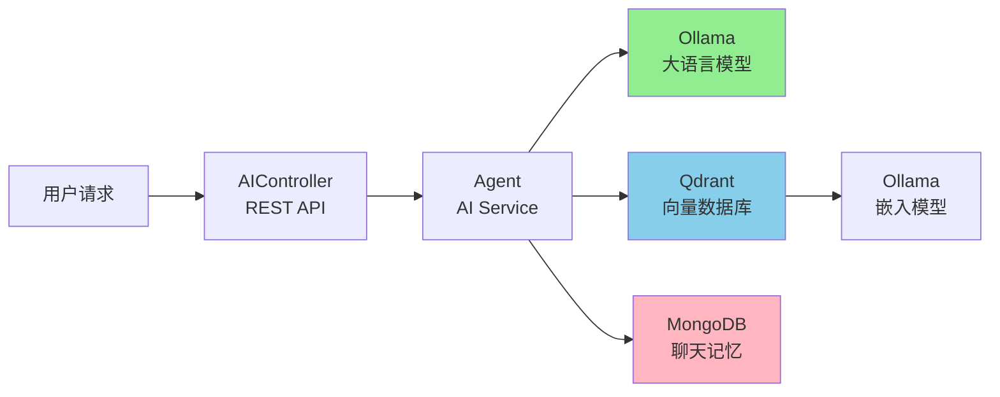

## 功能详述

- 智能对话
- Tool协助调用
- RAG操作说明

## 依赖与配置

```xml
<!-- ... existing code ... -->
<dependencies>
    <!-- web 应用程序核心依赖 -->
    <dependency>
        <groupId>org.springframework.boot</groupId>
        <artifactId>spring-boot-starter-web</artifactId>
    </dependency>
    <!-- 编写和运行测试用例 -->
    <dependency>
        <groupId>org.springframework.boot</groupId>
        <artifactId>spring-boot-starter-test</artifactId>
        <scope>test</scope>
    </dependency>
    <!-- 前后端分离中的后端接口测试工具 -->
    <dependency>
        <groupId>com.github.xiaoymin</groupId>
        <artifactId>knife4j-openapi3-jakarta-spring-boot-starter</artifactId>
        <version>${knife4j.version}</version>
    </dependency>
    <!-- 大模型调用接口-->
    <dependency>
        <groupId>dev.langchain4j</groupId>
        <artifactId>langchain4j-open-ai-spring-boot-starter</artifactId>
    </dependency>
    <dependency>
        <groupId>dev.langchain4j</groupId>
        <artifactId>langchain4j-ollama-spring-boot-starter</artifactId>
    </dependency>
    <dependency>
        <groupId>dev.langchain4j</groupId>
        <artifactId>langchain4j-community-dashscope-spring-boot-starter</artifactId>
    </dependency>

    <!-- langchain4j SpringBoot整合 @AIService @Tool等关键Bean整合 -->
    <dependency>
        <groupId>dev.langchain4j</groupId>
        <artifactId>langchain4j-spring-boot-starter</artifactId>
    </dependency>

    <!-- MongoDB AI对话本地存储 -->
    <dependency>
        <groupId>org.springframework.boot</groupId>
        <artifactId>spring-boot-starter-data-mongodb</artifactId>
    </dependency>

    <!-- Mysql Connector -->
    <dependency>
        <groupId>com.mysql</groupId>
        <artifactId>mysql-connector-j</artifactId>
    </dependency>
    <!--mybatis-plus 持久层-->
    <dependency>
        <groupId>com.baomidou</groupId>
        <artifactId>mybatis-plus-spring-boot3-starter</artifactId>
        <version>${mybatis-plus.version}</version>
    </dependency>

    <!-- RAG检索器 -->
    <dependency>
        <groupId>dev.langchain4j</groupId>
        <artifactId>langchain4j-easy-rag</artifactId>
    </dependency>

    <!-- Qdrant 向量数据库 -->
    <dependency>
        <groupId>dev.langchain4j</groupId>
        <artifactId>langchain4j-qdrant</artifactId>
    </dependency>
	<!-- 流式输出（后端与AI） -->
    <dependency>
        <groupId>org.springframework.boot</groupId>
        <artifactId>spring-boot-starter-webflux</artifactId>
    </dependency>
    <dependency>
        <groupId>dev.langchain4j</groupId>
        <artifactId>langchain4j-reactor</artifactId>
    </dependency>

</dependencies>
<dependencyManagement>
    <dependencies>
        <!--引入SpringBoot依赖管理清单-->
        <dependency>
            <groupId>org.springframework.boot</groupId>
            <artifactId>spring-boot-dependencies</artifactId>
            <version>${spring-boot.version}</version>
            <type>pom</type>
            <scope>import</scope>
        </dependency>

        <dependency>
            <groupId>dev.langchain4j</groupId>
            <artifactId>langchain4j-bom</artifactId>
            <version>${langchain4j.version}</version>
            <type>pom</type>
            <scope>import</scope>
        </dependency>

        <dependency>
            <groupId>dev.langchain4j</groupId>
            <artifactId>langchain4j-community-bom</artifactId>
            <version>${langchain4j.version}</version>
            <type>pom</type>
            <scope>import</scope>
        </dependency>
    </dependencies>
</dependencyManagement>
```

```yml
server:
  port: 8080
spring:
  datasource:
    username: root
    password: 165831
    url: jdbc:mysql://localhost:3306/erp?useUnicode=true&characterEncoding=UTF-8&serverTimezone=Asia/Shanghai&useSSL=false
    driver-class-name: com.mysql.cj.jdbc.Driver
  application:
    name: erp-demo
  data:
    mongodb:
      uri: mongodb://localhost:27017/chat_memory_db
langchain4j:
  ollama:
    streaming-chat-model:
      base-url: http://localhost:11434
      model-name: qwen2.5:7b
      temperature: 0.7
      timeout: PT60S
      log-requests: true
      log-responses: true
    chat-model:
      base-url: http://localhost:11434
      model-name: qwen2.5:7b
      temperature: 0.7
      timeout: PT60S
      log-requests: true
      log-responses: true
    embedding-model:
      base-url: http://localhost:11434
      model-name: nomic-embed-text
      timeout: PT60S
      log-requests: true
      log-responses: true

# Qdrant 配置
qdrant:
  host: localhost
  port: 6333
  collection-name: erp-collection
  use-tls: false
  # api-key: your-api-key  # 如果需要认证可配置

# 开启系统日志
logging:
  level:
    root: debug

# MyBatis-Plus 配置
mybatis-plus:
  # Mapper XML 文件位置（可选，如果使用注解方式可不配）
  mapper-locations: classpath*:mapper/**/*.xml

  # 实体扫描包（可选，MP 会自动扫描 @TableName 注解的类）
  type-aliases-package: com.demo.erp.entity

  # 全局配置
  global-config:
    db-config:
      # 主键策略（默认 ASSIGN_ID，即雪花算法）
      id-type: assign_id
      # 表名前缀（如 entity 为 User，实际表为 t_user）
      table-prefix: t_
      # 逻辑删除字段值配置（已删除 = 1，未删除 = 0）
      logic-delete-value: 1
      logic-not-delete-value: 0

  # MyBatis 原生配置（如日志、驼峰等）
  configuration:
    # 开启驼峰命名自动映射（如 user_name → userName）
    map-underscore-to-camel-case: true
```

### Qdrant向量数据库配置

```java
@Configuration
public class RAGConfig {

    @Autowired
    private EmbeddingModel embeddingModel;

    @Value("${qdrant.host:localhost}")
    private String qdrantHost;

    @Value("${qdrant.port:6333}")
    private int qdrantPort;

    @Value("${qdrant.collection-name:xiaozhi-collection}")
    private String collectionName;

    @Bean
    public QdrantClient qdrantClient() {
        // 创建 Qdrant gRPC 客户端
        return new QdrantClient(
                QdrantGrpcClient.newBuilder(qdrantHost, qdrantPort, false)
                        .build()
        );
    }

    @Bean
    public EmbeddingStore<TextSegment> embeddingStore(QdrantClient qdrantClient) {
        // 创建 Qdrant 向量存储
        return QdrantEmbeddingStore.builder()
                .client(qdrantClient)
                .collectionName(collectionName)
                .build();
    }

    @Bean
    public ContentRetriever contentRetrieverXiaozhi() {
        // 创建一个 EmbeddingStoreContentRetriever 对象，用于从嵌入存储中检索内容
        return EmbeddingStoreContentRetriever
                .builder()
                // 设置用于生成嵌入向量的嵌入模型
                .embeddingModel(embeddingModel)
                // 指定要使用的嵌入存储
                .embeddingStore(embeddingStore())
                // 设置最大检索结果数量，这里表示最多返回 1 条匹配结果
                .maxResults(1)
                // 设置最小得分阈值，只有得分大于等于 0.8 的结果才会被返回
                .minScore(0.8)
                // 构建最终的 EmbeddingStoreContentRetriever 实例
                .build();
    }
}
```

## 本地部署清单

### ollama

#### LLM对话

```bash
# === 中文能力强 - 推荐 ===

# 1. Qwen2.5 (通义千问) - 7B 参数，综合性能最佳
ollama pull qwen2.5:7b

# 2. Qwen2.5-Coder - 代码能力更强
ollama pull qwen2.5-coder:7b

# 3. DeepSeek-R1 - 推理能力强
ollama pull deepseek-r1:7b

# 4. Llama3.1 - Meta 最新模型
ollama pull llama3.1:8b

# 5. Gemma2 - Google 开源模型
ollama pull gemma2:9b


# === 轻量级模型（低配电脑）===

# 6. Phi-3 - 微软小模型（3.8B）
ollama pull phi3:3.8b

# 7. Qwen2.5 - 0.5B 超轻量版
ollama pull qwen2.5:0.5b

# 8. TinyLlama - 1.1B 极速模型
ollama pull tinyllama:1.1b
```

#### 向量解析大模型

```bash
# === 文本嵌入模型（向量数据库用）===

# 1. Nomic Embed Text - 推荐
ollama pull nomic-embed-text

# 2. Mxbai Embed Large - 效果更好
ollama pull mxbai-embed-large

# 3. All-MiniLM - 轻量快速
ollama pull all-minilm:l6-v2
```


### Qdrant向量数据库

```bash
# 1. 使用 Docker 安装 Qdrant（推荐）
docker run -d `
  -p 6333:6333 `
  -p 6334:6334 `
  --name qdrant `
  qdrant/qdrant

# 或者使用 Docker Compose（创建 docker-compose.yml）
# docker-compose.yml 内容：
# version: '3.8'
# services:
#   qdrant:
#     image: qdrant/qdrant
#     ports:
#       - "6333:6333"
#       - "6334:6334"
#     volumes:
#       - ./qdrant_storage:/qdrant/storage

# 2. 验证 Qdrant 是否启动成功
curl http://localhost:6333/

# 3. 查看 Qdrant 日志
docker logs qdrant

# 4. 访问 Qdrant Web UI (可选)
# 浏览器打开：http://localhost:6333/dashboard
```



