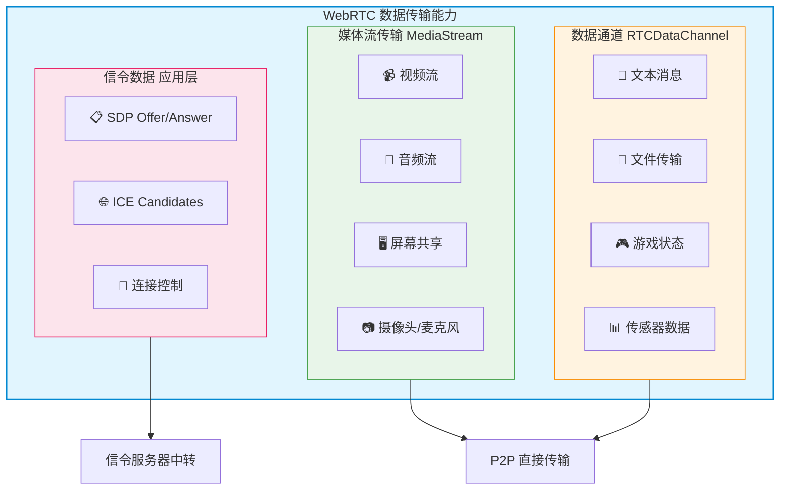
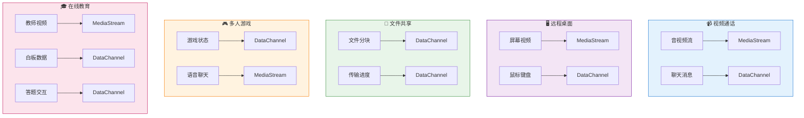
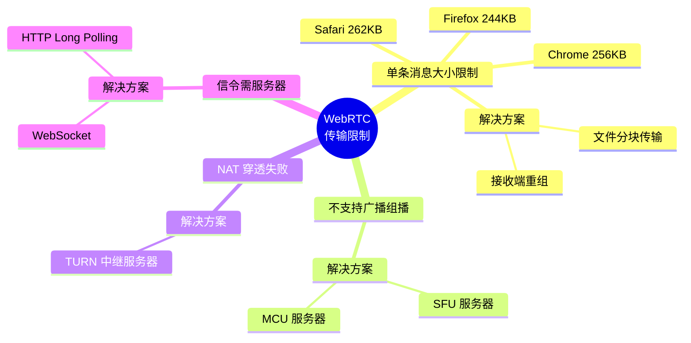
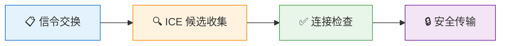
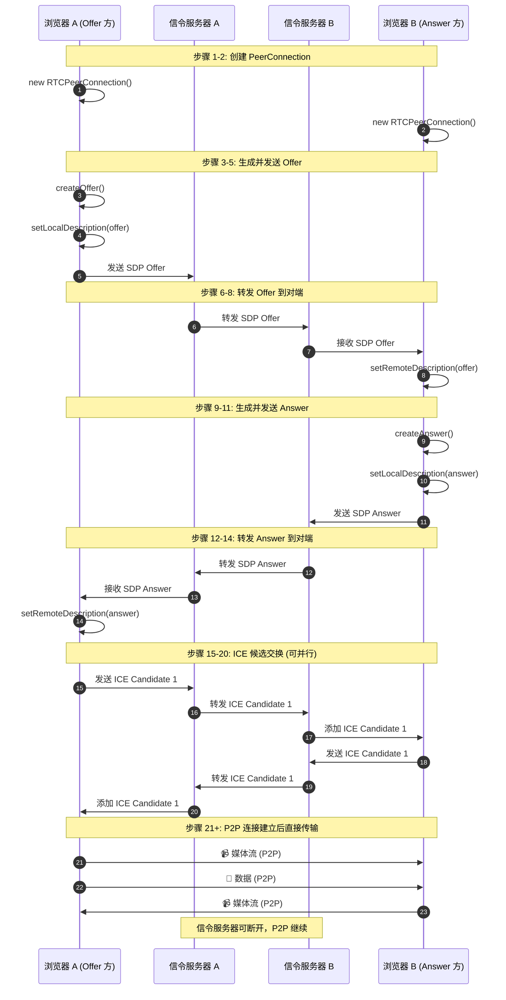
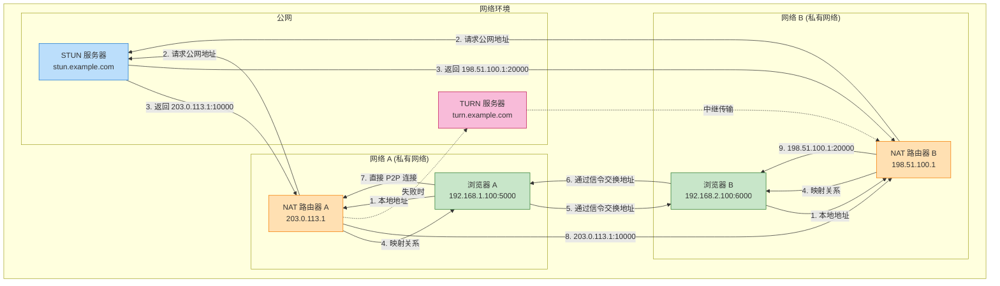
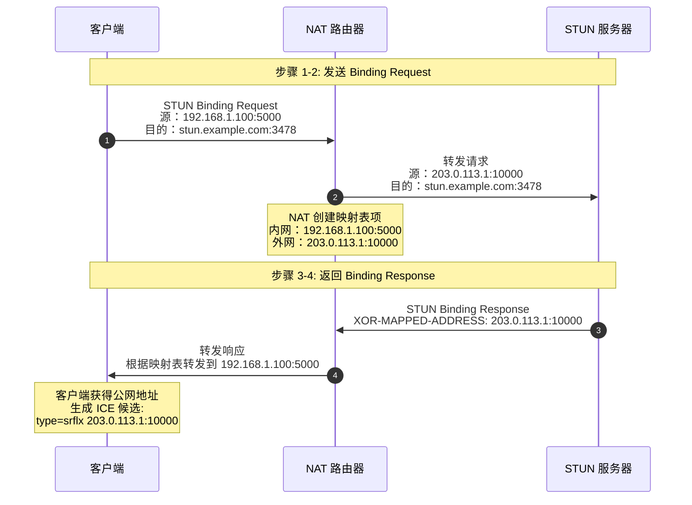
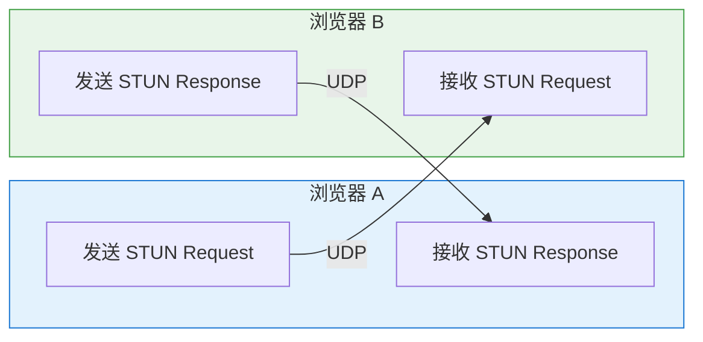
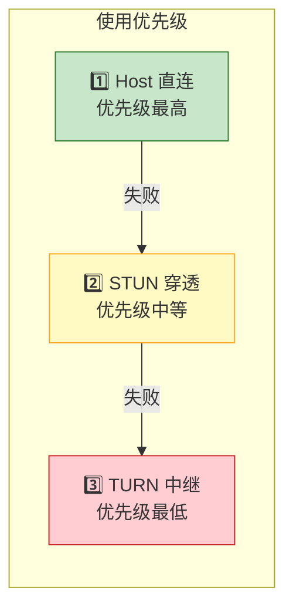
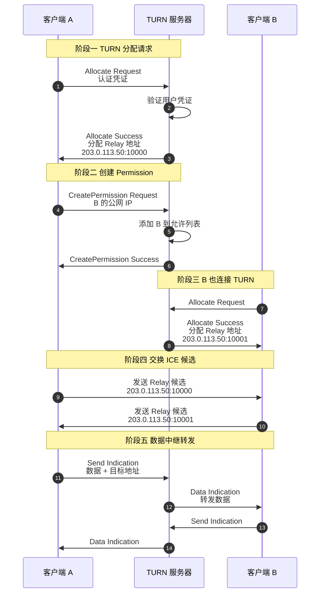

简易入门：[WebRTC入门指南WebRTC入门指南：实现浏览器间的实时通信 什么是WebRTC？ WebRTC（Web Real- - 掘金](https://juejin.cn/post/7509367333522964480)

​	[WebRTC入门，这一篇就够了 - 知乎](https://zhuanlan.zhihu.com/p/624357784)

## WebRTC概念引入

WebRTC（Web Real-Time Communication）是一项**开源实时通信技术**，允许浏览器和移动应用在无需安装插件的情况下实现**点对点（P2P）**的音视频传输和数据共享。

| 属性         | 说明                                 |
| :----------- | :----------------------------------- |
| **全称**     | Web Real-Time Communication          |
| **发起方**   | Google主导，2011年开源               |
| **标准化**   | W3C + IETF 联合制定的开放标准        |
| **核心目标** | 让浏览器之间直接进行低延迟的实时通信 |
| **当前状态** | 已成为实时音视频通信的事实标准       |

基于p2p的**端对端直接连接**，其可以直接实现很多内容：





当然由于其p2p的特性，也存在一定限制：



实现p2p的关键协议：

| 协议     | 全称                                   | 作用                               | 适用场景            |
| :------- | :------------------------------------- | :--------------------------------- | :------------------ |
| **ICE**  | Interactive Connectivity Establishment | 交互式连接建立框架，整合STUN和TURN | 所有WebRTC连接      |
| **STUN** | Session Traversal Utilities for NAT    | 获取设备的公网IP+端口              | 大多数家庭/公司网络 |
| **TURN** | Traversal Using Relays around NAT      | 当中继服务器转发数据（STUN失败时） | 对称NAT、严格防火墙 |

在这个IM项目中，WebRTC可以起到非常重要的作用：

- **音视频通话**
- **在线文件p2p传输**
- **多端消息同步**

其实WebRTC更倾向于是一个**前端技术**，后端方面只需要处理好**sdp**以及**ice候选**的传输问题（**WebSocket**）就没有什么需要他做的了。


### p2p连接建立流程

为了让双方客户端可以直接连接到对方，我们需要服务器来交换彼此的ip等信息，这样的数据传输我们就称之为**信令**。但是一般情况下，用户的网络都是**NAT**转接的，这时候没有公网根本无法直接连接；同时，双方对于数据如媒体数据的解析协议也是不同的，不一样的格式可能会导致无法解析获取到的数据，怎么办？

第一个问题我们会想到**NAT穿透**，第二个问题我们可以考虑在完成连接的前确定好双方的数据传输格式，而为了实现这两个需求，webrtc给出了一套概念：

- **媒体协商（SDP）**：两个用户在连接之前相互确定并交换双方支持的音视频格式的过程就是媒体协商。SDP 是描述信息的一种格式，其格式组成可自行查找了解；

- **网络协商（candidate）**：两个用户在 NAT 后交换各自的网络信息的过程就是网络协商。candidate 也是一种描述信息的一种格式，其格式组成可自行查找了解。

- **信令服务器**：传递双方信息的服务器就是信令服务器，此服务其实就是 web 服务，其职责也不止传输媒体格式以及网络信息，还可传输业务信息。其传输信息的协议可是 HTTP 或 Socket 等。

- **STUN**：STUN 是一种网络协议，其目的是进行 NAT 穿越。 内网进行 NAT 后进行 P2P 连接会有两个问题：

  - 由于 NAT 的安全机制，NAT 会过滤掉一些外网主动发送到内网的报文，而 P2P 恰恰就需要主动发起访问；
  - NAT 后，会得到一个 IP + 端口的地址，而在进行 P2P 连接时并不知道这个地址，难道要用户手动填写吗。

  **所以 STUN 的作用就是能够检测网络中是否存在 NAT 设备，有就可以获取到 NAT 分配的 IP + 端口地址，然后建立一条可穿越 NAT 的 P2P 连接（这一过程就是打洞）。**

- **TURN**：TURN 是 STUN 协议的扩展协议，其目的是如果 STUN 在无法打通的情况下，能够正常进行连接，其原理是通过一个中继服务器进行数据转发，此服务器需要拥有独立的公网 IP。

  **TURN 很明显的一个问题就是其转发数据所产生的带宽费用需要由自己承担！**

- **ICE**：ICE（Interactive Connectivity Establishment），是一种用于实现网络连接的技术框架，用于在对等连接（如实时通信、P2P 文件共享等）中解决 NAT（Network Address Translation）和防火墙等网络障碍的问题。
   ICE 是一种框架，可以通过使用多种技术（如 STUN、TURN、NAT 透明性检测等）来搜索可用的网络路径，并选择最优的路径建立连接，从而解决了 NAT 和防火墙等网络障碍的问题。 ICE 框架包含了以下几个步骤：
  - 收集网络接口信息，包括本地 IP 地址、端口等；
  - 通过 STUN 服务器获取公网 IP 地址和端口号；
  - 通过 NAT 透明性检测来确定 NAT 类型和行为；
  - 尝试直接连接对等端点；
  - 如果直接连接失败，则使用 TURN 服务器作为中继节点进行连接。 **也就是，ICE 更好的进行 NAT 穿越效果，从而提高实时通信的质量和效率。**

WebRTC 的 P2P 连接建立是一个**多阶段协作过程**，需要通信双方通过信令服务器交换信息，最终建立直接连接。以上的过程可分为四个核心阶段：



| 阶段         | 核心任务               | 是否需服务器 | 典型耗时  |
| :----------- | :--------------------- | :----------- | :-------- |
| 信令交换     | 交换 SDP 和 ICE 候选   | ✅ 需要       | 100-500ms |
| ICE 候选收集 | 获取所有可能的网络地址 | ❌ 不需要     | 200-400ms |
| 连接检查     | 测试候选对连通性       | ❌ 不需要     | 300-800ms |
| 安全传输     | DTLS 握手 + SRTP 加密  | ❌ 不需要     | 100-300ms |

1. **创建Offer**: 发起方创建包含媒体信息的SDP描述
2. **信令交换**: 通过信令服务器交换SDP信息
3. **ICE候选收集**: 收集网络连接候选路径
4. **NAT穿透**: 通过STUN/TURN服务器建立连接
5. **P2P通信**: 建立直接的点对点连接

最后我们再从客户端的角度来看这个信令交换以及连接建立的过程：




### stun实现NAT穿透

结合mermaid图看看借助stun获取公网ip的整体工作流程：



为了实现p2p连接，我们需要传输sdp解析格式以及ice候选以实现NAT穿透，而stun就是一个用于发现ICE候选的的服务（ICE候选是**所有可能的网络连接地址**），其通过**让客户端向公网服务器发送请求，服务器告诉客户端"我看到你的地址是什么"**来实现公网ip的获取（NAT下每次向外发送请求，都会在**高层ip**创建一个**port端口**专门处理**低层ip**的请求以及连接，用这种**大ip端口->小ip**（**端口映射/地址转换**）的方式实现**层层ip映射**）



> ICE候选：
>
> | 候选类型             | 说明                     | 优先级 | 获取方式           |
> | :------------------- | :----------------------- | :----- | :----------------- |
> | **Host**             | 本地局域网 IP            | 最高   | 直接读取网卡       |
> | **Server Reflexive** | STUN 服务器返回的公网 IP | 中等   | 查询 STUN 服务器   |
> | **Peer Reflexive**   | NAT 映射发现的地址       | 中等   | ICE 检查过程中发现 |
> | **Relay**            | TURN 中继服务器地址      | 最低   | 连接 TURN 服务器   |

现在我们通过stun获取到了ICE候选，但还是无法保证双方能够相互访问，所以拿到ICE候选后还会进行进行一次**校验**：



校验的实现形式为**双向的 STUN Binding 请求/响应过程**。双方轮流发送 STUN 请求，确认候选对是否可达。

1. **按优先级排序**：所有候选对按优先级降序排列
2. **逐个测试**：从高到低依次发送 STUN 请求
3. **首个成功**：第一个成功的候选对即为最佳路径
4. **持续优化**：连接建立后仍可继续检查更优路径

> stun无需后端信令交换服务准备，前端配备即可

免费stun服务：（客户的网络可能无法连到一些stun服务，建议多配几个stun服务或者干脆自己做一个stun/turn服务保证稳定）

```
stun:stun.hitv.com
stun:stun.chat.bilibili.com
stun:stun.l.google.com:19302
```

测试stun网站：（使用以下网站以测试stun服务在当前网络是否可用）

https://devina.io/stun-tester
https://webrtc.github.io/samples/src/content/peerconnection/trickle-ice/	

> trickle-ice可能会报一次错误：
>
> Note: errors from onicecandidateerror above are not necessarily fatal. For example an IPv6 DNS lookup may fail but relay candidates can still be gathered via IPv4.
> The server stun:stun.chat.bilibili.com:3478 returned an error with code=701:
> STUN host lookup received error.
>
> 这个是正常的，ipv6的连接失败换ipv4了，只要结果栏看到`srflx`候选者结果出来了就没问题了。


### turn实现兜底转接

**TURN**（Traversal Using Relays around NAT）是 WebRTC 连接建立失败时的**最后兜底方案**。当 STUN 无法穿透 NAT 时，TURN 服务器作为**中继节点**转发所有数据。



| 特性           | STUN                                | TURN                              |
| :------------- | :---------------------------------- | :-------------------------------- |
| **全称**       | Session Traversal Utilities for NAT | Traversal Using Relays around NAT |
| **作用**       | 获取公网 IP 地址                    | 数据中继转发                      |
| **数据传输**   | ❌ 不转发数据                        | ✅ 转发所有数据                    |
| **使用场景**   | 首选（低延迟）                      | 兜底（高延迟）                    |
| **服务器负载** | 低（仅信令）                        | 高（转发流量）                    |
| **成本**       | 低                                  | 高（带宽消耗）                    |
| **认证**       | 可选                                | 必需                              |

通过turn建立连接的流程：




## 后端信令交换逻辑实现

现在终于完成了概念的梳理，我们会发现其实在已经完成了WebSocket连接建立的前提下，后端要做的其实很少，只需要完成sdp以及ice候选的指定收发以及用户状态的维护即可完成后端方面任务：

### 传输信令

在现有 IM 消息协议基础上，增加 3 种 WebRTC 专用消息：

| 消息类型           | 方向      | 内容         |
| :----------------- | :-------- | :----------- |
| `webrtc_offer`     | 主叫→被叫 | SDP Offer    |
| `webrtc_answer`    | 被叫→主叫 | SDP Answer   |
| `webrtc_candidate` | 双向      | ICE 候选地址 |

**做法**：在现有消息转发逻辑里加个判断，这 3 类消息走 WebRTC 信令通道

现在我们结合原有的基础，让**发起方**先走**http**发起offer请求寻找**接收方**并ws发送通话请求，接收回应http给服务器，服务器再ws将回应发送给**发起方**。若**接收方**回应为同意则双方就可以带上SDP等信息发送http请求，服务收到请求后尝试寻找指定**接收方**用户并通过ws连接发送完整信息，**接收方**在收到信息后准备自己的SDP等信息走http发起answer请求，同样让服务去寻找对应的**发起方**并通过ws连接发送消息。在这个过程中，双方还需要通过stun/turn完成ICE候选的准备并发送给互相，最终建立起连接。

现在，我们准备好DTO用于存储SDP以及ICE的candidate，然后完成发起接口，回应接口以及信令传输接口的创建：

```java
@RestController
@RequestMapping("/webrtc")
@Api(tags = "WebRTC接口")
public class WebRTCController extends MBaseController{

    @Autowired
    private WebRTCService webRTCService;

    /**
     * 发起WebRTC通话请求
     */
    @PostMapping("/call")
    @ApiOperation("发起好友WebRTC通话")
    public ResponseVO call(@RequestBody WebRTCCallRequestDto callRequest) throws BusinessException {
    }

    /**
     * 处理WebRTC通话响应（接听/拒接/忙线）
     */
    @PostMapping("/response")
    @ApiOperation("处理WebRTC通话响应")
    public ResponseVO response(@RequestBody WebRTCCallResponseDto responseDto) throws BusinessException {
    }

    /**
     * 发送WebRTC信令（SDP Offer/Answer, ICE Candidate等）
     */
    @PostMapping("/signal")
    @ApiOperation("发送WebRTC信令")
    public ResponseVO signal(@RequestBody WebRTCSignalingDto signalingDto) throws BusinessException {
    }

    /**
     * 挂断WebRTC通话
     */
    @PostMapping("/hangup")
    @ApiOperation("挂断WebRTC通话")
    public ResponseVO hangup(@RequestParam String roomId,
                             @RequestParam String targetUserId) throws BusinessException {
    }

    /**
     * 获取通话状态
     */
    @GetMapping("/status")
    @ApiOperation("获取通话状态")
    public ResponseVO getStatus(@RequestParam String roomId) throws BusinessException {
    }
}
```


### 维护用户以及通话房间的通话状态

实际使用软件时在call对方时需要知道对方的状态，如不在线则无法call，如正在和其他人通话也无法进行call，


## 群组通话概念引入

先来看看WebRTC中对于群组通话的支持：[Webrtc音视频会议之Mesh/MCU/SFU三种架构_sfu模式-CSDN博客](https://blog.csdn.net/qlshouyu/article/details/106733653)


## 群组通话的简单实现-Mesh


## EX：几种NAT类型


## EX：为什么stun获取到的“公网”是可以打洞的？


## EX：Coturn搭建搭建 stun / turn 服务器

如果由于不稳定等原因不想使用外部的stun，那么我们也可以自建一个IP确认/数据传输服务器：
