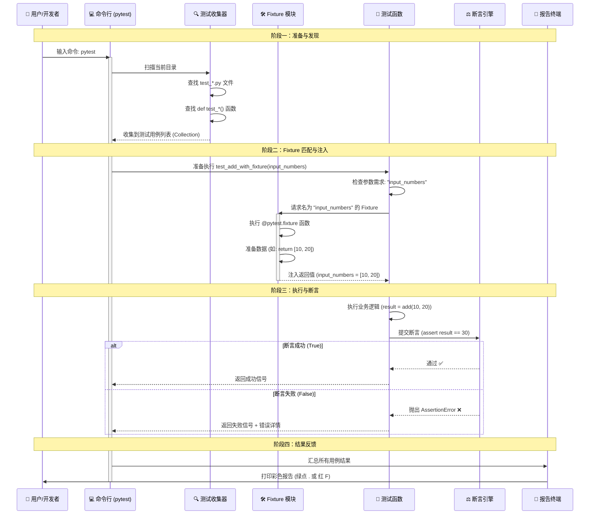

安装pytest：`pip install -U pytest`

说明文档：[API 参考 - pytest 文档 - pytest 测试框架](https://pytest.cn/en/stable/reference/reference.html)

先从一个简单基本的测试**流程**来看pytest：

## pytest的执行流程

> **目标**：测试一个数学加法函数 `add(a, b)`，确保它算得对。

我们将分 **5 个绝对清晰的步骤**，每一步只讲一个核心概念。

------

### 第 1 步：准备被测试的代码

**概念**：**被测对象 (SUT - System Under Test)** 在测试之前，你首先得有一个东西需要被测试。通常这是你开发的**业务代码/接口**。

创建一个文件叫 `my_math.py` (名字随意，只要不是 `test_` 开头)：

```python
# my_math.py

def add(a, b):
    """这是一个简单的加法函数"""
    return a + b

def subtract(a, b):
    """这是一个减法函数"""
    return a - b
```

> **💡 重点**：测试代码和业务代码通常是**分开存放**的。pytest 负责去“调用”这里的代码。

------

### 第 2 步：创建测试文件

**概念**：**测试发现规则 (Test Discovery)** pytest 很聪明，但它有规矩。它只认特定名字的文件和函数。

创建一个新文件，**名字必须以 `test_` 开头（或者以 `_test.py` 结尾）**。 我们创建：`test_my_math.py`

```python
# test_my_math.py

# 1. 导入我们要测试的函数
from my_math import add

# 2. 定义测试函数
# 规则：函数名必须以 test_ 开头
def test_add_two_numbers():
    # 这里我们将要写“断言”
    pass 
```

> **💡 重点**：
>
> - 文件名：`test_xxx.py` ✅ (pytest 会扫描它)
> - 文件名：`my_test_code.py` ❌ (pytest 默认忽略它)
> - 函数名：`test_xxx()` ✅
> - 函数名：`check_xxx()` ❌ (pytest 默认忽略它)

------

### 第 3 步：编写断言

**概念**：**断言 (Assertion)** 这是测试的核心。断言就是**“对结果的预期”**。 如果预期和实际结果一致，测试通过（绿）；如果不一致，测试失败（红）。

在 pytest 中，你不需要学复杂的 `self.assertEqual`，直接用 Python 原生的 `assert` 关键字。

修改 `test_my_math.py`：

```python
# test_my_math.py
from my_math import add

def test_add_two_numbers():
    # --- 动作 (Action) ---
    # 调用函数，获取实际结果
    result = add(1, 2)
    
    # --- 断言 (Assert) ---
    # 意思是：我“断言” result 必须等于 3
    # 如果 result 真的是 3，程序继续往下走（测试通过）
    # 如果 result 不是 3，程序立刻报错（测试失败）
    assert result == 3
    
    # 你可以写多个断言
    assert add(0, 0) == 0
    assert add(-1, 1) == 0
```

> **💡 重点**：
>
> - `assert 条件`：条件为真 (True)，测试通过。
> - `assert 条件`：条件为假 (False)，测试失败，抛出 `AssertionError`。
> - pytest 会自动捕获这个错误，并告诉你哪一行错了，期望是什么，实际是什么。

------

### 第 4 步：运行测试

**概念**：**测试运行器 (Test Runner)** 现在代码写好了，怎么让它跑起来？我们需要在命令行（终端/CMD）中运行 pytest。

1. 打开你的终端（Terminal 或 CMD）。
2. 进入存放这两个文件的文件夹。
3. 输入命令：`pytest`

**你会看到什么？** 如果一切正常，你会看到类似这样的绿色输出：

```text
============================= test session starts =============================
platform win32 -- Python 3.x.x, pytest-8.x.x
collected 1 item                        <-- 收集到了 1 个测试用例

test_my_math.py .                       <-- 一个点 '.' 代表成功 (Passed)

============================== 1 passed in 0.05s ==============================
```

**故意让它失败试试？** 把代码里的 `assert result == 3` 改成 `assert result == 4`。 再次运行 `pytest`。 你会看到红色的 `F` (Failed)，并且 pytest 会详细打印出：

```text
E       assert 3 == 4
E        +  where 3 = add(1, 2)
```

它会告诉你：期望是 4，但实际得到了 3。

> **💡 重点**：
>
> - `.` (点) = 成功 (Pass)
> - `F` = 失败 (Fail)
> - `E` = 错误 (Error，通常指代码崩了，比如除以零)
> - `s` = 跳过 (Skip)

------

### 第 5 步：引入第一个 Fixture (前置准备)

**概念**：**Fixture (夹具/准备工作)** 现在我们的测试很简单，直接算就行。但如果测试前需要**准备数据**呢？ 比如：每次测试前，都要先初始化一个复杂的列表？

这就是 `fixture` 登场的时候。它的作用是：**在测试运行前，自动帮你准备好东西。**

#### 怎么写一个最简单的 Fixture？

1. 导入 `pytest` 模块。
2. 在函数上面加一个装饰器 `@pytest.fixture`。
3. 用 `return` 返回准备好的数据。

修改 `test_my_math.py`：

```python
# test_my_math.py
import pytest  # 1. 必须导入 pytest
from my_math import add

# 2. 定义一个 fixture
# 名字叫 'input_numbers'，你可以随便起
@pytest.fixture
def input_numbers():
    print("\n🔧 [Fixture] 正在准备测试数据...")
    # 这里可以做任何准备工作，比如读文件、连数据库
    # 最后 return 你准备好的数据
    return [10, 20] 

# 3. 在测试函数中使用它
# 注意：参数名 'input_numbers' 必须和上面的函数名一模一样！
def test_add_with_fixture(input_numbers):
    print(f"📝 [Test] 拿到的数据是: {input_numbers}")
    
    a = input_numbers[0]
    b = input_numbers[1]
    
    result = add(a, b)
    
    # 断言：10 + 20 应该等于 30
    assert result == 30
```

#### 运行看看发生了什么？

运行 `pytest -s` (加上 `-s` 是为了让你看到 print 输出的内容)。

**输出顺序会是：**

1. 先打印：`🔧 [Fixture] 正在准备测试数据...` (Fixture 先运行)
2. 再打印：`📝 [Test] 拿到的数据是: [10, 20]` (测试函数运行，并接收到了数据)
3. 最后显示：`.` (测试通过)

> **💡 核心逻辑**：
>
> - pytest 发现测试函数 `test_add_with_fixture` 需要一个参数叫 `input_numbers`。
> - pytest 到处找，发现有一个 `@pytest.fixture` 定义的函数也叫 `input_numbers`。
> - pytest **先执行** 这个 fixture 函数。
> - pytest 把 fixture `return` 的值，**自动填入** 测试函数的参数里。
> - 测试函数开始执行。

###  第一阶段总结

到现在为止，你已经掌握了 pytest 最基础的闭环：

1. **被测代码** (`my_math.py`)：你要测的功能。

2. **测试文件** (`test_*.py`)：必须以 `test_` 开头。

3. **测试函数** (`test_*`)：必须以 `test_` 开头。

4. **断言** (`assert`)：判断对错的标准，对了绿，错了红。

5. **运行** (`pytest`)：启动测试的命令。

6. Fixture(`@pytest.fixture`)：

    - 用来准备数据。
- 通过**参数名匹配**自动注入到测试函数中。

图解：



## 基础概念再介绍

### **测试发现规则 (Test Discovery)**

**定义**：pytest 自动寻找测试代码的“雷达规则”。只有符合命名规范的文件和函数才会被执行。

- **文件规则**：`test_*.py` 或 `*_test.py`
- **函数规则**：`test_*()`
- **类规则**：`Test*` (类名大写 T 开头，且不含 `__init__`)

```python
# ✅ 会被运行
def test_login(): pass
class TestUser: def test_profile(self): pass

# ❌ 会被忽略
def check_login(): pass      # 函数没加 test_
class UserProfile: pass      # 类名没加 Test
```


### **测试用例 (Test Case)**

**定义**：一个独立的测试函数，代表一个具体的验证场景。

- **特点**：无需继承任何基类（不像 unittest），就是普通函数。
- **结构**：准备数据 -> 执行操作 -> 断言结果。

```python
def test_add_positive():
    # 直接写逻辑，不需要 class, 不需要 self
    result = 1 + 1
    assert result == 2
```


### **断言 (Assertion)**

**定义**：判断测试通过与否的“标准”。

- **核心**：直接使用 Python 原生的 `assert` 关键字。
- **优势**：pytest 会自动重写断言，失败时显示详细的变量值对比（不用记各种 `assertEquals`）。

```python
def test_division():
    res = 10 / 2
    assert res == 5           # 相等
    assert res > 4            # 大于
    assert "error" in "no error" # 包含 (这将失败，并显示详细对比)
```


### **夹具 (Fixture)**

**定义**：测试前的“准备工作”和测试后的“清理工作”。

- **机制**：使用 `@pytest.fixture` 装饰器，通过**参数名匹配**自动注入。
- **生命周期**：`yield` 之前是 Setup（准备/注入前执行），`yield` 之后是 Teardown（清理/销毁时执行）。
- **作用域**：`scope` 参数控制执行频率 (`function`, `module`, `session`...)。

```python
@pytest.fixture				  # 不填scope，默认function，每test_函数执行一次，获取一次
def db_cursor():
    conn = connect_db()       # Setup: 连数据库
    cursor = conn.cursor()
    yield cursor              # <--- 分界线：把 cursor 给测试用
    cursor.close()            # Teardown: 关闭连接

def test_query(db_cursor):    # 参数名匹配，自动注入
    db_cursor.execute("SELECT 1")
```

> 注意test_函数拿数据的时候，参数中的参数名不是fixture他yield给出的那个数据的参数名，而是fixture他的函数名！


### 作用域(Scope)

**定义**： pytest Fixture 中**控制“生命周期”和“执行频率”**的核心参数。

简单来说，它决定了：**这个准备工作（Fixture）到底要做几次？什么时候做？什么时候销毁？**

如果不指定 `scope`，默认是 `function`（每个测试函数都重新做一次）。

```python
@pytest.fixture(scope="session") 
def auth_token():
    print("正在登录... (耗时 2 秒，但只发生一次)")
    token = login_api() 
    return token
```

| Scope 值              | 含义       | 执行频率                            | 典型应用场景                                                 |
| :-------------------- | :--------- | :---------------------------------- | :----------------------------------------------------------- |
| **`function`** (默认) | **函数级** | 每个 `test_` 函数运行前都执行一次   | 需要**数据隔离**的场景（如：每条用例操作不同的数据库记录，互不干扰）。 |
| **`class`**           | **类级**   | 每个 `class TestXxx` 运行前执行一次 | 测试类中的所有方法共享同一个资源（较少用）。                 |
| **`module`**          | **模块级** | 每个 `.py` 文件运行前执行一次       | 同一个文件内的所有测试用例共享资源（如：同一个文件测同一个 API 模块）。 |
| **`package`**         | **包级**   | 每个文件夹（包）运行前执行一次      | 整个目录下的测试共享资源（较少用）。                         |
| **`session`**         | **会话级** | **整个 pytest 运行过程只执行一次**  | **最耗时**的操作（如：登录获取 Token、启动浏览器、连接数据库池）。 |

**注意！**使用 `scope="session"` 或 `module` 时，要注意**状态污染**：

- **问题**：因为所有用例共用同一个资源（比如同一个 Token 或同一个数据库连接），如果某个测试用例**修改**了这个资源（比如注销了 Token，或者删除了共享数据），后面的测试用例就会失败。
- 解决：
  1. 确保 Fixture 提供的资源是**只读**的，或者测试用例不会破坏它。
  2. 如果需要修改数据，请在 `function` 级别的 Fixture 中基于 `session` 级别的数据去创建**副本**（例如：用全局 Token 去为每个用例创建一个临时用户）。

总结：

- **要隔离，用 Function**（默认，最安全，但慢）。
- **要速度，用 Session**（最快，但要小心数据冲突）。
- **登录、浏览器、数据库连接** -> 首选 `session`。
- **临时数据、文件操作** -> 首选 `function`。


### **参数化 (Parametrization)**

**定义**：用**一套代码**测**多组数据**。

- **写法**：`@pytest.mark.parametrize("参数名", [数据列表])`
- **效果**：pytest 会自动把列表拆开，为每组数据生成一个独立的测试用例。

```python
# 这里的 test_add 会运行 3 次：(1,2,3), (5,5,10), (-1,1,0)
@pytest.mark.parametrize("a, b, expected", [
    (1, 2, 3),
    (5, 5, 10),
    (-1, 1, 0)
])
def test_add(a, b, expected):
    assert a + b == expected
```


## 结合后端的接口完成一个测试流程

我们将模拟一个经典的 **“用户管理模块”** 测试：

1. **登录** (获取 Token) -> *使用 `session` 级 Fixture*
2. **创建用户** (POST) -> *使用参数化测试多组数据*
3. **查询用户** (GET) -> *验证数据一致性*
4. **清理数据** (DELETE) -> *使用 `yield` 进行 Teardown*

------

### 📂 项目结构

为了模拟真实环境，我们建立以下文件结构：

```text
api_tests/
├── conftest.py          # 全局配置：登录逻辑、Session 管理
├── test_user_api.py     # 具体测试用例：增删改查
└── requirements.txt     # 依赖列表
```

### 1️⃣ 安装依赖

```bash
pip install requests pytest
```

------

### 2️⃣ 编写全局夹具 (`conftest.py`)

**目标**：处理**登录**和**会话保持**。
**关键点**：

- 使用 `scope="session"`：整个测试过程**只登录一次**，节省时间。
- 使用 `requests.Session()`：自动携带 Cookie/Token，无需每个请求都写 Header。
- 使用 `yield`：测试结束后自动注销或清理。

> **注意**：为了让能直接运行代码，使用了一个公开的免费测试 API (`reqres.in`) 作为演示。可以随时把 URL 换成本地的 `http://localhost:8000`。

```python
# conftest.py
import pytest
import requests

# 被测系统的基础 URL (这里使用公开测试接口，实际请换成你的后端地址)
BASE_URL = "https://reqres.in/api"

@pytest.fixture(scope="session")
def api_session():
    """
    【Session 级 Fixture】
    1. 启动一个 Session (类似浏览器的会话)
    2. 执行登录 (模拟)
    3. 将 Token 注入到 Session 的 Header 中
    4. Yield 给测试用例使用
    5. 测试全部结束后，执行清理 (Logout)
    """
    print("\n🚀 [Setup] 正在初始化 API Session 并登录...")
    
    session = requests.Session()
    
    # --- 模拟登录 ---
    # 在实际项目中，这里会是 requests.post(..., json={...})
    login_payload = {"email": "eve.holt@reqres.in", "password": "cityslicka"}
    response = session.post(f"{BASE_URL}/login", json=login_payload)
    
    if response.status_code != 200:
        pytest.fail(f"❌ 登录失败！无法继续测试。响应: {response.text}")
    
    token = response.json().get("token")
    print(f"✅ 登录成功！Token: {token}")
    
    # 将 Token 自动注入到后续所有请求的 Header 中
    session.headers.update({"Authorization": f"Bearer {token}"})
    
    # --- Yield: 把 session 交给测试用例 ---
    yield session
    
    # --- Teardown: 所有测试跑完后执行 ---
    print("\n🧹 [Teardown] 测试结束，正在注销/清理 Session...")
    # session.post(f"{BASE_URL}/logout") 
    session.close()
    print("✅ Session 已关闭。")
```

------

### 3️⃣ 编写测试用例 (`test_user_api.py`)

**目标**：测试用户的 **创建 (Create)** 和 **查询 (Read)**，并自动清理。
**关键点**：

- **参数化 (`parametrize`)**：一次性测试“创建正常用户”和“创建带特殊字符的用户”。
- **依赖注入**：直接使用 `api_session` 参数。
- **嵌套 Fixture 逻辑**：在测试函数内部手动调用删除接口（或者可以写成另一个 fixture，这里为了直观写在函数里）。

```python
# test_user_api.py
import pytest
from conftest import BASE_URL  # 导入基础 URL

# --- 测试数据准备 ---
# 模拟 AI 生成的多组测试数据
USER_DATA_CASES = [
    ("正常用户_张三", {"name": "Zhang San", "job": "Developer"}, 201),
    ("特殊字符_李四", {"name": "Li $#! Four", "job": "Tester"}, 201),
    ("长名字_王五", {"name": "Wang " + "Wu" * 20, "job": "Manager"}, 201),
]

@pytest.mark.parametrize("case_name, payload, expected_status", USER_DATA_CASES)
def test_create_and_verify_user(api_session, case_name, payload, expected_status):
    """
    完整流程测试：
    1. 创建用户 (POST)
    2. 验证创建结果 (Assert)
    3. 查询用户详情 (GET) - 模拟验证
    4. 清理数据 (DELETE) - 虽然 reqres.in 是假接口删不了，但逻辑要写上
    """
    print(f"\n🧪 开始测试案例: {case_name}")
    
    created_user_id = None
    
    try:
        # --- 步骤 1: 创建用户 (POST) ---
        print(f"   📝 正在创建用户: {payload['name']}")
        resp_create = api_session.post(f"{BASE_URL}/users", json=payload)
        
        # 断言状态码
        assert resp_create.status_code == expected_status, \
            f"创建失败！期望 {expected_status}, 实际 {resp_create.status_code}"
        
        # 解析响应
        data = resp_create.json()
        created_user_id = data.get("id") # 假接口会返回 ID
        created_at = data.get("createdAt")
        
        print(f"   ✅ 创建成功！ID: {created_user_id}, 时间: {created_at}")
        
        # 断言返回数据的一致性
        assert data["name"] == payload["name"], "返回的名字与发送的不一致"
        assert data["job"] == payload["job"], "返回的工作与发送的不一致"
        assert created_user_id is not None, "必须返回用户 ID"
        
        # --- 步骤 2: 查询用户 (GET) ---
        # 注意：reqres.in 的 GET /users/{id} 可能查不到刚创建的假数据，
        # 但在真实环境中，这里应该能查到。
        # 我们这里假设能查到，并验证逻辑
        print(f"   🔍 正在尝试验证用户 ID: {created_user_id}")
        
        # 如果是真实后端，这里应该是:
        # resp_get = api_session.get(f"{BASE_URL}/users/{created_user_id}")
        # assert resp_get.status_code == 200
        # assert resp_get.json()["name"] == payload["name"]
        
        # 为了演示通过，我们暂时跳过真实的 GET 检查 (因为 reqres.in 是假的)
        # 在实际项目中，请取消下面这行的注释并删除 pass
        # assert resp_get.status_code == 200 
        pass 

    finally:
        # --- 步骤 3: 清理数据 (Teardown) ---
        # 无论测试成功还是失败，finally 块都会执行，确保清理
        if created_user_id:
            print(f"   🗑️ 正在清理测试数据 ID: {created_user_id}")
            # 真实后端代码:
            # resp_delete = api_session.delete(f"{BASE_URL}/users/{created_user_id}")
            # assert resp_delete.status_code in [200, 204, 404] 
            print("   ✅ 清理逻辑已触发 (模拟)")

# --- 额外测试：测试异常场景 ---
def test_create_user_missing_job(api_session):
    """测试缺少必填字段的情况"""
    payload = {"name": "No Job User"} # 缺少 job
    
    resp = api_session.post(f"{BASE_URL}/users", json=payload)
    
    # 即使 reqres.in 可能允许，真实后端通常应校验
    # 这里我们只断言它返回了某种状态 (201 或 400 取决于后端设计)
    assert resp.status_code in [201, 400]
    print("   ✅ 异常场景测试完成")
```

> 如果说我们需要**动态**获取测试数据，那我们其实可以搭配`parametrize`+`indirect`这两个来实现动态获取测试数据，同时还可以使用`parametrize`的多轮测试：
>
> ```py
> # conftest.py
> import pytest
> import requests
> 
> BASE_URL = "https://reqres.in/api"
> 
> def pytest_generate_tests(metafunc):
>     """
>     这个钩子函数会在收集阶段自动运行。
>     它可以动态修改 parametrize 的参数列表。
>     """
>     # 如果当前测试函数需要 "dynamic_user_id" 参数
>     if "dynamic_user_id" in metafunc.fixturenames:
>         print("\n🌐 [Hook] 正在动态获取用户列表...")
>         
>         # 1. 在这里发起真实的网络请求 (注意：这会在收集阶段发生，稍微慢一点)
>         resp = requests.get(f"{BASE_URL}/users")
>         users = resp.json()["data"]
>         
>         # 2. 提取 ID 列表
>         id_list = [user["id"] for user in users]
>         
>         # 3. 动态参数化
>         # 这行代码等价于 @pytest.mark.parametrize("dynamic_user_id", id_list, indirect=True)
>         metafunc.parametrize("dynamic_user_id", id_list, indirect=True)
> 
> # 对应的 Fixture
> @pytest.fixture(scope="module")
> def dynamic_user_id(request):
>     uid = request.param
>     print(f"   🔍 准备测试动态用户 ID: {uid}")
>     # 这里可以再次请求详情，或者直接返回 ID 供测试使用
>     return uid
> 
> # 测试函数
> def test_dynamic_user(dynamic_user_id):
>     """
>     这个测试会自动运行 N 次，N = 接口返回的用户数量。
>     今天可能是 2 次，明天接口加了人就是 10 次。
>     """
>     assert dynamic_user_id > 0
>     print(f"   ✅ 验证通过: ID {dynamic_user_id}")
> ```
>
> 当然也可以干脆直接在`test_*.py`文件里面加入使用request拿到动态测试数据，然后用`parametrize`来多批次测试，不要什么fixture和钩子了

------

### 4️⃣ 运行测试

在终端执行：

```bash
pytest -v -s
```

#### 🎬 预期输出流程解析

1. Setup 阶段 (只运行一次):
   - 看到 `🚀 [Setup] 正在初始化 API Session 并登录...`
   - 看到 `✅ 登录成功！Token: ...`
2. 测试执行阶段:
   - `test_create_and_verify_user[正常用户_张三]` -> 打印创建日志 -> 断言通过。
   - `test_create_and_verify_user[特殊字符_李四]` -> 打印创建日志 -> 断言通过。
   - `test_create_and_verify_user[长名字_王五]` -> 打印创建日志 -> 断言通过。
   - `test_create_user_missing_job` -> 运行异常测试。
   - 每个用例结束后，都会看到 `🗑️ 正在清理测试数据...` (因为我们在 `finally` 块里)。
3. Teardown 阶段 (最后运行一次):
   - 看到 `🧹 [Teardown] 测试结束，正在注销/清理 Session...`
   - 看到 `✅ Session 已关闭。`
4. 结果:
   - `4 passed` (全绿)。


## 实际工作的测试流程

### 使用swagger/postman得到一个request的标准环境

在测试环境中，我们不仅仅需要准备一个简单的token，可能还需要一些额外的验证信息。我们可以先用postman跑通一个样例，然后拿到python中可用对应接口的request代码，接下来就可以将这部分代码放到pytest中准备数据了。

### 根据swagger/postman等api文档准备测试样例


### 测试结果可视化


## 通用测试输入检查清单

[通用功能测试点全汇总 - fangyan781 - 博客园](https://www.cnblogs.com/fangyan781/p/15040294.html)

| 类别       | 核心策略    | 典型测试数据示例                                  | 预期结果                 |
| ---------- | ----------- | ------------------------------------------------- | ------------------------ |
| ✅ 正常场景 | 标准值      | `name="Alice"`, `age=25`, `amount=100.00`         | 成功 (200/201)           |
|            | 极值 (合法) | `age=0` (最小), `age=150` (最大), `备注`填满上限  | 成功                     |
| ⚠️ 边界值   | 刚越界      | `age=-1`, `age=151`, `长度=Max+1`                 | 失败 (400)               |
| (Bug高发)  | 刚达标      | `age=0`, `age=150`, `长度=Max`                    | 成功                     |
|            | 空值边界    | `""` (空串), `null`, `[]` (空数组), `不传字段`    | 视业务定义 (通常失败)    |
| ❌ 异常场景 | 类型错误    | `age="twenty"`, `id=true`, `data="{}"` (应为列表) | 失败 (400/422)           |
|            | 格式错误    | `email="abc"`, `date="2023-99-99"`, `phone="123"` | 失败                     |
|            | 必填缺失    | 缺少 `username`, 缺少 `password`                  | 失败                     |
| 🛡️ 安全特殊 | 注入攻击    | `' OR '1'='1`, `<script>alert(1)</script>`        | 失败 或 被转义           |
|            | 特殊字符    | `Emoji😀`, `中文`, `!@#$%`, `空格 "  "`            | 成功 (支持UTF8) 或 失败  |
| 🔄 业务逻辑 | 逻辑冲突    | `开始时间 > 结束时间`, `余额 < 转账金额`          | 失败                     |
|            | 重复/幂等   | 重复注册同名用户, 重复提交订单                    | 失败 (409) 或 返回原数据 |
|            | 状态依赖    | 修改“已删除”数据, 发货“未支付”订单                | 失败                     |


## 结合 Swagger (OpenAPI) + AI 自动生成测试

这是2026年的主流玩法：**不再手动写每一个接口测试，而是让 AI 基于文档生成骨架和用例。**

### 方案架构

1. **输入**: Swagger/OpenAPI JSON 文件 (`openapi.json`)。
2. 处理: 
   - **步骤 A (结构化)**: 使用 `prance` 或 `openapi-spec-validator` 解析文档，提取接口路径、方法、参数 schema。
   - **步骤 B (智能化)**: 将提取的 Schema 发送给 LLM (如 DeepSeek, GPT-4o, 通义千问)，要求生成 pytest 代码和边界值测试数据。
3. **输出**: 可执行的 `test_auto_generated.py`。

### 实战步骤

#### 第一步：准备工具库

```bash
pip install openapi-spec-validator requests python-dotenv langchain langchain-openai
# 假设你使用阿里云百炼或直接调用大模型 API
```

#### 第二步：编写“AI 测试生成器”脚本

创建一个 `generate_tests.py`，它的任务是读取 Swagger 并调用 AI 生成代码。

```python
import json
import os
from openapi_spec_validator import validate_spec
from langchain_openai import ChatOpenAI # 或者使用其他兼容 OpenAI 协议的库
from langchain.prompts import PromptTemplate

# 配置你的 API Key (以兼容 OpenAI 协议的 endpoint 为例，国内可用阿里云/DeepSeek)
os.environ["OPENAI_API_KEY"] = "YOUR_API_KEY"
os.environ["OPENAI_API_BASE"] = "https://dashscope.aliyuncs.com/compatible-mode/v1" # 示例：阿里云

def load_swagger(file_path):
    with open(file_path, 'r', encoding='utf-8') as f:
        spec = json.load(f)
    validate_spec(spec) # 确保文档合法
    return spec

def generate_pytest_code(swagger_spec, api_endpoint):
    # 初始化大模型 (2026年推荐使用支持长上下文的模型)
    llm = ChatOpenAI(model="qwen-max", temperature=0.2) # qwen-max 适合代码生成
    
    # 提取关键接口信息 (简化版，实际可遍历 paths)
    # 这里为了演示，我们只取第一个 POST 接口
    target_path = None
    method = None
    schema = None
    
    for path, methods in swagger_spec.get('paths', {}).items():
        for m, details in methods.items():
            if m.lower() == 'post':
                target_path = path
                method = m.upper()
                schema = details
                break
        if target_path: break

    if not target_path:
        return "未找到合适的 POST 接口进行测试生成"

    # 构建 Prompt (核心技巧：Few-Shot + 角色设定)
    prompt_template = """
    你是一位资深测试开发专家。请根据以下 OpenAPI (Swagger) 片段，编写一个完整的 pytest 测试函数。
    
    要求：
    1. 使用 requests 库发送请求。
    2. 必须包含正常场景 (200 OK) 和 2 个异常场景 (如参数缺失、类型错误)。
    3. 使用 @pytest.mark.parametrize 进行参数化。
    4. 基础 URL 为: {base_url}
    5. 代码风格符合 PEP8，包含清晰的断言。
    
    OpenAPI 片段:
    {schema_context}
    
    请直接输出 Python 代码，不要包含 markdown 标记。
    """
    
    prompt = PromptTemplate(
        input_variables=["base_url", "schema_context"],
        template=prompt_template
    )
    
    # 构造上下文
    context = {
        "path": target_path,
        "method": method,
        "details": schema
    }
    
    response = llm.invoke(prompt.format(
        base_url=api_endpoint,
        schema_context=json.dumps(context, ensure_ascii=False)
    ))
    
    return response.content

if __name__ == "__main__":
    # 1. 加载本地 swagger 文件
    spec = load_swagger("openapi.json")
    base_url = "http://localhost:8000" # 你的测试环境地址
    
    # 2. 生成代码
    print("🤖 AI 正在分析接口并生成测试用例...")
    code = generate_pytest_code(spec, base_url)
    
    # 3. 保存文件
    with open("test_ai_generated.py", "w", encoding="utf-8") as f:
        f.write("# 由 AI 自动生成，请人工审查后运行\nimport pytest\nimport requests\n\n")
        f.write(code)
        
    print("✅ 测试用例已生成至 test_ai_generated.py")
    print("👉 下一步：运行 pytest test_ai_generated.py")
```

#### 第三步：运行与迭代

1. 运行生成器：`python generate_tests.py`
2. 检查生成的 `test_ai_generated.py` (AI 可能会幻觉，需简单确认字段名)。
3. 执行测试：`pytest test_ai_generated.py --html=report.html`

------

## 2026年进阶技巧：Agentic Workflow (智能体工作流)

根据最新的技术趋势，单纯的一次性生成已经过时，现在流行 **Agent 闭环**：

1. **规划 Agent**: 读取 Swagger，识别出“高风险接口”（如涉及支付、权限的接口）。
2. **生成 Agent**: 针对高风险接口，结合历史 Bug 库（**RAG** 技术），生成更复杂的测试数据（例如：生成特定的 SQL 注入 payload 或 边界值）。
3. **执行 Agent**: 自动运行 pytest，如果失败，自动分析报错日志。
4. **修复 Agent**: 根据报错，尝试自动修正测试脚本中的断言或数据（比如 API 返回结构微调了，AI 自动更新解析逻辑）。

### 如何落地？

你可以使用 **LangChain** 或 **AutoGen** 搭建这样一个简单的流程：

- **Input**: Swagger URL + 历史 Jira/缺陷记录。
- **Process**: AI 分析 -> 生成 pytest 代码 -> 沙箱运行 -> 捕获错误 -> 自我修正代码。
- **Output**: 高稳定性的测试套件。

### 推荐工具链 (2026版)

- **Apifox / Postman**: 它们现在内置了 AI 生成功能，可以直接导出 pytest 代码，适合快速启动。
- **Testin XAgent / 阿里云 PAI**: 企业级方案，支持接入私有知识库，生成更符合业务逻辑的用例。
- **GitHub Copilot / Cursor**: 在 IDE 中直接选中 Swagger 内容，输入 `/test generate pytest cases`，这是最快的方式。

------

现如今，想要长久的走测试这条路，我们就只有学会使用AI的一条龙才能快速的完成团队里给出的任务了。
无论是单纯的使用llm的对话简单的生成样例，数据代码；还是用RAG等开始喂测试指南，开发api文档，bug库并输出测试代码；还是最终用skills或者其他agent组合实现自动完成代码的生成，必须开始学习高效的方法了。
