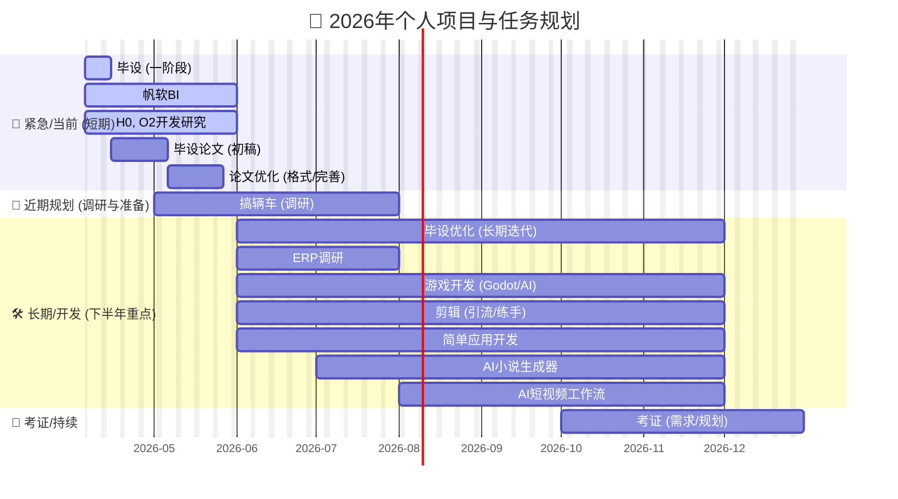

> **冲浪须知：**
>
> 以下无效无能无用内容禁止占用任何资源，发现即拉黑：
>
> - **涉政内容**，基本全部都是纯粹哗众取宠，只为擦边博流量，只停留于表面，根本无法带来任何有效提升，有深度的他不讲也讲不出，靠这个博大众流量的都是没水平的屁都讲不出
> - **贩卖焦虑的低质量引流课程**，只要带课程或者广告推广就不用看的，基本全部都是分析了半天什么都讲不出来，课程也是一等一的fw玩具项目，不如把几个流量大的直接原模原样复制下来，用一样的套路AI包装一下直接自己去卖课
> - **与自身关联度不高的社会事件（行业/社区）**，纯营销号，依旧只讲表面吸引流量，不如直接明目张胆抄，把视频扒下来交给AI重做一个大差不差的文案和嫖的AI视频缝合一下投了得了
> - **游戏社区的无意义争辩**，攻略和一般的meme还可以当消遣，这个就是纯粹浪费精力的同时什么都获取不到
> - **与他人争辩是非**，无论对方或者你的观点，论据对不对，互联网的争辩就不是冲着结果去的，屁用没有
> - **排行，社区reaction等**纯粹浪费时间的内容，纯粹无意义，不必多讲
> - **患得患失最不可取**，一旦陷入这个状态你的猪脑就不愿意动了，请上个厕所拉泡屎冷静一下，结合当下处境综合优势争取成功的概率以及收益最大化就行，输了也无妨，**千万不要扒拉着人生这栋大楼的一楼窗户以为自己摔下去就要私了**，在那里要死要活的狗叫，**清醒一点！**冷静下来了该干嘛干嘛去！
>
> 现在的流量其实非常好争取，只要去抄以上那些高流量但低质量的内容（他们压根就是流水线，根本没时间管，也不愿意管，更没脸管同行抄袭他们，所以只管抄）让AI总结**借鉴**出来一个大纲，然后将大纲再塞回AI让他完成借鉴的全部步骤就可以拿到流量卖钱了。

es，**mq**

nginx，git，docker，k8s

oss，支付模块，pgsql，MongoDB，hibernate

langchain4j，RAG，Agent

claudecode+glm，ComfyUI


毕设：HBase，STS，RocketMQ——一阶段完成

帆软BI，不一定一直搞，先简单看看课程，总结一个笔记就行

godot+AI简单学学——长期

剪映+AI玩一玩


当下目标：

| 项目           | 类型           | 明细                                                         | 目标                                                         | 开始日期  | 截止日期       |
| -------------- | -------------- | ------------------------------------------------------------ | ------------------------------------------------------------ | --------- | -------------- |
| **毕设**       | 短期（一阶段） | HBase，STS，RocketMQ                                         | 一阶段完成即可开始论文                                       | 当下      | 2026-4-15      |
| **毕设论文**   | 短期           | 将毕设一阶段写成论文形式展示，注意格式                       | 抓紧完成初稿，和老师核对                                     | 2026-4-15 | 2026-4-30      |
| **论文优化**   | 短期           | 完善论文                                                     | 格式等展现方式完善                                           | 2026-4-30 | 2026-5-15      |
| 毕设优化       | 长期           | 将后续列出的几阶段功能以及架构和对应的优化方案等内容完善并实现一下，还是很有意思的 | 慢慢完善一个个功能即可                                       | 2026-6-1  | 2026-12-1      |
| 帆软BI         | 短期           | 简单研究一下就行，需求不是很高，但是对接需求的时候一定要问好，这个才是真真要练到的东西！ | 先结合AI完成需求，同时学点有意思的功能                       | 当下      | BI模块转接他人 |
| H0，O2开发研究 | 短期           | 没多难，看看架构就行，不需要自己真全给写了                   | 研究报告，二次开发手册                                       | 当下      | 2026-6-1       |
| ERP调研        | 长期           | 看看公司里面用的这一套是怎么个事，这个不急，慢慢来熟悉一下就行，但是**一定要去做，要了解！** | 调研报告                                                     | 2026-6-1  | 2026-8-1       |
| 考证           | 长期           | 暂时不把详细的证书列出来，先看看自己需要什么，个人+公司要求结合起来，后续有具体任务了，每个都单列一个出来，记个笔记以及报告 | 个人证书需求调研报告+具体证书学习笔记                        | 2026-10-1 | ~              |
| 游戏开发       | 长期           | 先从godot开始做一个简单的AI跑团游戏就行，搭配AI做做玩玩，慢慢完善，感兴趣就接着做下去 | 短期：AI跑团游戏\|长期：游戏作品集                           | 2026-6-1  | 没兴趣为止     |
| 剪辑           | 长期           | 想要卖课引流剪辑还是少不了的，搭配AI开始简单学学             | 短期：练手作品集\|长期：B站，抖音等运营一个账号出来          | 2026-6-1  | ~              |
| AI短视频工作流 | 长期           | 利用comfyui+banana等实现一个短视频AI生产线，有点意思的项目，这里单列出来，相比别的idea更完整有意思 | 短视频AI生产线                                               | 2026-8-1  | 2026-12-1      |
| 简单应用开发   | 长期           | 有想法就记一下，多搭配AI，和AI一起完成项目的规划以及搭建，支援未来 | github投几个有点意思的项目，收点star想办法变现（卖课）/写入作品集 | 2026-6-1  | ~              |
| AI小说生成器   | 长期           | 结合小说强化的LLM/自己简单搞一个模型训练方案出来，做一个小说生成器，前端后端做完试验一下效果，慢慢优化完善功能，最终投到github，这里单列出来，相比别的idea更完整有意思 | web成品出来即可，后续考虑eletron或者app                      | 2026-7-1  | 2026-12-1      |
| 搞辆车         | 长期           | 买车做个调研，便宜又耐操，其实也就几个车里面挑一个就行       | 调研报告                                                     | 2026-5-1  | 2026-8-1       |

> **完成后剪切至最下面`已完成归档`内**

26.4.5示意图：




简单明细：

1. RocketMQ
2. grpc
3. 天机学堂
4. k8s
5. postgresql
6. 研究最具性价比的ECS方案
7. 研究一下GLM的coding plan 回头不管是web的开发还是游戏的开发甚至小说都玩玩
8. godot
9. 剪映


每天：

- **毕设优化（考虑微服务/先做一个ver.1应付毕业）**
- **学新的架构应用**
- **搞搞副业**
- **学点自己感兴趣的**


能的话尽量下面几条里搞

- DBA：OCA OCP OCM
- 架构：软考高架
- ERP：金蝶认证
- 网络：HCIE


> 毕设：
>
> 1. **webrtc好友间通话**——done
> 2. **hbase**
> 3. **ai接口**
>    
>    1. **简单模型调用**
>    2. **角色卡Prompt**
>    3. EX：根据chatLab拿到的性格分析生成AI好友
> 4. **OSS**（STS完善）
>    EX：盗刷防治：cdn转接做IP频次限制/直接阿里云WAF产品一步到位
>    cdn处理逻辑：
>
>    ```
>    用户 -> CDN 节点 -> (缓存命中) -> 用户
>    用户 -> CDN 节点 -> (缓存未命中) -> OSS 源站 -> CDN 节点 -> 用户
>    ```
>
>    - **用户下载的流量**：只算 **CDN 流量费**。
>    - **CDN 回源取数据的流量**：算 **OSS 回源流量费**（这个很便宜，约 0.15 元/GB，甚至某些套餐包包含回源流量）。
>    - **你不需要同时支付“OSS 外网流出”和“CDN 流出”两份全额费用。** 实际上，走了 CDN 后，OSS 的“外网流出流量”会大幅下降（只剩下回源那部分）。
> 5. **离线消息推送优化**（同时思考如何存储离线消息较好，保证无论何时登录都可以拿到离线之后的消息：**WebRTC实现多端消息同步**）——done
>    EX：避免回表的设计不错，但是使用Redis存储就不太好了，用postgresql改一下，降低Redis压力（做实验验证一下耗时差异，二次IO或许只会更慢，那就得不偿失了）
> 6. **RocketMQ做业务优化**
> 7. 共同好友
> 8. 附近用户
> 9. 用户签到
> 10. 朋友圈*
> 11. 聊天频道*
> 12. 加入ElasticSearch替换某些常用搜索场景（地理，ID，昵称）*
> 13. 利用WebRTC实现在线p2p多端消息同步*
> 14. 利用WebRTC实现在线文件传输*
> 15. 群组多人通话实现—Mesh/**SFU**/MCU*
> 16. EX：weClone/silly tavern引入实现个人AI暂替
> 17. EX：自制RAG搞点花里胡哨的
> 18. EX：chatLab引入实现聊天记录分析
> 19. EX：类oopz，kook的游戏频道一键组队
> 20. EX：微服务拆分-消息推送模块：**表层业务使用Redission/MQ/Rpc调用模块** + **Spring WebFlux**/Netty高度自制（不带mvc，仅注册nacos）（注意MQ的ack可能需要通知回发送者，同步RPC不用管）
>     若使用**MQ**实现消息推送的调用，那么就不需要springcloud那一套**rpc调用**了；对于前端**连接时**该模块的负载均衡，我们选择使用**Redis**存储并维护**在线ws服务器信息**（包括连接**负载状态**等），并使用自己的**负载均衡器**（**研究一下在高并发登录，分布式的环境下怎么实现正确的拿到当前压力较小的服务器**）选择哪个ws实例，不使用gateway做负载均衡了！（登录验证正确，http返回负载均衡器挑选的实例信息，前端使用其进行连接）这样就实现的消息推送模块与其他模块的最大化解耦
>     这个**负载均衡器**也是亮点，考虑怎么去实现高性能的一个轮询挑选器：
>     比如使用环形链表，AtomicInteger定位+volatile并发安全获取对应链表属性，RocketMQ监听netty服务注册（**分布式下不合适，这里的连接不是短连接而是长连接，这么做非常容易倾斜**）
>     那就使用redis的incr，根据node的list的长度取余直接拿node信息进行连接（**node长度频繁变动也不好，也会导致负载倾斜，但是小项目或者模块对应node基本不会轻易变动的话这个方案不错**）
>     再或者使用**平滑加权轮询 (Smooth Weighted Round-Robin)** ——将所有节点的 `current_weight` 加上 `weight`，选出最大的那个，然后将其 `current_weight` 减去 `total_weight`（**计算负载压力，但是一旦node比较多，这个的耗时就会比较大，然后就会导致业务主线程阻塞了**）
>     **这里思考前端维护用户与推送模块的映射关系如何，后端的redis干脆直接不存连接关系了，直接http接口拿到node信息然后推到node对应的mq队列就完事**
> 21. EX：微服务拆分-消息存储模块：**表层业务使用MQ异步调用模块**处理消息写入mysql + RPC调用查询mysql近期消息 + 定时处理往期消息写入HBase + 提供HBase慢查询往期消息（**往期消息考虑再分模块**）
> 22. EX：微服务拆分-通话会议模块：提供sdp+ice候选的信息传递（MQ通知指定推送模块），会议的SFU的Jitsi/Pion服务表层封装
> 23. EX：微服务拆分-消息文件模块：提供聊天消息的表层业务处理（MQ调用消息推送以及消息存储）+OSS的STS令牌颁发
> 24. EX：微服务拆分-用户信息模块：一些基础配置（群组+用户）
> 25. EX：对sqlite数据库进行加密做**安全防范**
> 26. EX：**gRPC**实现crud接口相互调用


> 假如真不行还想留在行业里准备**前端**转**全栈**，再学**运维**
>
> 看看**鸿蒙**和**安卓**有没有说法
>
> 准备向ai方向上靠，重点关注agent，prompt，RAG，llm，mcp以及工作流这些简单的ai**应用**级别的
>
> ​	文生图，视频工作流：ComfyUI
>

AI的应用开发：先从扣子看起，它搞的几个还挺有意思的


真做全栈，前端先从自己的**个人web**开始做起，使用GLM试试


> 游戏：Unity，ue，godot，Blender，服务端
>
> 桌面：Qt，.Net，winform
>
> 剪辑：pr，ae，剪映
>
> APP：ios的开发看看能不能应用市场卖钱


## 副业

**小说：**

1. 若智AI小说
2. 卖自动AI小说生成

**流量大业：**

1. 若智AI短视频/漫画视频
2. 引流狗视频


## 已完成归档

