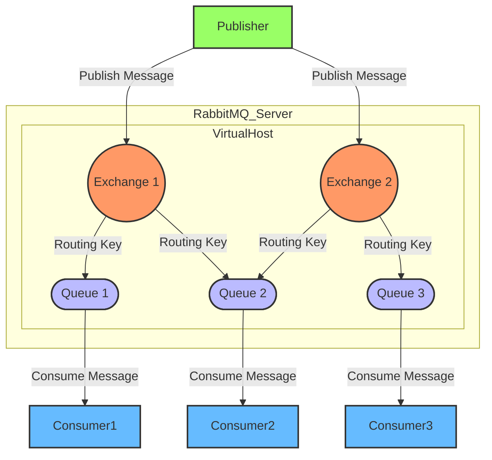
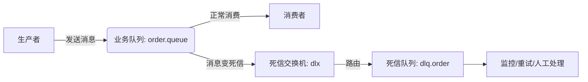

**消息队列**（Message Queue，简称 MQ）是一种在分布式系统中广泛使用的中间件技术，它的核心作用是**解耦、异步处理和削峰填谷**。以下是需要消息队列的主要原因：

| **作用**                | **说明**                                                     | **典型应用场景**                          |
| :---------------------- | :----------------------------------------------------------- | :---------------------------------------- |
| **系统解耦**            | 生产者与消费者无需直接通信，降低服务间依赖                   | 订单服务 → 库存、物流、通知等多个下游服务 |
| **异步处理**            | 将耗时操作转为后台任务，提升响应速度和吞吐量                 | 用户注册后异步发送邮件、初始化数据        |
| **流量削峰（缓冲）**    | 高并发请求暂存于队列，后端按能力消费，防止系统崩溃           | 秒杀、抢购、大促等突发流量场景            |
| **最终一致性**          | 通过可靠消息实现分布式事务的最终一致性，避免强一致性带来的复杂性 | 跨账户转账、订单支付后更新库存            |
| **事件驱动 & 日志收集** | 支持基于事件的架构，便于扩展；集中收集日志或行为数据用于分析 | 用户行为追踪、系统监控、大数据分析        |

> 💡 **适用条件**：当系统存在**高耦合、同步阻塞、流量突刺或需异步/事件驱动**等问题时，引入消息队列可显著提升稳定性与可维护性。

几种MQ的对比：

| 特性 / 产品      | **RabbitMQ**                             | **Apache Kafka**                         | **Apache RocketMQ**                  | **Apache Pulsar**                        |
| :--------------- | :--------------------------------------- | :--------------------------------------- | :----------------------------------- | :--------------------------------------- |
| **开发语言**     | Erlang                                   | Scala / Java                             | Java                                 | Java (Broker), C++ (BookKeeper)          |
| **消息模型**     | AMQP（支持多种协议：STOMP、MQTT 等）     | 发布-订阅（基于日志的流式模型）          | 发布-订阅 + 点对点                   | 统一支持 Queue 和 Stream（分层架构）     |
| **吞吐量**       | 中等（万级 QPS）                         | 极高（百万级 QPS）                       | 高（十万~百万级 QPS）                | 高（接近 Kafka，支持多租户）             |
| **延迟**         | 低（毫秒级）                             | 中（通常几毫秒到几十毫秒）               | 低（毫秒级）                         | 低（毫秒级）                             |
| **持久化**       | 支持（可配置）                           | 强持久化（写磁盘 + 分段日志）            | 强持久化（CommitLog + ConsumeQueue） | 强持久化（基于 BookKeeper，分层存储）    |
| **可靠性**       | 高（支持 ACK、持久队列、镜像队列）       | 高（副本机制，但早期版本有数据丢失风险） | 高（同步/异步刷盘，主从架构）        | 极高（计算与存储分离，自动故障恢复）     |
| **事务支持**     | 不支持原生事务（可通过插件或应用层实现） | 仅支持幂等和 Exactly-Once（0.11+）       | ✅ 支持分布式事务消息                 | 支持（通过 Pulsar Functions 或外部协调） |
| **顺序消息**     | 不天然支持（需单队列单消费者模拟）       | ✅ 分区内严格有序                         | ✅ 全局/分区顺序消息                  | ✅ 分区内有序                             |
| **扩展性**       | 一般（集群扩展较复杂）                   | 高（水平扩展方便）                       | 高（支持 NameServer 动态发现）       | 极高（无状态 Broker，存储独立扩展）      |
| **运维复杂度**   | 中等                                     | 中等（依赖 ZooKeeper）                   | 中等                                 | 较高（依赖 BookKeeper，组件较多）        |
| **社区 & 生态**  | 成熟，文档丰富，插件多                   | 非常活跃，大数据生态集成好（如 Flink）   | 阿里系强大，国内生态好               | 新兴，云原生友好，增长迅速               |
| **典型使用场景** | 企业应用、任务队列、中小规模异步解耦     | 日志收集、流处理、大数据管道             | 电商交易、金融支付、高可靠事务场景   | 多租户、混合负载（队列+流）、云原生架构  |

简要总结：

| **需求场景**                     | **推荐 MQ**  |
| :------------------------------- | :----------- |
| 需要灵活协议、强路由、低延迟     | **RabbitMQ** |
| 高吞吐、日志/事件流、大数据处理  | **Kafka**    |
| 金融级事务、顺序消息、国产可控   | **RocketMQ** |
| 云原生、多租户、统一队列与流处理 | **Pulsar**   |


### RabbitMQ

#### 安装与部署

官网：[RabbitMQ: One broker to queue them all | RabbitMQ](https://www.rabbitmq.com/)

我们也可以直接用docker运行容器来完成部署：[rabbitmq - Official Image | Docker Hub](https://hub.docker.com/_/rabbitmq)

```Shell
docker run \
 -e RABBITMQ_DEFAULT_USER=itheima \
 -e RABBITMQ_DEFAULT_PASS=123321 \
 -v mq-plugins:/plugins \				# 这里是挂载到数据卷上
 --name mq \
 --hostname mq \
 -p 15672:15672 \
 -p 5672:5672 \
 --network hm-net\
 -d \
 rabbitmq:3.8-management
```

> 无法直连docker导致pull不下来，考虑使用网上提供的tar包，然后
>
> ```bash
> docker load -i [tar包名称]
> ```

可以看到在安装命令中有两个映射的端口：

- 15672：RabbitMQ提供的管理控制台的端口
- 5672：RabbitMQ的消息发送处理接口

然后访问15672端口即可访问控制台界面：[RabbitMQ Management](http://192.168.0.200:15672/)，输入设置的账号密码即可进入页面。


#### 整体架构



> 生产者——>交换机——>队列——>消费者，**生产者不会直接将消息发送到队列而是由交换机转接**，可以简单将交换机理解为**发送策略**，指定发送消息的队列范围（和这个交换机绑定的队列）以及口令（根据RoutingKey通过绑定BingingKey选择队列）

| 组件                      | 说明                                                         |
| ------------------------- | ------------------------------------------------------------ |
| 1. **Producer**（生产者） | 消息的发送方，通过Client将消息发布到 RabbitMQ 的 Exchange（交换机），不直接发送到队列。 |
| 2. **Consumer**（消费者） | 消息的接收方，通过Client从 Queue（队列）中拉取或订阅消息进行处理。支持多个消费者并发消费（轮询或公平分发）。 |
| 3. Broker                 | RabbitMQ 服务实例本身，负责接收、路由、存储和投递消息。一个 Broker 可包含多个 Virtual Host。 |
| 4. Virtual Host（vhost）  | 虚拟主机，用于逻辑隔离不同应用或租户。每个 vhost 拥有独立的 Exchange、Queue、Binding 和权限体系，类似“命名空间”（**一个MQ一般一个项目用不完，可复用于多个项目/团队，这时候就用这个“namespace”作为最高隔离等级区分一下空间**） |
| 5. **Exchange**（交换机） | 消息的路由中心。接收生产者的消息，并根据类型 + 路由规则将消息分发到一个或多个队列。常见类型：  - `Direct`：**精确匹配 Routing Key**  - `Fanout`：**广播到所有绑定队列**  - `Topic`：**通配符匹配**（如 `*.error`）  - `Headers`：**基于消息头属性匹配**（较少用） |
| 6. **Queue**（队列）      | 消息的存储容器。消息在被消费前持久化在此（可配置内存或磁盘）。每个队列可绑定多个 Exchange。 |
| 7. **Binding**（绑定）    | 定义 Exchange 与 Queue 之间的关联规则，通常包含 Routing Key 或匹配模式。 |
| 8. Connection & Channel   | - Connection：客户端（Producer/Consumer）与 Broker 之间的 TCP 长连接。  - Channel：轻量级虚拟连接，复用同一个 TCP 连接，用于并发操作（如同时声明多个队列）。 |
| 9. Message（消息）        | 由 Payload（数据体） + Properties（元数据，如 routing key、priority、TTL 等） 组成。 |

----

**简要流程：**

1. **生产者** 建立 **Connection**，创建 **Channel**；
2. 通过 Channel 将 **Message** 发送到指定的 **Exchange**，并附带 **Routing Key**；
3. **Exchange** 根据类型和 **Binding 规则**，将消息路由到一个或多个 **Queue**；
4. **消费者** 建立 Connection/Channel，监听目标 Queue；
5. 消费者从 Queue 中获取消息，处理完成后发送 **ACK**；
6. Broker 收到 ACK 后，从 Queue 中删除该消息（若未 ACK，可能重新入队或进入死信队列）。

> ✅ **关键特性支持**：
>
> - **持久化**：Exchange、Queue、Message 可设为持久化，防止 Broker 重启丢失。
> - **ACK 机制**：确保消息被成功处理。
> - **死信队列（DLX）**：处理失败/过期消息。
> - **优先级队列**：VIP 用户消息优先处理。
> - **集群与高可用**：支持普通集群、镜像队列、Quorum 队列。

----

**部署类型：**

| 模式                          | 说明                                                         |
| :---------------------------- | :----------------------------------------------------------- |
| **单机模式**                  | 开发/测试使用，无高可用。                                    |
| **普通集群**                  | 多节点共享元数据（Exchange/Binding），但 Queue 数据只存在于一个节点。 |
| **镜像队列集群**              | Queue 数据在多个节点同步（主从复制），实现高可用（牺牲吞吐）。 |
| **Quorum 队列（推荐新项目）** | 基于 Raft 协议，强一致性、自动故障转移，替代镜像队列。       |


#### 简要理解

 **生产者（Producer）视角：**

> “我只管把消息发给「交换机」，不用知道谁会收到。”

1. 创建一条消息
2. 发给指定的 **Exchange（交换机）**，并附上一个 **Routing Key**（路由关键字）
3. 完事！不关心消息去哪、有没有人收

------

**消费者（Consumer）视角：**

> “我只管从「队列」里拿消息，不用知道是谁发的。”

1. 告诉 RabbitMQ：“我要监听某个 **Queue（队列）**”
2. 一旦队列有消息，就取出来处理
3. 处理完告诉 RabbitMQ：“收到了！”（ACK）
4. 完事！不关心消息从哪来、谁发的

------

 **🔗 中间发生了什么？（RabbitMQ 负责）**

- Exchange 根据 **Routing Key + 绑定规则（Binding）**，把消息自动投递到对应的 Queue
- 一个消息可以被多个队列收到（比如广播），也可以只进一个队列（比如点对点）

------

 **✅ 一句话总结：**

> **生产者 → 发给交换机**，**消费者 ← 从队列取**，中间路由由 RabbitMQ 自动搞定，双方完全解耦！


### 配置相关

#### 配置队列以及交换机

在RabbitMQ提供的可视化web页面：[RabbitMQ Management](http://192.168.0.200:15672/)，我们可以来到`Queues`标签页，在下方的队列管理分页界面我们只需要点点点就可以完成队列的相关配置了。

然后我们来到`Exchanges`标签页，在这里的管理界面我们同样也可以通过点点点实现对交换机的管理，我们先前提到**消息**进入broker后去到生产者指定的`vhost`然后就是`Exchanges`了，但是接下来我们的消息要怎么去到**消费者**能够**订阅获取**的**`Queues`**呢？

RabbitMQ的方案是提供了**`Exchanges`与`Queues`之间的绑定关系：`Bindings`**，通过这个绑定，我们将`Exchanges`与`Queues`联系起来，以后`Exchanges`只要收到消息就根据生产者附带的`Routing Key`将消息交给指定的`Queues`了。

而想要**实现一个`Bindings`**也很简单，只需要在`Exchange`标签页点开需要设置的那个`Exchange`，然后再点开下方的`Bindings`，配置好`Binding`指定的`Queue`和`Routing Key`以及相关参数即可完成配置。


#### 配置数据隔离

之前我们提到一般一个MQ会用于多个项目，这时候就需要我们去配置一个虚拟主机vhost来区分不同项目的空间环境，想要配置不同的vhost，我们只需要来到可视化web界面，点击最右侧的`Admin`标签页，然后就可以在这个页面完成配置了。

在RabbitMQ中，为了实现权限管理以及功能区分，专门配备了一个身份`User`，每个User都被指定了：

- 能否访问某个 **Virtual Host**
- 能否 **读（消费）** 队列
- 能否 **写（发布）** 到交换机
- 能否 **配置（声明/删除）** Exchange 或 Queue

> **User 是访问 RabbitMQ 的“通行证”，用来控制“谁可以做什么”**，可以理解为OSS的令牌。

每个用户在每个 vhost 上都有三个权限位：

| 权限类型      | 作用                                     | 示例                        |
| :------------ | :--------------------------------------- | :-------------------------- |
| **Configure** | 是否能声明/删除 Exchange、Queue、Binding | 声明 `order.queue`          |
| **Write**     | 是否能向 Exchange **发送**消息           | 发布消息到 `order.exchange` |
| **Read**      | 是否能从 Queue **消费**消息              | 从 `order.queue` 拉取消息   |

> 💡 默认情况下，RabbitMQ 只有一个用户：`guest` / `guest`，**但该用户只能从 localhost 登录**，生产环境必须创建新用户！

那么现在我们想要去为一个项目配置一个`Virtual Host`，使得他的`User`能够访问这个空间里面的交换机`Exchange`，我们只需要来到MQ的可视化web界面：

1. 在`User`标签页为这个**项目**创建一个`Virtual Host`（这时已生成了默认的`Exchange`交换机）
2. 为计划的几个业务配置对应的`User`，将自己的`Virtual Host`的相应访问access赋予这些用户
3. 在`Queues`标签页配置对应的业务`Queue`，配置好其的`Virtual Host`（`Bindings`会自动绑定到默认的default交换机）
4. 在`Exchange`标签页完成相应交换机的创建，`Bindings`配置与指定`Queue`的绑定关系

然后生产者就可以发送消息到交换机；消费者就可以订阅对应的队列

> 嫌其他项目的`Virtual Host`相关内容太多可以在右上角选择仅展示某一`Virtual Host`的内容


### Java Client

#### 引入依赖

```xml
        <!--AMQP依赖，包含RabbitMQ-->
        <dependency>
            <groupId>org.springframework.boot</groupId>
            <artifactId>spring-boot-starter-amqp</artifactId>
        </dependency>
```

#### 配置YML

在application中设置好client的用户信息：

```yml
spring:
  rabbitmq:
    host: 192.168.0.200 # 你的虚拟机IP
    port: 5672 # 端口
    virtual-host: /hmall # 虚拟主机
    username: hmall # 用户名
    password: 123 # 密码
```

> 一般情况下一个项目只会使用一个虚拟主机，我们为不同的微服务配置指定的用户即可


#### 生产者发送消息

```java
@SpringBootTest
class PublisherApplicationTest {

    @Autowired
    private RabbitTemplate rabbitTemplate;

    @Test
    public void testMain() {
        String queueName = "simple.queue";
        String message = "Hello World!";
        rabbitTemplate.convertAndSend(queueName, message);
    }
}
```

> **生产者不应该发到交换机吗？为什么指定队列名就可以直接发送消息了？**
>
> 当你**直接指定队列名**发送消息时，`RabbitTemplate` 会自动使用 RabbitMQ 内置的「**默认交换机（Default Exchange）**」，并将 routing key 设为队列名。这是合法且常用的做法。
>
> **默认交换机（Default Exchange）**会在创建完成一个虚拟主机时也一同生成，其属于该虚拟主机，**RabbitMQ 的默认交换机（Default Exchange）会自动绑定到每一个队列（Queue）**，而且这个过程是**隐式的、不可见的、无法删除或修改的**。
>
> 底层实际等价于：
>
> ```java
> rabbitTemplate.convertAndSend("", "simple.queue", "Hello!");
> //            				   ↑交换机   ↑routing key
> ```
>
> - 交换机：`""`（默认 direct 交换机）
> - Routing Key：`"simple.queue"`
> - 消息被路由到名为 `simple.queue` 的队列
>
> ✅ 这完全符合 direct 交换机的匹配规则（精确匹配 routing key）。
>
> 这种方式能成功，**必须满足**：
>
> 1. 队列 `simple.queue`已经存在（RabbitMQ 不会自动创建队列！）
>
>    - 如果队列不存在，消息会被**静默丢弃**（因为默认交换机无法路由）
>    
> 2. 你确实想实现 **“直接发到某个队列”** 的简单模式（无 **fanout广播**/**topic通配符匹配** 等复杂路由）


#### 消费者订阅队列

```java
@Component
@Slf4j
public class MQListener {
    
    @RabbitListener(queues = "simple.queue")
    public void listen(String message) {
        log.info("接收到消息：{}", message);
    }
}
```

在完成依赖导入后，我们只需要保证连接配置正确，就可以让这个Bean实例能够监听到指定消息队列的消息，实际上一个方法可以监听多条消息队列（传入`List<String>`即可）。


#### 消费者负载均衡

在实际生产中我们会为一个队列配备多个消费者来完成多个生产者发布的任务，而就像Nacos选择微服务实例会通过LoadBalancer进行**负载均衡**一样，监听**同一队列**的消费者也会进行负载均衡，默认情况下是**轮询**，也即每个消费者**轮流**取出一个消息并**完成业务以后**下一个消费者取消息操作。但是实际环境中，并非所有消费者服务的性能是一样的，这就会导致有些性能好的消费者必须等待其他消费服务实例完成任务后才轮得到自己，使得他们的性能被**浪费**了。

针对这一种情况，RabbitMQ其实也提供了一种负载均衡模式：**能者多劳**：每个消费者服务每次只获取一条消息，处理完成就会获取下一条消息。想要配置这样一种模式，我们只需要到配置文件application中去修改模式：

```YAML
spring:
  rabbitmq:
    listener:
      simple:
        prefetch: 1 # 每次只能获取一条消息，处理完成才能获取下一个消息
```

这样就可以让性能更佳的消费者实例去尽可能的完成任务了。

实际上，RabbitMQ **总是按顺序从队列头部取出消息，并依次尝试分发给消费者** —— 这个过程**本身是轮询式的**。

但关键在于：**是否允许把消息发给某个消费者？**

- **如果没有 prefetch 限制**：
  RabbitMQ 会一口气把所有消息按轮询顺序推给消费者（比如 C1、C2、C1、C2...），但因为网络/缓冲区原因，往往第一个消费者拿走大部分。
- **如果设置了 `prefetch = 1`**：
  RabbitMQ 仍然按轮询顺序尝试派发，但**只有当消费者未确认消息数 < 1 时，才真正发送**。
  → 如果 C1 还没 ACK，即使轮到它，也不发；转而发给 C2（如果 C2 空闲）。

✅ 所以：**底层仍是轮询尝试，但实际派发受 prefetch + ACK 状态控制**。

> **RabbitMQ一个队列的多个消费者默认采用「轮询分发」（Round-Robin） + 「自动 ACK」或「手动 ACK」下的「公平分发」（Fair Dispatch）**
>
> **情况 1：自动 ACK 模式（autoAck = true）**
>
> - RabbitMQ 采用简单的轮询（Round-Robin）：
>   - 消息 1 → Consumer A
>   - 消息 2 → Consumer B
>   - 消息 3 → Consumer A
>   - ...
> - ❌ **问题**：如果 Consumer A 处理慢，Consumer B 处理快，会导致 A 堆积、B 空闲 —— **不公平！**
>
> **情况 2：手动 ACK 模式（autoAck = false） + 设置 prefetch（推荐！）**
>
> - RabbitMQ 采用基于 prefetch 的公平分发（Fair Dispatch）：
>   - 只有当消费者**未确认的消息数 < prefetch count** 时，才给它发新消息
>   - 处理快的消费者会拿到更多消息，处理慢的则少拿
>   - ✅ 实现**动态负载均衡**
>
> 📌 **结论**：
> **真正的“负载均衡”依赖于 `manual ACK + prefetch`，而不是简单的轮询！**


### 三种发送类型

#### Fanout交换机广播

先前我们完成了生产者对单队列的消息传递，但是如果我们希望将消息**同时**传递给多个队列怎么办？我们可以直接传一个`List<String>`参数进去直接让默认交换机进行广播吗？答案是**不行**！

> **默认交换机是 `direct` 类型，且每个队列只能通过「自己的名字」作为 routing key 被单独访问 —— 它根本不支持广播语义。**

那么我们就需要去自制交换机，并将需要传递消息的队列与之绑定，然后再在client将信息发送给他以完成广播：

```java
@Test
public void testMain() {
    String exchangename = "hmall.fanout";
    String message = "H5165";
    rabbitTemplate.convertAndSend(exchangename, "", message);
}
```

> **在 Fanout Exchange 中，`routing key` 完全被忽略 —— 无论你发什么 routing key（包括空字符串），消息都会广播给所有绑定的队列。**

`hmall.fanout`交换机绑定了`fanout.queue1`以及`fanout.queue2`，生产者将消息发送给`hmall.fanout`交换机即可将消息传递给两个队列。

```java
@RabbitListener(queues = "fanout.queue1")
public void listen2(String message) {
    log.info("1接收到消息：{}", message);
}

@RabbitListener(queues = "fanout.queue2")
public void listen3(String message) {
    log.info("2接收到消息：{}", message);
}
```

消费者只需要正常监听即可。


#### Direct定向发送

我们说对于绑定的队列我们**不希望进行无脑广播**，我们要挑着来，有的队列我们要发，有的队列我们不发，那该怎么搞？RabbitMQ提供的方案是给`Bindings`加上属性`Routing Key`，倘若这个`Routing Key`符合要求那就发。

> 注意一个交换机和一个队列之间可以**多次绑定**，**绑定多种**`Routing Key`，总之就是很灵活

如果我们对于`Routing Key`的要求是**完全一致**，那么我们就可以使用RabbitMQ提供的**Direct**类型交换机，他就会对自己绑定的所有队列通过**内部索引快速查找**符合要求的`Binding`并给其所对应的队列发送消息：

准备一个交换机hmall.direct，将之与队列direct.queue1和direct.queue2绑定，规则：

| To              | Routing key |
| :-------------- | :---------- |
| [direct.queue1] | 123         |
| [direct.queue1] | 5           |
| [direct.queue2] | 321         |
| [direct.queue2] | 5           |

```java
@Test
public void testMain() {
    String exchangename = "hmall.direct";
    String message = "H5165";
    rabbitTemplate.convertAndSend(exchangename, "123", message);
}
```

> rabbitTemplate.convertAndSend的参数为
>
> - 交换机name
> - Routing Key
> - 消息Obj

```java
@RabbitListener(queues = "direct.queue1")
public void listen4(String message) {
    log.info("1接收到消息：{}", message);
}

@RabbitListener(queues = "direct.queue2")
public void listen5(String message) {
    log.info("2接收到消息：{}", message);
}
```

当使用5作为Routing Key时发现两个绑定的队列都收到消息，使用123或321就会发现只有一个收到了消息。


#### Topic话题通配发送

我们说RoutingKey直接完全相等还是太粗暴了，是否可以通配符来匹配RoutingKey实现指定队列的绑定呢？可以的xd，RabbitMQ就提供了Topic类型的交换机来指定通配规则RoutingKey：

- `#`：匹配一个或多个词
- `*`：匹配不多不少恰好1个词

RoutingKey举例：

- `item.#`：能够匹配`item.spu.insert` 或者 `item.spu`
- `item.*`：只能匹配`item.spu`

完成交换机以及队列的创建以及绑定后，在Client的使用上和前两种方式没什么区别。


#### 简单总结

**生产者：**对于只希望**简单的**发送到**一个队列**的生产者，实际上我们可以通过虚拟主机生成时的**默认交换机**直接发送到指定的队列，client中也不需要指定Exchange，只需要输入routing key（即队列name）以及消息内容接口。

> **默认交换机是 `direct` 类型，且每个队列只能通过「自己的名字」作为 routing key 被单独访问 —— 它根本不支持广播语义。**原文解释：
>
> **Default exchange**
>
> The default exchange is implicitly bound to **every** queue, with a **routing key equal to the queue name**. It is not possible to explicitly bind to, or unbind from the default exchange. It also cannot be deleted.

如果希望**复杂**发送，比如进行虚拟主机内全广播或者指定多条队列传递消息，那就需要去自定义交换机并绑定那几条队列，然后用client将消息传递给这个Exchange以完成消息发送，RabbitMQ提供的几种交换机类型：

| 交换机类型     | 英文名    | 路由规则                                        | 典型用途                                           |
| :------------- | :-------- | :---------------------------------------------- | :------------------------------------------------- |
| **直连交换机** | `Direct`  | **精确匹配** routing key                        | 点对点任务、按类型分发（如订单创建/取消）          |
| **扇出交换机** | `Fanout`  | **忽略 routing key，广播到所有绑定队列**        | 广播通知（短信、邮件、日志）                       |
| **主题交换机** | `Topic`   | **通配符模糊匹配** routing key                  | 多维度分类（如 `log.error.api`、`stock.usd.nyse`） |
| **头交换机**   | `Headers` | **基于消息 headers 属性匹配**（非 routing key） | 复杂条件路由（极少使用）                           |

> 其实可以将交换机看作一种给队列传递消息的**策略**

对于Java的Client，我们只需要使用`rabbitTemplate.convertAndSend()`去发送给**交换机**并带上**RoutingKey**和**消息Obj**即可。

**消费者：**只管监听自己负责消费的队列即可：

```java
@RabbitListener(queues = "{队列name}")
public void listen4({设置的对应消息Obj类型} message) {
    // 对应业务
}
```


### 代码声明队列及交换机

人工到可视化web界面中去进行操作还是太慢太low了，其实我们可以通过amqp提供的接口实现交换机以及队列的生成，还可以管理他们之间的连接以及配置规则RoutingKey，这样我们只需要在消费者服务启动时生成即可。

#### 基于Bean声明

废话不多说，见代码：

```java
@Configuration
public class FanoutConfig {

    @Bean
    public FanoutExchange fanoutExchange() {
        return new FanoutExchange("fanout.exchange");
    }

    @Bean
    public Queue fanoutQueue1() {
        return new Queue("fanout.queue1");
    }

    @Bean
    public Binding fanoutBinding1(Queue fanoutQueue1, FanoutExchange fanoutExchange) {
        return BindingBuilder.bind(fanoutQueue1).to(fanoutExchange);
    }

}
```

> `@Bean`注解必须在`@Configuration`类中才会被扫描

可以看到甚至连**Binding**也是作为**Bean实例**被声明出来的。

----

如果是**Direct**类型：

```java
@Bean
public DirectExchange directExchange() {
    return new DirectExchange("direct.exchange");
}

@Bean
public Queue directQueue1() {
    return new Queue("direct.queue1");
}

@Bean
public Binding directBinding1(Queue directQueue1, DirectExchange directExchange) {
    return BindingBuilder.bind(directQueue1).to(directExchange).with("123");
}
```

绑定时使用**with**指定**RoutingKey**即可。

----

生成绑定时使用了Binding**Builder**返回一个新的实例，其实在交换机以及队列上也可以如此：

```java
@Bean
public FanoutExchange fanoutExchange() {
    return ExchangeBuilder.fanoutExchange("fanout.exchange").durable(true).build();
}

@Bean
public Queue fanoutQueue1() {
    return QueueBuilder.durable("fanout.queue1").build();
}
```


#### 基于注解声明

上面的Bean声明队列交换机以及绑定还要额外搞一个Configuration，有点麻烦，其实我们也可以直接在监听类中直接一步到位：

```java
@RabbitListener(bindings = @QueueBinding(
        value = @Queue(name = "direct.queue1"),
        exchange = @Exchange(name = "hmall.direct", type = ExchangeTypes.DIRECT),
        key = {"red", "blue"}
))
public void listenDirectQueue1(String msg){
    System.out.println("消费者1接收到direct.queue1的消息：【" + msg + "】");
}

@RabbitListener(bindings = @QueueBinding(
        value = @Queue(name = "direct.queue2"),
        exchange = @Exchange(name = "hmall.direct", type = ExchangeTypes.DIRECT),
        key = {"red", "yellow"}
))
public void listenDirectQueue2(String msg){
    System.out.println("消费者2接收到direct.queue2的消息：【" + msg + "】");
}
```

> 类型默认为DIRECT

也可以使用TOPIC：

```Java
@RabbitListener(bindings = @QueueBinding(
    value = @Queue(name = "topic.queue1"),
    exchange = @Exchange(name = "hmall.topic", type = ExchangeTypes.TOPIC),
    key = "china.#"
))
public void listenTopicQueue1(String msg){
    System.out.println("消费者1接收到topic.queue1的消息：【" + msg + "】");
}

@RabbitListener(bindings = @QueueBinding(
    value = @Queue(name = "topic.queue2"),
    exchange = @Exchange(name = "hmall.topic", type = ExchangeTypes.TOPIC),
    key = "#.news"
))
public void listenTopicQueue2(String msg){
    System.out.println("消费者2接收到topic.queue2的消息：【" + msg + "】");
}
```

FANOUT也是同理（且不需要key），只需根据交换机类型进行type的修改即可。


### 消息内容序列化

生产者使用convertAndSend发送消息时，我们发现消息内容是Object，这意味着我们不懂那可以使用String以及Integer等类型，还可以使用自定的数据结构来传输数据，这时候就需要序列化以及反序列化了。原版使用的是**`SimpleMessageConverter`**，这玩意基于JDK自己实现的序列化实现，JDK自带的序列化带有几个缺点：

- 数据体积过大
- 有安全漏洞
- 可读性差

那么我们就得换一个序列化器：Jackson2JsonMessageConverter，首先引入jackson的依赖：

```XML
<dependency>
    <groupId>com.fasterxml.jackson.dataformat</groupId>
    <artifactId>jackson-dataformat-xml</artifactId>
    <version>2.9.10</version>
</dependency>
```

然后在一个`@Configuration`类中注入一个Bean即可完成序列化器的配置：

```Java
@Bean
public MessageConverter messageConverter(){
    // 1.定义消息转换器
    Jackson2JsonMessageConverter jackson2JsonMessageConverter = new Jackson2JsonMessageConverter();
    // 2.配置自动创建消息id，用于识别不同消息，也可以在业务中基于ID判断是否是重复消息
    jackson2JsonMessageConverter.setCreateMessageIds(true);
    return jackson2JsonMessageConverter;
}
```

> 在 `spring-boot-starter-amqp` 中，默认使用：
>
> - **`SimpleMessageConverter`**（旧版）或
> - **`Jackson2JsonMessageConverter`**（推荐，Spring Boot 2.0+ 自动配置）
>
> 也即只要使用了2.0+的`spring-boot-starter-web`就自动配置Jackson了。


### MQ的应用场景

首先是**不适合**的场景：

| 场景                           | 原因                         |
| :----------------------------- | :--------------------------- |
| 强一致性要求（如银行核心交易） | MQ 通常只保证最终一致        |
| 超低延迟要求（<1ms）           | 网络 + 持久化带来额外开销    |
| 简单单体应用                   | 引入 MQ 增加复杂度，得不偿失 |

**这样的场景尽量避免使用MQ**平白无故增加复杂度！

MQ的核心是**异步**，将本次业务逻辑中**不是必须立刻完成并返回的操作**交给消息队列，等后面再说，也即**不阻塞当前线程**。
符合这一要求的业务操作都可以考虑使用MQ进行优化：

| **场景需求**      | **核心目的**         | **典型示例**                                        |
| :---------------- | :------------------- | :-------------------------------------------------- |
| **系统解耦**      | 消除服务间强依赖     | 用户注册 → 邮件服务、积分服务、日志服务各自独立消费 |
| **异步处理**      | 提升响应速度与吞吐量 | 下单后立即返回，后台异步扣库存、发通知              |
| **流量削峰**      | 抵御突发高并发       | 秒杀请求先入队，订单服务匀速处理                    |
| **最终一致性**    | 跨服务数据一致       | 支付成功 → 发消息 → 库存服务扣减（失败可重试）      |
| **事件广播**      | 一对多通知           | 配置更新事件 → 所有微服务监听并刷新缓存             |
| **任务队列**      | 后台执行耗时作业     | 视频上传 → 入队 → 转码服务异步处理                  |
| **日志/数据管道** | 高吞吐数据收集       | 应用日志 → MQ → ELK 或 Flink 实时分析               |

注意以下常踩的坑：

| 风险         | 解决方案                                                     |
| :----------- | :----------------------------------------------------------- |
| **消息丢失** | - 消息持久化 - 生产者确认（Publisher Confirm） - 消费者手动 ACK |
| **重复消费** | - 消费者实现**幂等性**（如用订单ID去重）                     |
| **顺序错乱** | - 单队列单消费者保序 - 或用 RocketMQ/Kafka 分区保序          |
| **调试困难** | - 完善日志追踪（TraceID 透传） - 使用消息轨迹工具            |
| **过度异步** | - 不要所有操作都异步！核心步骤（如扣款）仍需同步校验         |

最后虽然我们可以在消费者服务中进行二次校验，但还是尽量避免出现**过早提交异步操作**，结果后面当前线程业务**出错导致需要回滚**的情况出现，考虑将异步操作的提交放到**完全校验的后面**！

> **“只有当本地业务逻辑（包括数据库事务）完全成功提交后，才发送异步消息。”**
> **绝不能在事务提交前发消息，否则会导致「数据不一致」。**


### 生产者可靠性

有时**生产者发送消息**会出现意外，RabbitMQ提供了一些处理方案：

#### 生产者重试

有时候生产者会和MQ断连，这时候就需要**自动重连**，而且生产者发送消息也会出现无法到达的情况，这时候也需要**消息重试**：

```YAML
spring:
  rabbitmq:
    connection-timeout: 1s # 设置MQ的连接超时时间
    template:
      retry:
        enabled: true # 开启超时重试机制
        initial-interval: 1000ms # 失败后的初始等待时间
        multiplier: 1 # 失败后下次的等待时长倍数，下次等待时长 = initial-interval * multiplier
        max-attempts: 3 # 最大重试次数
```

就是**消息没发成功就重试**

> 以上为默认配置，如有需求可以声明修改


#### 生产者确认

一般情况下，只要生产者与MQ之间的网路连接顺畅，基本不会出现发送消息丢失的情况，因此大多数情况下我们无需考虑这种问题。
不过，在少数情况下，也会出现消息发送到MQ之后丢失的现象，比如：

- 生产者发送消息到达MQ后未找到`Exchange`
- 生产者发送消息到达MQ的`Exchange`后，未找到合适的`Queue`，因此无法路由（**路由失败**）
- MQ内部处理消息的进程发生了异常

针对上述情况，RabbitMQ提供了生产者消息确认机制，包括`Publisher Confirm`和`Publisher Return`两种。在开启确认机制的情况下，当生产者发送消息给MQ后，MQ会根据消息处理的情况返回不同的**回执**。

- 当消息投递到MQ，但是**路由失败**时，通过**Publisher Return**返回异常信息，同时返回ack的确认信息，代表投递成功
- 临时消息投递到了MQ，并且入队成功，返回ACK，告知投递成功
- 持久消息投递到了MQ，并且入队完成持久化，返回ACK ，告知投递成功
- 其它情况都会返回NACK，告知投递失败

> 其中`ack`和`nack`属于**Publisher Confirm**机制，`ack`是投递成功；`nack`是投递失败。
> 而`return`则属于**Publisher Return**机制。
>
> 注意！**`Return` 和 `Confirm` 可以同时发生**，它们解决的是**不同阶段的问题**。

要想开启生产者确认，只需要到yml配置文件中：

```YAML
spring:
  rabbitmq:
    publisher-confirm-type: correlated # 开启publisher confirm机制，并设置confirm类型
    publisher-returns: true # 开启publisher return机制
```

这里`publisher-confirm-type`有三种模式可选：

- `none`：关闭confirm机制
- `simple`：同步阻塞等待MQ的回执
- `correlated`：MQ异步回调返回回执

同时amqp也提供了return callback的记录接口帮助我们记录日志：

```java
@Slf4j
@AllArgsConstructor
@Configuration
public class MqConfig {
    private final RabbitTemplate rabbitTemplate;

    @PostConstruct
    public void init(){
        rabbitTemplate.setReturnsCallback(new RabbitTemplate.ReturnsCallback() {
            @Override
            public void returnedMessage(ReturnedMessage returned) {
                log.error("触发return callback,");
                log.debug("exchange: {}", returned.getExchange());
                log.debug("routingKey: {}", returned.getRoutingKey());
                log.debug("message: {}", returned.getMessage());
                log.debug("replyCode: {}", returned.getReplyCode());
                log.debug("replyText: {}", returned.getReplyText());
            }
        });
    }
}
```

这样Client就会在接收到return callback时将学习内容记录到log中。

同样的，也给confirm准备了封装好的对象以供我们查看ack：

```Java
@Test
void testPublisherConfirm() {
    // 1.创建CorrelationData
    CorrelationData cd = new CorrelationData();
    // 2.给Future添加ConfirmCallback
    cd.getFuture().addCallback(new ListenableFutureCallback<CorrelationData.Confirm>() {
        @Override
        public void onFailure(Throwable ex) {
            // 2.1.Future发生异常时的处理逻辑，基本不会触发
            log.error("send message fail", ex);
        }
        @Override
        public void onSuccess(CorrelationData.Confirm result) {
            // 2.2.Future接收到回执的处理逻辑，参数中的result就是回执内容
            if(result.isAck()){ // result.isAck()，boolean类型，true代表ack回执，false 代表 nack回执
                log.debug("发送消息成功，收到 ack!");
            }else{ // result.getReason()，String类型，返回nack时的异常描述
                log.error("发送消息失败，收到 nack, reason : {}", result.getReason());
            }
        }
    });
    // 3.发送消息
    rabbitTemplate.convertAndSend("hmall.direct", "q", "hello", cd);
}
```

> 就是对异步的阻塞获取结果，类似js的Promise：
>
> | 概念               | Java（Spring / RabbitMQ）                                   | JavaScript / 通用并发模型        | 作用                   |
> | :----------------- | :---------------------------------------------------------- | :------------------------------- | :--------------------- |
> | **异步操作发起者** | `rabbitTemplate.convertAndSend(..., correlationData)`       | `fetch(url)` / `someAsyncTask()` | 启动一个异步任务       |
> | **结果占位符**     | `CorrelationData.getFuture()` → `ListenableFuture<Confirm>` | `Promise`                        | 代表“将来会有一个结果” |
> | **结果回调**       | `addCallback(onSuccess, onFailure)`                         | `.then().catch()` 或 `await`     | 处理成功或失败         |


### MQ可靠性

有时MQ收到了消息，但还是会出现一些意外导致消息丢失，RabbitMQ也提供了几个解决方案：

#### 数据持久化

为了提升性能，默认情况下MQ的数据都是在内存存储的临时数据，重启后就会消失。为了保证数据的可靠性，必须配置数据持久化，包括：

- 交换机持久化
- 队列持久化
- 消息持久化

实际上在我们创建交换机，队列的时候默认都会配置持久化，因此不必太过在意。


#### Lazy Queue

在默认情况下，RabbitMQ会将接收到的信息保存在内存中以降低消息收发的延迟。但在某些特殊情况下，这会导致消息积压，比如：

- 消费者宕机或出现网络故障
- 消息发送量激增，超过了消费者处理速度
- 消费者处理业务发生阻塞

持久化的时候还需要磁盘IO，这时会占用一点资源导致处理能力下降，RabbitMQ提供了**惰性队列**的解决方案：

- 接收到消息后**直接存入磁盘**而非内存
- 消费者要消费消息时才会**从磁盘中读取并加载到内存**（也就是懒加载，会**部分缓存一些消息在内存**）
- 支持数百万条的消息存储

> 而在3.12版本之后，LazyQueue已经成为所有队列的默认格式。因此官方推荐升级MQ为3.12版本或者所有队列都设置为LazyQueue模式。
>
> 旧版本想要设置惰性队列有两种方式：
>
> - 可视化web界面创建队列的时候可以指定Argument中带上Lazy Mode
> - 代码中声明：
>
> ```Java
> @Bean
> public Queue lazyQueue(){
>     return QueueBuilder
>             .durable("lazy.queue")
>             .lazy() // 开启Lazy模式
>             .build();
> }
> ```
>
> 或者是注解式：
>
> ```Java
> @RabbitListener(queuesToDeclare = @Queue(
>         name = "lazy.queue",
>         durable = "true",
>         arguments = @Argument(name = "x-queue-mode", value = "lazy")
> ))
> public void listenLazyQueue(String msg){
>     log.info("接收到 lazy.queue的消息：{}", msg);
> }
> ```


### 消费者可靠性

为了避免消息在消费者层面发生丢失的问题，RabbitMQ也提供了一套处理方案:

#### 消费者确认

为了确认消费者是否成功处理消息，RabbitMQ提供了消费者确认机制（**Consumer Acknowledgement**）。即：当消费者处理消息结束后，应该向RabbitMQ发送一个回执，告知RabbitMQ自己消息处理状态。回执有三种可选值：

| 回执       | 方法                                     | 作用                     | 是否删除消息 | 是否重入队                |
| :--------- | :--------------------------------------- | :----------------------- | :----------- | :------------------------ |
| **ACK**    | `channel.basicAck(tag, false)`           | 成功处理                 | ✅ 删除       | ❌                         |
| **NACK**   | `channel.basicNack(tag, false, requeue)` | 处理失败                 | ❌ 不删       | ✅ `requeue=true` 时重入队 |
| **Reject** | `channel.basicReject(tag, requeue)`      | 拒绝消息（通常格式错误） | ❌ 不删       | ✅ `requeue=true` 时重入   |

> 消费者从队列获取到消息后不会直接通知MQ删除该消息，待完成获取以及业务处理后再手动ack再会完成删除

amqp中提供了几种ack确认处理机制：

| 模式       | 配置                             | 行为                                       | 可靠性 | 适用场景          |
| :--------- | :------------------------------- | :----------------------------------------- | :----- | :---------------- |
| **none**   | `acknowledge-mode: none`         | 消息一投递就删除                           | ❌ 极低 | 测试/日志（可丢） |
| **auto**   | `acknowledge-mode: auto`（默认） | 无异常 → 自动 ACK；有异常 → NACK（重入队） | ⚠️ 中等 | 简单业务          |
| **manual** | `acknowledge-mode: manual`       | **必须手动调用 `basicAck/Nack/Reject`**    | ✅ 高   | **生产环境推荐**  |

> 📌 **强烈建议生产环境使用 `manual` 模式**，完全掌控消息生命周期。

想要去修改模式也很简单，仅需到yml配置文件中修改：

```YAML
spring:
  rabbitmq:
    listener:
      simple:
        acknowledge-mode: manual # 手动处理，配合手动提交使用
```

手动模式需要自己调用接口返回回执：

```java
@RabbitListener(queues = "order.queue")
public void listen(Message message, Channel channel) throws IOException {
    long deliveryTag = message.getMessageProperties().getDeliveryTag();
    
    try {
        // 1. 业务处理（如扣库存、发通知）
        processOrder(message);
        
        // 2. 成功 → 手动 ACK
        channel.basicAck(deliveryTag, false);
        
    } catch (BusinessException e) {
        // 3. 业务异常 → 拒绝并重入队（可重试）
        channel.basicNack(deliveryTag, false, true);
        
    } catch (Exception e) {
        // 4. 严重异常 → 拒绝且不重入队（进死信队列）
        channel.basicNack(deliveryTag, false, false);
    }
}
```

> 如无性能需求，尽量在**完成所有业务后**再手动ack掉消息


#### 消费者重试

当消费者出现异常后，消息会不断requeue（重入队）到队列，再重新发送给消费者。如果消费者再次执行依然出错，消息会再次requeue到队列，再次投递，直到消息处理成功为止。

极端情况就是消费者一直无法执行成功，那么消息requeue就会无限循环，导致mq的消息处理飙升，带来不必要的压力。为了应对上述情况Spring又提供了消费者失败重试机制：在消费者出现异常时利用本地重试，而不是无限制的requeue到mq队列。

```YAML
spring:
  rabbitmq:
    listener:
      simple:
        retry:
          enabled: true # 开启消费者失败重试
          initial-interval: 1000ms # 初识的失败等待时长为1秒
          multiplier: 1 # 失败的等待时长倍数，下次等待时长 = multiplier * last-interval
          max-attempts: 3 # 最大重试次数
          stateless: true # true无状态；false有状态。如果业务中包含事务，这里改为false
```

> **为什么队列发送消息的重试设置是在消费者配置的？假如几个消费者重试配置不一样会怎么样？**
>
> **这个 `retry` 配置确实是“消费者本地的重试”，不是“队列”的属性，也不是“生产者”的行为。**
> 它控制的是：**当某个消费者实例在处理消息时抛出异常，是否在本机重试，以及重试几次。**
>
> - **它属于消费者应用的配置**
> - **不同消费者可以有不同的重试策略**
> - **RabbitMQ 队列本身完全不知道这个配置的存在**
>
> **`spring.rabbitmq.listener.simple.retry` 是“消费者对自己说：我再试几次”，而不是“队列要求所有消费者重试”。**

在重试达到最大次数后消息就会丢失，这时候需要日志记录之类的我们就需要到amqp提供的接口中进行操作，Spring允许我们自定义重试次数耗尽后的消息处理策略，这个策略是由`MessageRecovery`接口来定义的，它有3个不同实现：

-  `RejectAndDontRequeueRecoverer`：重试耗尽后，直接`reject`，丢弃消息。**默认就是这种方式** 
-  `ImmediateRequeueMessageRecoverer`：重试耗尽后，返回`nack`，消息重新入队 
-  `RepublishMessageRecoverer`：重试耗尽后，将失败消息投递到指定的交换机 

比较优雅的一种处理方案是`RepublishMessageRecoverer`，失败后将消息投递到一个指定的，专门存放异常消息的队列（**死信队列**），后续由人工集中处理。

想要使用这个`RepublishMessageRecoverer`，我们需要先配置一个消息队列（**死信队列**）专门用于存储这些失败消息，而要配置这个消息队列要求我们一定得先搞个direct的交换机（**死信交换机**），因为`RepublishMessageRecoverer`只接受交换机和`RoutingKey`作为传入参数：

```Java
@Configuration
@ConditionalOnProperty(name = "spring.rabbitmq.listener.simple.retry.enabled", havingValue = "true")
public class ErrorMessageConfig {
    @Bean
    public DirectExchange errorMessageExchange(){
        return new DirectExchange("error.direct");
    }
    @Bean
    public Queue errorQueue(){
        return new Queue("error.queue", true);
    }
    @Bean
    public Binding errorBinding(Queue errorQueue, DirectExchange errorMessageExchange){
        return BindingBuilder.bind(errorQueue).to(errorMessageExchange).with("error");
    }
	// 配置重试失败处理器
    @Bean
    public MessageRecoverer republishMessageRecoverer(RabbitTemplate rabbitTemplate){
        return new RepublishMessageRecoverer(rabbitTemplate, "error.direct", "error");
    }
}
```

> ❌ **死信队列（DLQ）不能直接使用 RabbitMQ 的「默认交换机（Default Exchange）」进行绑定。**
> ✅ **必须显式声明一个交换机（如 `DirectExchange`、`TopicExchange` 等）并绑定到 DLQ。**


#### 消息幂等性

理解**消息幂等性**，关键在于抓住一句话：

> **“同一条消息被消费多次，对系统产生的最终结果与只消费一次完全相同。”**

它不是 MQ 的功能，而是**消费者业务逻辑必须具备的性质**，用来应对**消息重复投递**这一分布式系统的常态。

在 RabbitMQ、Kafka 等消息队列中，**消息重复是不可避免的**，常见原因包括：

| 场景                            | 说明                                                         |
| :------------------------------ | :----------------------------------------------------------- |
| **消费者处理成功，但 ACK 丢失** | 消费者处理完消息 → 网络闪断 → ACK 未送达 Broker → Broker 重发 |
| **消费者处理中宕机**            | 消息已取出但未 ACK → 消费者挂掉 → Broker 重新投递            |
| **生产者重试**                  | 生产者未收到 confirm → 重发 → 实际 Broker 已接收（导致重复） |
| **MQ 自身重试机制**             | 如 RabbitMQ 的 `requeue=true` 导致消息重回队列               |

> 📌 **结论：任何基于“至少一次”（At-Least-Once）语义的 MQ，都可能产生重复消息。**

说了这么多，其实我们就是想要业务不会因为**意外的多次执行**导致错误的发生（也即消息幂等性），或者至少避免出现这种**意外的多次执行**，常见的实现方式：

| 方法                        | 适用场景       | 原理                                            |
| :-------------------------- | :------------- | :---------------------------------------------- |
| **1. 唯一业务 ID + 去重表** | 订单创建、支付 | 数据库唯一索引 / Redis SETNX                    |
| **2. 状态机校验**           | 订单状态流转   | 只允许“待支付 → 已支付”，重复“已支付”消息被忽略 |
| **3. 乐观锁CAP（版本号）**  | 更新操作       | `UPDATE ... WHERE version = oldVersion`         |
| **4. Token 机制**           | 前端防重提交   | 提交时携带 token，服务端校验后失效              |

> **“MQ 不保证不重复，你必须保证不怕重复。”**


### 延迟消息

#### 死信交换机

一条消息在以下 **任意一种情况** 下会变成“**死信**”：

| 触发条件                                             | 说明                                                         |
| :--------------------------------------------------- | :----------------------------------------------------------- |
| **1. 消息被拒绝（Reject / Nack）且 `requeue=false`** | 消费者明确表示“我不处理这条消息，也不要它重回队列”（重试失败） |
| **2. 消息 TTL（Time-To-Live）过期**                  | 消息在队列中存活时间超过设定值（如 10 秒未被消费）           |
| **3. 队列达到最大长度（x-max-length）**              | 队列满了，新消息进来会挤掉队首消息 → 被挤掉的消息变死信      |

> 📌 注意：**只有配置了死信交换机（DLX）的队列，才会将死信转发；否则直接丢弃！**

死信流程：



要想在代码中处理死信，只需要准备好死信交换机以及死信队列，然后将需要处理死信的队列与死信交换机绑定即可：

```java
@Configuration
public class DirectConfig {

    @Bean
    public DirectExchange dlxExchange() {   // 创建死信交换机
        return ExchangeBuilder.
                directExchange("dlx.direct").
                build();
    }
    
    @Bean
    public Queue dlxQueue() {   // 创建死信队列
        return QueueBuilder.
                durable("dlx.queue").
                build();
    }
    
    @Bean
    public Binding bindingDlxQueue() {  // 绑定死信队列
        return BindingBuilder.
                bind(dlxQueue()).
                to(dlxExchange()).
                with("dlx");
    }

    @Bean
    public DirectExchange directExchange() {
        return ExchangeBuilder.
                directExchange("hmall.direct").
                build();
    }

    @Bean
    public Queue directQueue() {    // 创建队列，绑定死信交换机
        return QueueBuilder.
                durable("direct.queue").
                deadLetterExchange("dlx.direct").			// 绑定死信交换机
                deadLetterRoutingKey("dlx").				// 声明RoutingKey导向指定的死信队列
                build();
    }
    
    @Bean
    public Binding bindingDirectQueue() {
        return BindingBuilder.
                bind(directQueue()).
                to(directExchange()).
                with("red");
    }
}
```

通过`deadLetterExchange`就可以将自制的队列和死信交换机绑定了。

而想要实现延迟消息，我们就只需要在一个设置了ttl的正常队列（**但是没人监听导致必定过期**），ttl到期后触发死信机制，将消息发给死信交换机，交换机根据RoutingKey发给指定的死信队列，这个死信队列是有消费者监听处理的，现在我们只需要将无人监听的队列加个ttl即可实现延迟消息：

```java
@Bean
public Queue directQueue() {    					// 创建无人监听的ttl队列
    return QueueBuilder.
            durable("direct.queue").
            deadLetterExchange("dlx.direct").		// 绑定死信交换机
            deadLetterRoutingKey("dlx").			// 设置RoutingKey
            ttl(10000).								// 设置延迟时间ttl
            build();
}
```

> 普通的队列可以绑定多个交换机，那**可以绑定多个死信交换机吗？**
>
> **不可以。一个 RabbitMQ 队列只能绑定一个死信交换机（DLX）。**
>
> | 参数                        | 类型       | 说明                                                         |
> | :-------------------------- | :--------- | :----------------------------------------------------------- |
> | `x-dead-letter-exchange`    | **String** | 死信目标交换机名称（只能一个）                               |
> | `x-dead-letter-routing-key` | String     | 转发死信时使用的 routing key（可选，默认用原消息的 routing key） |
>
> 📌 你无法为一个队列设置多个 `x-dead-letter-exchange`。
>
> **那如果我想把死信路由到多个地方怎么办？**
>
> 虽然**一个队列只能有一个 DLX**，但你可以通过将死信交换机设置为**fanout**或者准备**多个RoutingKey相同的死信队列的Direct**来实现**将死信发送给多个队列**。
>
> 交换机只是发送给队列的**策略**，最终我们还是要发给干实事的**队列**


#### 延迟消息插件

基于死信队列虽然可以实现延迟消息，但是太麻烦了。因此RabbitMQ社区提供了一个延迟消息插件来实现相同的效果，其允许消息被暂时存储在交换机中，延时投递到指定的队列中：

官方文档说明：[Scheduling Messages with RabbitMQ | RabbitMQ](https://www.rabbitmq.com/blog/2015/04/16/scheduling-messages-with-rabbitmq)

下载地址：[rabbitmq/rabbitmq-delayed-message-exchange: Delayed Messaging for RabbitMQ](https://github.com/rabbitmq/rabbitmq-delayed-message-exchange)

> 已经**archived**了

使用docker部署，我们需要看一下挂载的数据卷：

```Shell
docker volume inspect mq-plugins
```

```JSON
[
    {
        "CreatedAt": "2024-06-19T09:22:59+08:00",
        "Driver": "local",
        "Labels": null,
        "Mountpoint": "/var/lib/docker/volumes/mq-plugins/_data",
        "Name": "mq-plugins",
        "Options": null,
        "Scope": "local"
    }
]
```

```bash
cd /var/lib/docker/volumes/mq-plugins/_data
```

然后将插件文件传到数据卷中，并安装插件：

```bash
docker exec -it mq rabbitmq-plugins enable rabbitmq_delayed_message_exchange
```

现在我们就可以用代码创建几个交换机以及队列了：

**注解一步到位：**

```Java
@RabbitListener(bindings = @QueueBinding(
        value = @Queue(name = "delay.queue", durable = "true"),
        exchange = @Exchange(name = "delay.direct", delayed = "true"),
        key = "delay"
))
public void listenDelayMessage(String msg){
    log.info("接收到delay.queue的延迟消息：{}", msg);
}
```

**Bean声明：**

```java
@Slf4j
@Configuration
public class DelayExchangeConfig {

    @Bean
    public DirectExchange delayExchange(){
        return ExchangeBuilder
                .directExchange("delay.direct") // 指定交换机类型和名称
                .delayed() // 设置delay的属性为true
                .durable(true) // 持久化
                .build();
    }

    @Bean
    public Queue delayedQueue(){
        return new Queue("delay.queue");
    }
    
    @Bean
    public Binding delayQueueBinding(){
        return BindingBuilder.bind(delayedQueue()).to(delayExchange()).with("delay");
    }
}
```

后续发送消息时注意带上ttl：

```Java
@Test
void testPublisherDelayMessage() {
    // 1.创建消息
    String message = "hello, delayed message";
    // 2.发送消息，利用消息后置处理器添加消息头
    rabbitTemplate.convertAndSend("delay.direct", "delay", message, new MessagePostProcessor() {
        @Override
        public Message postProcessMessage(Message message) throws AmqpException {
            // 添加延迟消息属性
            message.getMessageProperties().setDelay(5000);
            return message;
        }
    });
}
```

> 延迟消息插件内部会维护一个本地数据库表，同时使用Elang Timers功能实现计时。如果消息的延迟时间设置较长，可能会导致堆积的延迟消息非常多，会带来较大的CPU开销，同时延迟消息的时间会存在误差。
>
> 因此，**不建议设置延迟时间过长的延迟消息**。
