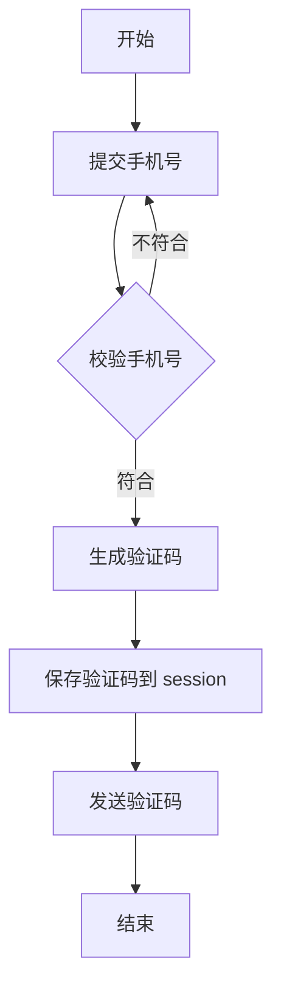
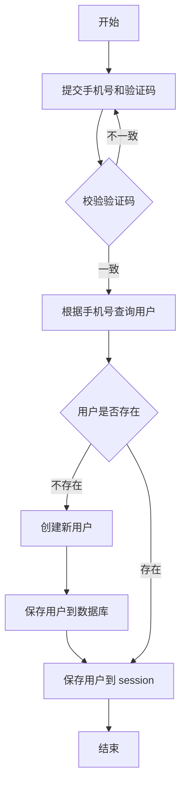
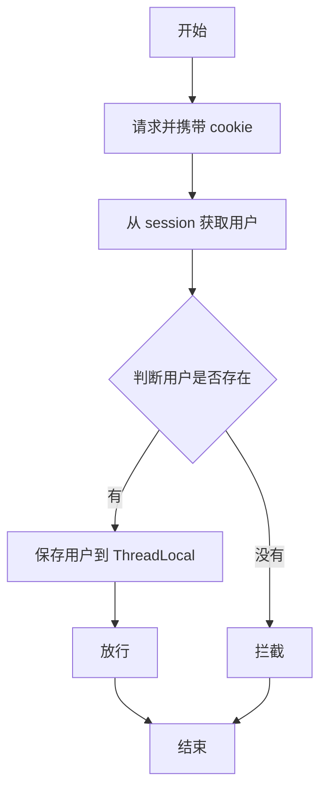
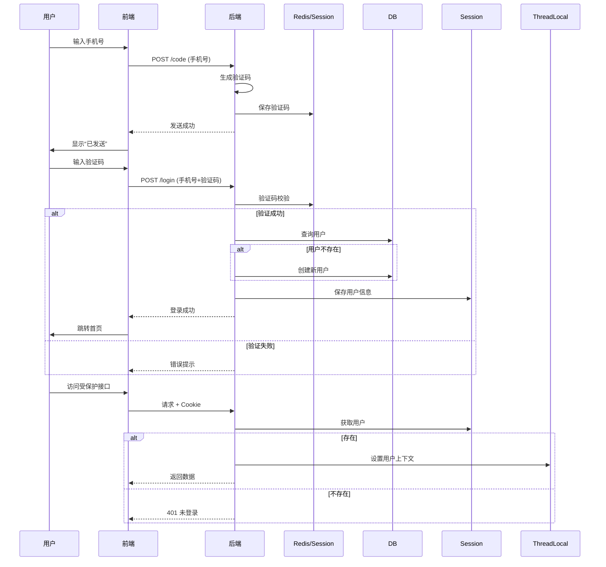

## ✅ Session vs Token（JWT）核心区别

| 对比项                 | Session（基于服务器状态）                               | Token（如 JWT，无状态）                                 |
| ---------------------- | ------------------------------------------------------- | ------------------------------------------------------- |
| **存储位置**           | 服务端（内存/Redis/DB） + 客户端 Cookie（存 sessionId） | 完全由客户端存储（如 localStorage、Cookie）             |
| **是否需要服务端存储** | ✅ 需要（保存用户会话数据）                              | ❌ 不需要（Token 自包含用户信息）                        |
| **扩展性（分布式）**   | 差（需共享 Session，如 Redis）                          | 极好（无状态，天然支持水平扩展）                        |
| **安全性**             | 依赖 Cookie，易受 CSRF 攻击（需防跨站请求伪造）         | 依赖 Header，不受 CSRF 影响，但需防 XSS（避免 JS 窃取） |
| **性能**               | 每次请求需查 Session（如 Redis），有 IO 开销            | 无需查库，直接解析 Token（但需验签）                    |
| **适用场景**           | 传统 Web 应用（如后台管理系统）                         | 前后端分离、App、微服务、API 网关                       |

简单来讲：

session在cookie中，只有一个sessionid，传到后端再在redis中查用户信息

token在header中，包含用户全部信息，解密后无需根据id查用户信息即可获取用户信息

当然如果是自行设计的当然怎么样都行。

注意一般来说token还有加密解密这一步的额外开销需要考虑进去。

总结session的最大优势：自动化，SpringBoot已帮我们封装好了一系列对象，我们只需要给前端分配一个sessionid，后面前端就会自动在cookie里带上sessionid，然后我们只管给session set，get，del即可完成对用户登录所需信息的快速缓存。


## session在SpringBoot中的使用

> token:自行设置在header中，返回时自行装入响应体
>
> session:同样设置在header中，返回时sessionId自动装入响应体
>
> 后端使用getSession()自动生成一个session时也会生成一个id，在传回前端时也会在header的Set-Cookie字段带上这个id，前端会在响应头收到：
>
> Set-Cookie: JSESSIONID=abc123xyz; Path=/; HttpOnly     
>
> 这个JSESSIONID就是sessionId，后续浏览器会自动发送cookie：Cookie: JSESSIONID=abc123xyz     之后后端就可以根据这个id查询session内容了

和先前做过的token类似，我们都是将这个玩意塞到header里面去，但是相对于我们自行设置的token且需要从请求体HttpServletRequest 自行获取header的相关参数（键值对形式存储），java专门有这么一个封装类帮助我们快速从cookie中获取session：

```java
@RestController
public class SessionController {

    // 存入 Session
    @PostMapping("/login")
    public String login(@RequestParam String username, HttpServletRequest request) {
        HttpSession session = request.getSession(); // 自动创建
        session.setAttribute("user", username);		// 如果不使用redis，则会存储到tomcat的容器中，也即内存中，以本次生成的sessionid为key
        return "登录成功";
    }

    // 从 Session 获取
    @GetMapping("/profile")
    public String profile(HttpServletRequest request) {
        HttpSession session = request.getSession(false); // 不自动创建
        if (session == null) {
            return "未登录";
        }
        String user = (String) session.getAttribute("user");
        return "当前用户: " + user;
    }

    // 注销（清除 Session）
    @PostMapping("/logout")
    public String logout(HttpServletRequest request) {
        HttpSession session = request.getSession(false);
        if (session != null) {
            session.invalidate(); // 销毁整个 Session
        }
        return "已退出";
    }
}
```

还有可以使用注解注解读出：

```java
@GetMapping("/welcome")
public String welcome(@SessionAttribute(name = "user", required = false) String user) {
    return user != null ? "欢迎 " + user : "请先登录";
}
```

当然用注解的方式是无法set session的值的

相关安全配置：

```yml
server:
  servlet:
    session:
      timeout: 1800 # 30分钟（单位：秒），默认30分钟
      cookie:
        name: JSESSIONID
        http-only: true   # 防 XSS 攻击
        secure: false     # true 表示仅 HTTPS 传输（生产环境建议开）
        same-site: strict # 防 CSRF（现代浏览器支持）
```

## session与redis

SpringBoot提供的session的便利不仅只有上述内容，还有对于redis的快速注解：

**步骤 1：添加依赖（Maven）**

```xml
<dependency>
    <groupId>org.springframework.session</groupId>
    <artifactId>spring-session-data-redis</artifactId>
</dependency>
<dependency>
    <groupId>org.springframework.boot</groupId>
    <artifactId>spring-boot-starter-data-redis</artifactId>
</dependency>
```

**步骤 2：配置 Redis**

```yml
spring:
  redis:
    host: localhost
    port: 6379
  session:
    store-type: redis
    timeout: 1800s
```

**步骤 3：启用 Spring Session**

```java
@SpringBootApplication
@EnableRedisHttpSession // 关键注解！
public class Application {
    public static void main(String[] args) {
        SpringApplication.run(Application.class, args);
    }
}
```

> ✅ 效果：
>
> - 所有 Session 数据自动存入 Redis；
> - 多个服务实例共享同一份 Session；
> - 客户端 Cookie 仍为 `JSESSIONID`，但值对应 Redis 中的 key。
> - 存储的形式默认为hash，key是JSESSIONID

## 利用session拦截请求进行鉴权验证以及threadlocal

常见的方式有aop以及拦截器，当然过滤器也行，这里使用拦截器：

在鉴权时，我们需要从session的存储容器中取出信息，看有没有这个session，拿到信息后再做其他的验证。在很多的业务中，我们实际上都需要这个session中的内容，如果我们在鉴权时只是对其进行验证就有点浪费了，拦截器取一次，业务取一次甚至多次，我说这不好。那我们应该怎么做到让aop/拦截器中获取到的session信息与业务处理共享呢？

我们都知道对于一个request的处理是从tomcat中取出一个线程进行操作，其实这个线程就提供了一个方式让我们不必去重复获取session，那就是threadlocal：

```java
public class UserHolder {
    private static final ThreadLocal<UserDTO> tl = new ThreadLocal<>();

    public static void saveUser(UserDTO user){
        tl.set(user);
    }

    public static UserDTO getUser(){
        return tl.get();
    }

    public static void removeUser(){
        tl.remove();
    }
}
```

这里封装了一个专门用于存储一个用户信息的类（当然如果你需要list类型的就用`ThreadLocal<List<UserDTO>>`），这样我们就可以在一个线程里面复用这个UserDTO了（注意一个线程中对应的threadlocal唯一，比如这里的tl就是唯一的一个ThreadLocal实例，当然也可以在这个对外开放的ThreadLocal工具接口类中多搞几个ThreadLocal，他们之间在一个线程内是不会相互影响的，但是占用一定的内存资源，并且记得最后结束时删除几个ThreadLocal内需要刷新的数据）

需要注意的是`ThreadLocal<T>`仅允许我们存一个类型T的一个对象且**不会初始化**，如需存储map，list之类的别忘了先创建好实例对象：

```java
private static final ThreadLocal<Map<String, Object>> tl = new ThreadLocal<>();

// 使用时需要先初始化
public static void initMap() {
    tl.set(new HashMap<>()); // 必须先创建Map实例
}

public static void putValue(String key, Object value) {
    Map<String, Object> map = tl.get();
    if (map != null) {
        map.put(key, value);
    }
}

```

拦截器：

```java
public class LoginInterceptor implements HandlerInterceptor {
    @Override
    public boolean preHandle(HttpServletRequest request, HttpServletResponse response, Object handler) throws Exception {
        HttpSession session = request.getSession();
        if (session.getAttribute("user") == null) {
            response.setStatus(401);
            return false;
        }
        UserHolder.saveUser((UserDTO) session.getAttribute("user"));
        return true;
    }

    @Override
    public void afterCompletion(HttpServletRequest request, HttpServletResponse response, Object handler, Exception ex) throws Exception {
        UserHolder.removeUser();
    }
}
```

然后再mvc中注册：

```java
@Override
public void addInterceptors(org.springframework.web.servlet.config.annotation.InterceptorRegistry registry) {
    // 添加登录拦截器
    registry.addInterceptor(new LoginInterceptor())
            .addPathPatterns("/**")
            .excludePathPatterns(
                    "/user/code",
                    "/user/login",
                    "/blog/hot",
                    "/blog/query",
                    "/blog/query/*",
                    "/blog/like",
                    "/blog/liked"
            );
}
```

## 转换为redis的缓存

之前一直用session作为cache，这会导致tomcat的serlvet容器被占用空间，我说这不好，我们考虑使用redis作为替代品来专门做cache。其实用sessionid也没毛病，只要用先前提到的SpringBoot提供的session-redis来实现存储容器的转换即可，但是这里出于对后续的维护的可观性的考虑（redis的key从原来的sessionid换为自行定义）。我们自行去设置token等信息：

每次登录时获取token，根据用户数据生成一个hash对象存储信息，以tokenid为key：

```java
        String token = RandomUtil.randomString(15);
        UserDTO userDTO = BeanUtil.copyProperties(user, UserDTO.class);
        Map<String, Object> userMap = BeanUtil.beanToMap(userDTO, new HashMap<>(),
                CopyOptions.create()
                        .setIgnoreNullValue(true)
                        .setFieldValueEditor((fieldName, fieldValue) -> fieldValue.toString()));
        stringRedisTemplate.opsForHash().putAll(RedisConstants.LOGIN_USER_KEY + token, userMap);
        stringRedisTemplate.expire(RedisConstants.LOGIN_USER_KEY + token, RedisConstants.LOGIN_USER_TTL, TimeUnit.MINUTES);
```

最后将token返回给前端，每次前端发送request都需要在header带上token（key值自拟）。然后我们就可以在拦截器中获取这个用户的token并存储到threadlocal中：

```java
@Component
public class RefreshInterceptor implements HandlerInterceptor {
    @Autowired
    private StringRedisTemplate stringRedisTemplate;

    @Override
    public boolean preHandle(HttpServletRequest request, HttpServletResponse response, Object handler) throws Exception {
//        HttpSession session = request.getSession();
        String token = request.getHeader("Authorization");
        if (token == null || token.isEmpty()) {
            return true;
        }
        Map<Object, Object> userMap = stringRedisTemplate.opsForHash().entries(RedisConstants.LOGIN_USER_KEY + token);
        if (userMap.isEmpty()) {
            return true;
        }
        UserDTO user = BeanUtil.fillBeanWithMap(userMap, new UserDTO(),false);
        UserHolder.saveUser(user);
        // 刷新token有效期
        stringRedisTemplate.expire(RedisConstants.LOGIN_USER_KEY + token, RedisConstants.LOGIN_USER_TTL, java.util.concurrent.TimeUnit.MINUTES);
        return true;
    }

    @Override
    public void afterCompletion(HttpServletRequest request, HttpServletResponse response, Object handler, Exception ex) throws Exception {
        UserHolder.removeUser();
    }
}
```

再对一些需要token的接口做拦截：

```java
@Component
public class LoginInterceptor implements HandlerInterceptor {

    @Autowired
    private StringRedisTemplate stringRedisTemplate;

    @Override
    public boolean preHandle(HttpServletRequest request, HttpServletResponse response, Object handler) throws Exception {
//        HttpSession session = request.getSession();
        UserDTO userDTO = UserHolder.getUser();
        if (userDTO == null) {
            response.setStatus(401);
            return false;
        }
        return true;
    }
}
```

当发现token过期时，就会通过这个专门的拦截器拦截请求，最后，设置mvc：

```java
@Override
public void addInterceptors(org.springframework.web.servlet.config.annotation.InterceptorRegistry registry) {
    registry.addInterceptor(new RefreshInterceptor())
            .addPathPatterns("/**")
            .order(0);
    // 添加登录拦截器
    registry.addInterceptor(new LoginInterceptor())
            .addPathPatterns("/**")
            .excludePathPatterns(
                    "/user/code",
                    "/user/login",
                    "/blog/hot",
                    "/blog/query",
                    "/blog/query/*",
                    "/blog/like",
                    "/blog/liked"
            ).order(1);

}
```

这里其实只要注意注册的顺序就可以保证拦截器的执行顺序了，如果有自定义需求，我们也可以通过相识设置order的参数来实现对执行顺序的管理。

## 利用session结合手机号短信验证登录











## mybatisplus中IService

除了熟悉的注入并查询单表：

```java
User user = userMapper.selectOne(new QueryWrapper<User>().eq("phone", loginForm.getPhone()));
```

我们还可以直接使用mybatisplus的IService提供的query()直接查：

```java
user = query().eq("phone", loginForm.getPhone()).one(); // one()是因为返回的是list，需要去取第一个
```

同样对于单表insert：

```java
userMapper.insert(user);
```

我们也可以直接：

```java
save(user);
```


## stringRedisTemplate的使用注意事项

获取数据时是全部都为String的，可以自行转换类型，但是插入数据的时候就需要注意了，比如从里面entries出来全部hash时，对应的字段值均为String可以类型强制转换，但是putall的时候一定要将所有的字段转换为String类型：

```java
        Map<String, Object> userMap = BeanUtil.beanToMap(userDTO, new HashMap<>(),
                CopyOptions.create()
                        .setIgnoreNullValue(true)
                        .setFieldValueEditor((fieldName, fieldValue) -> fieldValue.toString()));
        stringRedisTemplate.opsForHash().putAll(RedisConstants.LOGIN_USER_KEY + token, userMap);
```

当然我们也可以找出来哪些字段不是String类型的，强制转换完重新put进去即可：

```java
        Map<String, Object> userMap = BeanUtil.beanToMap(userDTO);
        userMap.put("id", userDTO.getId().toString());
```
