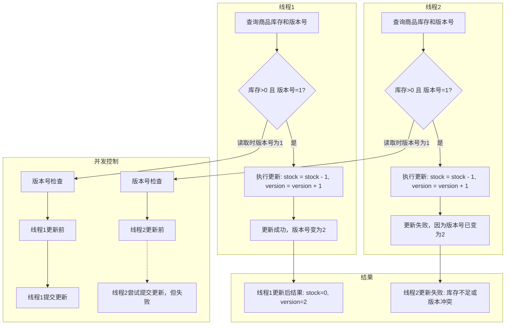
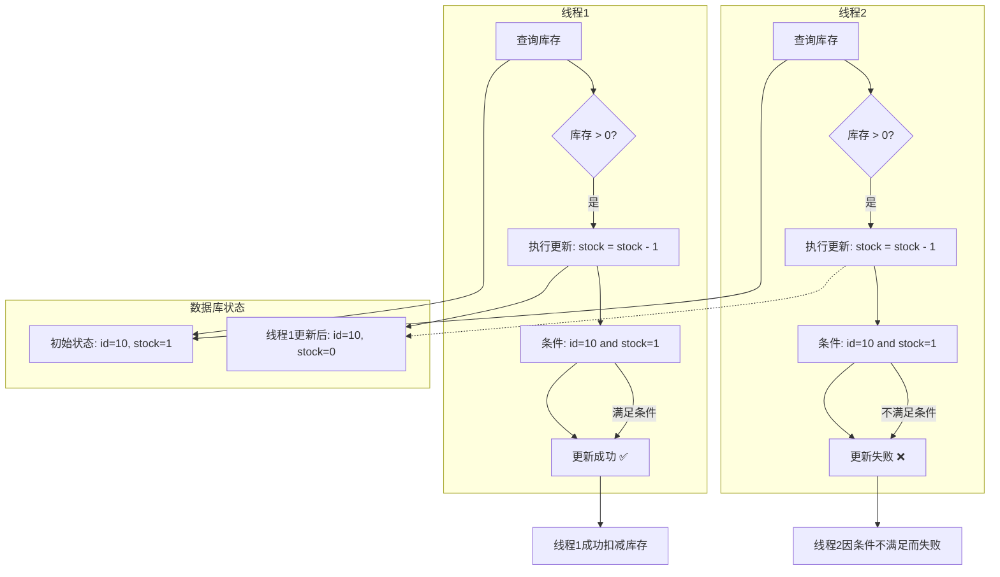

### 全局唯一ID

简单业务下我们会使用自增长ID来确保其的唯一性，但是这样的方式存在一定问题：

- id规律过于明显，容易从中暴露信息
- 数据量太大，即便是多位数字也无法存储

而UUid又存在不确保唯一性的问题

那么我们在思考一下全局id的几个要求

- **唯一性**：不可重复
- **高可用**：多服务均可用且可靠
- **高性能**：生成速度快
- **递增性**：有利于数据库构建索引
- **安全性**：尽量避免暴露信息

而基于以上要求，我们可以利用Redis实现一个全局ID生成器，比如用时间戳以及序列号**拼接**生成ID实现唯一性（比如用long，8字节，64位，除去1位符号位，31位时间戳+32位序列号实现2^31秒*秒内2^32个序列号实现完全不同的ID）

```java
@Component
public class RedisIdWorker {

    /**
     * 开始时间戳
     */
    private static final long BEGIN_TIMESTAMP = 1768052420L;

    /**
     * 序列号位数
     */
    private static final int COUNT_BITS = 32;

    @Autowired
    private StringRedisTemplate stringRedisTemplate;

    /**
     * 获取该key下一个ID
     *
     * @param keyPrefix key前缀
     * @return id
     */
    public long nextId(String keyPrefix) {
        // 生成时间戳
        LocalDateTime now = LocalDateTime.now();
        long nowSecond = now.toEpochSecond(ZoneOffset.UTC);
        long timestamp = nowSecond - BEGIN_TIMESTAMP;
        // 生成序列号
        // 借助redis自增生成序列号，这里统计的是每天的，序列号最大为2^32-1，每天最多生成2^32个ID
        // key不存在时，自动生成0，后续自增正常执行
        String date = now.format(DateTimeFormatter.ofPattern("yyyy:MM:dd"));
        long count = stringRedisTemplate.opsForValue().increment("icr:" + keyPrefix + ":" + date);
        // 拼接并返回
        // |运算和||不一样，一个是对每一位bit进行或运算，一个是逻辑运算符
        return timestamp << COUNT_BITS | count;
    }
}
```

这样的做法和**雪花算法**类似，详见后续说明


### 优惠券

本项目对优惠券表的设置是每种优惠券单独在表中作为一行数据，记录对应店铺，库存等相关信息。

开始优惠秒杀活动时，用户点击购买，后端确认优惠券**活动是否开始**->判断**库存是否充足**->减扣库存，中间有异常则抛出异常，返回失败结果，成功则返回订单id。

```java
    @Override
    @Transactional
    public Result seckillVoucher(Long voucherId) throws BusinessException {
        SeckillVoucher seckillVoucher = seckillVoucherService.getById(voucherId);
        // 查询活动是否开始
        if (seckillVoucher.getBeginTime().isAfter(LocalDateTime.now())) {
            throw new BusinessException(400, "优惠活动尚未开始");
        }
        if (seckillVoucher.getEndTime().isBefore(LocalDateTime.now())) {
            throw new BusinessException(400, "优惠活动已结束");
        }
        // 检查库存是否充足
        if (seckillVoucher.getStock() < 1) {
            throw new BusinessException(400, "优惠券已售罄");
        }
        // 扣减库存
        boolean success = seckillVoucherService.update(new UpdateWrapper<SeckillVoucher>().
                setSql("stock = stock - 1").
                eq("voucher_id", voucherId)
        );
//        seckillVoucherService.update().setSql("stock = stock + 1").eq("voucher_id", voucherId).update();
        if (!success){
            throw new BusinessException(400, "库存不足");
        }

        // 创建订单
        VoucherOrder voucherOrder = new VoucherOrder();
        // 订单id
        long id = redisIdWorker.nextId("order");
        voucherOrder.setId(id);
        // 用户id（通过Threadlocal提取）
        Long userId = UserHolder.getUser().getId();
        voucherOrder.setUserId(userId);
        // 代金券券id
        voucherOrder.setVoucherId(voucherId);
        // 保存订单
        voucherOrderMapper.insert(voucherOrder);

        return Result.ok(voucherId);
    }
```

但是以上操作实际上是存在问题的，比如这里在高并发场景下，检查库存数量时会出现异常（都发现为1，然后都进入临界区导致库存减到负数），但是这里如果随便加锁就会造成极大且无法接受的速率损耗，怎么办呢？


### 悲观锁以及乐观锁

**悲观锁**

认为无论何时，线程安全问题一定会发生，执行操作前必须尝试获取锁，保证线程串行执行：比如synchronized，Lock就是悲观锁，这样的阻塞对速率的影响非常大。

**乐观锁**

认为线程安全问题不一定会发生，**不加锁**，只在更新数据时判断**是否有其他线程对数据做操作**了：如无，则判断安全；如已被其他线程修改，则判断不安全，尝试重试或返回错误。**（推荐）**


### 超卖问题

乐观锁常见的实现方法有：

- **版本号法：**

为数据增加一条版本列（Version），专门用于记录该数据是否被其他事务/线程修改了（保证前后数据一致才可继续执行，类似mvcc的事务id检查）：



关键在于其中对数据的更新不是

```sql
update ...
	set stock = stock + 1
	where id = 10
```

而是

```sql
update ...
	set stock = stock - 1 , version = version + 1
	where id = 10 and version = 1
```

这就保证了几个事务获取到一个version的数据后，只能有一个事务修改库存了。

这里之所以不会再次遇到高并发问题，是因为一条update语句会对对应的数据行加**X锁**，其他的update操作会被阻塞，而等当前事务完成操作后，再次update就会发现version变了从而无法找到对应行，只能返回错误。

- **CAS法**

但是以上操作不仅稍显复杂，还需要额外占用一点空间用于存储version，我们说这不合理，所以就使用类似的一种方式，即只比较前后库存是否相同，如相同我们会对其进行更新，若不相同则会返回错误：



通过CAS比较**前后数据是否一致**且后续的**更新操作**和**比较操作**是耦合在一起的，具有**原子性**的sql，这时就保证了该修改操作一定是安全的。

但是！只是安全是不够的，以上操作会导致失败率过高，即由于**获取到同一stock版本的几个事务只能有一个事务成功**，其他的都会失败，导致很多的请求返回了失败异常！

那么这时候，我们就可以换一种策略：

我们将对stock前后必须一致要求改为**stock必须>0**来解决这个失败问题（update操作会加**X锁**，保证同一行数据同一时刻只能有一个事务进行修改操作，那么这里在update的原子性sql中加一条stock必须>0的确可以保证每一条修改sql都不会将stock减到负数，且都可以正常获取优惠。但是！这实际上是将并发问题丢给了数据库，归根结底还是用数据库的**X锁**来解决这个并发问题，**是悲观锁并非乐观锁**！）

> 这时我们会发现update操作是**在事务内**的，这时在**可重复读**的事务隔离等级下，是否会由于**并发事务之间数据不可见**的特性导致stock超卖呢？
>
> 事实上是不会的！update的**where条件**读的并非和select一样要符合**快照**要求！
>
> **在 InnoDB 的可重复读（RR）隔离级别下：**
> **`UPDATE` / `DELETE` 语句的 WHERE 条件使用的是 \*当前最新已提交的数据\*（即“实时读”），而不是事务启动时的快照！**
> 但 **SET 子句中的值**（如果涉及子查询）可能仍受快照影响。
>
> 换句话说：
> 🔹 **`WHERE` 条件 → 实时读（Read Committed 行为）**
> 🔹 **普通 `SELECT` → 快照读（Repeatable Read 行为）**
>
> 而上了X锁，只会在事务提交的时候释放，也就是说只要其他事务修改了，就必须等待到正在处理的事务提交了才能够上X锁并检查stock>0并修改

```java
@Override
@Transactional
public Result seckillVoucher(Long voucherId) throws BusinessException {
    SeckillVoucher seckillVoucher = seckillVoucherService.getById(voucherId);
    // 查询活动是否开始
    if (seckillVoucher.getBeginTime().isAfter(LocalDateTime.now())) {
        throw new BusinessException(400, "优惠活动尚未开始");
    }
    if (seckillVoucher.getEndTime().isBefore(LocalDateTime.now())) {
        throw new BusinessException(400, "优惠活动已结束");
    }
    // 检查库存是否充足
    if (seckillVoucher.getStock() < 1) {
        throw new BusinessException(400, "优惠券已售罄");
    }
    // 扣减库存
    boolean success = seckillVoucherService.update(new UpdateWrapper<SeckillVoucher>().
            setSql("stock = stock - 1").
            eq("voucher_id", voucherId).
            gt("stock", 0)  
    );

    if (!success) {
        throw new BusinessException(400, "库存不足");
    }

    // 创建订单
    VoucherOrder voucherOrder = new VoucherOrder();
    // 订单id
    long id = redisIdWorker.nextId("order");
    voucherOrder.setId(id);
    // 用户id（通过Threadlocal提取）
    Long userId = UserHolder.getUser().getId();
    voucherOrder.setUserId(userId);
    // 代金券券id
    voucherOrder.setVoucherId(voucherId);
    // 保存订单
    voucherOrderMapper.insert(voucherOrder);

    return Result.ok(voucherId);
}
```

> X锁会在update语句尝试获取，未获取到则阻塞等待，直到成功获取，最后在事务完成commit后释放；
>
> 同时X锁会获取到**实时数据**而非符合快照的数据（包括**`SELECT ... FOR UPDATE`**）
>
> **所有“当前读”（Current Read）操作 —— 包括 `SELECT ... FOR UPDATE`、`SELECT ... LOCK IN SHARE MODE`、`UPDATE`、`DELETE` ——
> 在 RR 隔离级别下都会：**
>
> 1. **读取最新已提交的数据（实时视图）**；
> 2. **对匹配的行加锁（X 锁或 S 锁）**；
> 3. **忽略 MVCC 快照（Read View）**。


### 一人一单

为了避免一个用户使用多次优惠券，我们需要在检测数据库是否已经存在该订单，使用了该优惠券id且用户id与输入订单信息重复，如有则表示该用户已经使用了该优惠券，无法再次使用：

```java
// 检测用户是否已经使用过该优惠券
Long userId = UserHolder.getUser().getId();
int count = voucherOrderMapper.selectCount(new QueryWrapper<VoucherOrder>().eq("user_id", userId).eq("voucher_id", voucherId));
if (count > 0) {
    throw new BusinessException(400, "用户已经使用过该优惠券");
}
```

但是在这里存在一个问题：并发下多次查询可能多个请求均同时通过，为了避免这个情况，我们很容易联系到加**锁**使得每次只能有一个进程修改数据，前面我们讲过用**redis**做互斥锁，**乐观锁**（前后保持一致等），以及借助X锁实现的悲观锁，这里我们再讲一个jvm提供的synchronized实现的悲观锁：

```java
        // String类型的==可能比较的是内存地址而非字符串内容，所以用String的intern()方法保证锁准确
        Long userId = UserHolder.getUser().getId();
        synchronized (userId.toString().intern()) {
            return createVoucherOrder(voucherId);
        }
	...

    /**
     * 创建订单
     *
     * @param voucherId 代金券id
     * @return 订单id
     */
    @Override
    @Transactional
    public Result createVoucherOrder(Long voucherId) throws BusinessException {
        // 检测用户是否已经使用过该优惠券
        Long userId = UserHolder.getUser().getId();

        int count = voucherOrderMapper.selectCount(new QueryWrapper<VoucherOrder>().
                eq("user_id", userId).
                eq("voucher_id", voucherId)
        );
        if (count > 0) {
            throw new BusinessException(400, "用户已经使用过该优惠券");
        }

        // 扣减库存
        boolean success = seckillVoucherService.update(new UpdateWrapper<SeckillVoucher>().
                setSql("stock = stock - 1").
                eq("voucher_id", voucherId).
                gt("stock", 0)  // 事实上是借助数据库X锁保证同一时间只能有一个进程修改的实现的悲观锁
        );

        if (!success) {
            throw new BusinessException(400, "库存不足");
        }

        // 创建订单
        VoucherOrder voucherOrder = new VoucherOrder();
        // 订单id
        long id = redisIdWorker.nextId("order");
        voucherOrder.setId(id);
        // 用户id（通过Threadlocal提取）
        voucherOrder.setUserId(userId);
        // 代金券券id
        voucherOrder.setVoucherId(voucherId);
        // 保存订单
        voucherOrderMapper.insert(voucherOrder);
        return Result.ok(id);
    }
```

**注意锁释放时一定要保证事务已经提交！**否则其他事务读不到该事务修改的数据（MVCC**可重复读**下，事务只会读**该事务开启前已经提交的事务修改的数据版本**）

**而且这里一定要注意外层的方法不要加事务注解！**假如加了，那么事务AB先后启动，A未提交时进入synchronized（内部方法并入A），B等待，**A完成数据修改后B是看不到的！（B启动时活跃事务快照视图中包含A）**这里要保证将**操作的事务**放入锁内！（当然其实也可以把事务隔离等级改为**读已提交**：每执行一条 `SELECT` 语句（而不是事务启动时），就创建一个新的 Read View，只包含当时已提交的数据。）

> **事务必须在获取应用层锁（如 synchronized）之后才开启！（事务放到锁里面）**
> 否则 MVCC 的 Read View 会“冻结”在锁等待之前的状态，导致看不到已提交数据。

**即我们要求某操作一个一个执行，且后一个操作拿得到前面一个操作修改的数据！那么这时候我们上锁，保证操作一个一个执行，且要么对这段操作整体加事务（提交了之后再释放锁让下一个事务开启），要么改事务隔离等级为读已提交，以保证操作间数据一致性。**

当然这里还有问题，比如synchronized**无法跨机**，分布式或微服务下无法实现全局的上锁，最后可能还是需要**redis的分布式锁**来解决这一问题（或者在数据库加**唯一索引**保证只有一个，尝试添加已有的会报异常）


**总结以上内容，我们保证某一数据的完全安全，就是要求对其的操作一个一个顺序串行执行（加锁），且查询条件操作以及修改操作是耦合在一块的一个原子性操作（放入一个事务/sql），同时注意条件的准确性（操作间数据一致性，改事务隔离等级，或让事务不交叉即放到锁内）**

**简单记忆就是如需加锁，那么这时候一般考虑将事务挪到锁内，让锁包住事务，保证事务间数据一致性！**


-----


### Mybatisplus提供的update以及setSql()快速拼接update的sql

都知道可以通过Service的update，再给出updateWrapper来实现更新，我们其实也可以用链式编程来实现sql的拼接：

```java
seckillVoucherService.update().setSql("stock = stock + 1").eq("voucher_id", voucherId).update();
```

这也可以实现sql语句的拼接效果，当然使用wrapper的话：

```java
seckillVoucherService.update(new UpdateWrapper<SeckillVoucher>().
        setSql("stock = stock - 1").
        eq("voucher_id", voucherId)
);
```

其中**setSql**比较重要，我们平时写简单更新业务的时候不想到mapper层写的话，就可以在这直接加上set后面的语句。


### 雪花算法

雪花算法（Snowflake）是一种**分布式唯一 ID 生成算法**，最早由 Twitter 开源，广泛用于数据库主键、订单号、消息队列等需要**高性能、全局唯一、有序递增**的场景。

**核心结构**

标准 64 位 Snowflake ID 由以下部分组成：

- **1 位符号位**：固定为 0，保证正数。
- **41 位时间戳**：记录自定义起始时间（epoch）以来的毫秒数，可用约 69 年。
- **10 位机器标识**：区分不同节点（可拆分为数据中心 ID + 机器 ID）。
- **12 位序列号**：同一毫秒内的自增序列，最大支持每毫秒 4096 个 ID。

生成流程

1. **获取当前时间戳**（毫秒）并减去 epoch。
2. **处理时钟回拨**：若当前时间小于上次生成时间，可等待追平或抛异常。
3. **生成序列号**： 同一毫秒内递增，超过最大值则等待下一毫秒。 不同毫秒重置为 0。
4. **位移拼接**：将时间戳、机器 ID、序列号按位移组合成 64 位整数。


### lang封装的类型注意==判断可能并非内容是否相等

在 Java 中，使用 `==` 比较封装类型（如 `Integer`、`Long`、`Boolean` 等）时，**比较的是对象的引用（内存地址），而不是它们的值内容**。这可能导致 **看似相等的数值，用 `==` 判断却返回 `false`**。

**对封装类型（Wrapper Classes）应始终使用 `.equals()` 比较值是否相等，而不是 `==`。**


### 解决自调用

1. 简单事务失效直接在外层套一个事务注解就行，但是内层事务相关配置是不会生效了。
2. 自注入

```java
    @Autowired
    private OrderService self;
```

3. AOP获取代理对象

4. **`ApplicationContext`** 上下文获取代理对象**（不推荐）**

5. 拆分到其他Service


### MVCC可重复读保证的事务内数据一致性

MVCC可重复读是用于保证事务内前后读取同一行数据不一致的问题的版本管理，可重复读它是保证每个事务只能读到**该事务开启之前就已经完成提交**的事务修改的数据版本，其他的一概不可见！

这就会导致事务间数据不一致，使用事务不要无脑，结合业务场景去选择事务隔离等级，如业务要求操作间数据一致性强，那么就要考虑如何使得操作之间事务不交叉（加锁），或是换成读已提交了！


### 保证并发下数据安全的几个必要条件

1. 原子性：**条件检查**与**修改**操作内聚为一个**原子**操作
2. 互斥性：对原子操作上锁，保证同一时间对该数据只能有一个修改操作正在执行
3. 条件获取必须准确（如RR的事务隔离可能会导致条件数据存在异常，需修改隔离等级或保证事务不交叉）

以超卖问题为例：

一条sql实现where条件与update修改实现原子性；X锁实现互斥；X锁读取最新数据
