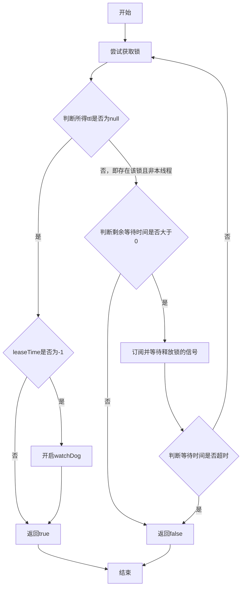
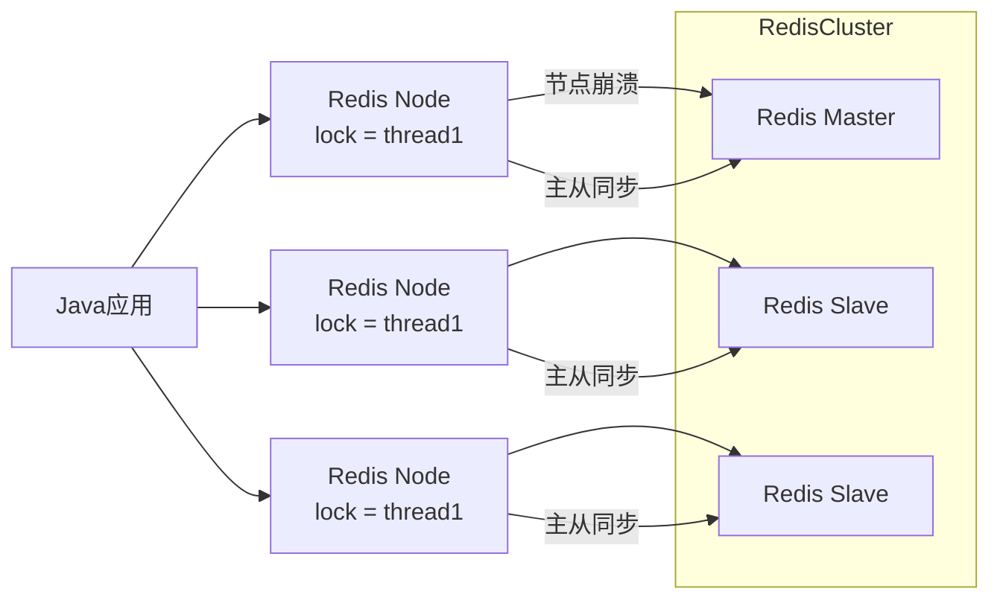

我们在单机项目中使用synchronized是没毛病，但假如是多机部署的集群环境呢？并发下该怎么处理呢？

这时候我们就会使用分布式锁：

| 实现方式         | 互斥机制                                                     | 高可用性 | 高性能 | 安全性（防死锁）                     | 适用场景                   | 缺点/注意事项                        |
| :--------------- | :----------------------------------------------------------- | :------- | :----- | :----------------------------------- | :------------------------- | :----------------------------------- |
| **MySQL**        | 利用 `SELECT ... FOR UPDATE` 或唯一索引 + 行锁               | 好       | 一般   | 断开连接自动释放锁（需配合事务）     | 低并发、对一致性要求高     | 性能较差，不适合高并发；依赖数据库   |
| **Redis**        | 使用 `SETNX` + 过期时间（或 Redisson 的 RedLock / Lua 脚本） | 好       | 好     | 设置超时时间ttl，到期自动释放        | 高并发、轻量级锁           | 单节点有单点故障风险；需处理网络分区 |
| **ZooKeeper**    | 创建临时顺序节点，通过选举机制保证互斥                       | 好       | 一般   | 临时节点断开自动删除                 | 分布式协调、配置中心       | 性能较低；部署复杂                   |
| **Etcd**         | 利用 `txn` 操作（CAS）和租约（Lease）实现锁                  | 好       | 好     | 租约过期自动释放                     | Kubernetes 等云原生系统    | 学习成本高；生态不如 Redis 广泛      |
| **Redisson**     | 基于 Redis 的高级客户端，支持 RedLock、公平锁、可重入锁等    | 好       | 极好   | 支持看门狗机制（watchdog），自动续期 | 高并发、复杂锁需求         | 依赖 Redis；需引入额外组件           |
| **数据库乐观锁** | 使用版本号（version）或时间戳字段，通过 `UPDATE ... WHERE version = ?` | 好       | 好     | 无死锁风险，但失败后需重试           | 读多写少、允许重试的业务   | 不适合强一致性场景；需处理重试逻辑   |
| **基于消息队列** | 使用 MQ（如 Kafka/RabbitMQ）作为任务分发，确保只有一条消息被消费 | 好       | 好     | 消费者异常时由 MQ 重试机制兜底       | 异步任务调度、幂等性要求高 | 不能直接用于同步资源竞争             |


## Redis的分布式锁

- 获取锁：

​		互斥：利用setnx实现，记得加ttl防止redis宕机

​		非阻塞：不会等待，需要自己设置重试或返回

- 释放锁：

​		手动删除：del

​		过期删除：设置时带上expire

现在我们来实现一个工具类实现获取锁释放锁：

```java
public class ILockImpl implements ILock {

    private static final String KEY_PREFIX = "lock:";

    private String name;

    private StringRedisTemplate stringRedisTemplate;

    public ILockImpl(String name, StringRedisTemplate stringRedisTemplate) {
        this.name = name;
        this.stringRedisTemplate = stringRedisTemplate;
    }

    @Override
    public boolean tryLock(long timeoutSec) {
        String key = KEY_PREFIX + name;
        long threadId = Thread.currentThread().getId();
        Boolean flag = stringRedisTemplate.opsForValue().setIfAbsent(key, threadId + "", timeoutSec, TimeUnit.SECONDS);
        // 拆箱防止出现空指针问题
        return Boolean.TRUE.equals(flag);
    }

    @Override
    public void unLock() {
        // 释放
        stringRedisTemplate.delete(KEY_PREFIX + name);
    }
}
```


## 锁误删问题

如果线程阻塞时间过长，ttl设置的又不合理，导致**线程尚未完成任务锁就已经超时释放**了，这就存在很大的问题了，比如这时A的锁超时释放了，B获取了这个锁，结果B还执行着呢A结束任务了就一下给锁删了。

**先来处理误删其他线程的锁这个问题：**

对于这个问题，我们可以对value作设置，在存入时存uuid值并记录，删除时检查该值是否是自己的，如不是自己的则不删：

```java
public class ILockImpl implements ILock {

    private static final String KEY_PREFIX = "lock:";

    private static final String ID_PREFIX = UUID.randomUUID().toString(true) + "-";

    private String name;

    private StringRedisTemplate stringRedisTemplate;

    public ILockImpl(String name, StringRedisTemplate stringRedisTemplate) {
        this.name = name;
        this.stringRedisTemplate = stringRedisTemplate;
    }

    @Override
    public boolean tryLock(long timeoutSec) {
        String key = KEY_PREFIX + name;
        String threadId = ID_PREFIX + Thread.currentThread().getId();
        Boolean flag = stringRedisTemplate.opsForValue().setIfAbsent(key, threadId, timeoutSec, TimeUnit.SECONDS);
        // 拆箱防止出现空指针问题
        return Boolean.TRUE.equals(flag);
    }

    @Override
    public void unLock() {
        // 获取线程标识
        String threadId = ID_PREFIX + Thread.currentThread().getId();
        // 获取锁标识
        String id = stringRedisTemplate.opsForValue().get(KEY_PREFIX + name);
        // 判断是否相同
        if (threadId.equals(id)) {
            // 释放
            stringRedisTemplate.delete(KEY_PREFIX + name);
        }
    }
}
```

这里还存在一个问题：**判断线程标识是否相同**以及**释放锁**这两个最关键的操作被分为了**两步**进行，那么这里面就会出现一定问题，比如A判断相同完结果阻塞了，然后超时释放了，其他线程这时加锁然后被A释放了就出问题了。

熟悉的场景我们在**加锁**其实也见过，我们最后使用的setnx聚合这两个操作来解决这个问题，只要redis靠谱，单线程下我们就一定能确保**判断**与**加锁一块执行**以防止其他请求乘机而入，那么有没有其他方式来帮我们处理**释放锁**呢？


## lua脚本聚合Redis命令

Redis提供了lua脚本的功能，使得redis的单线程可**一次连续执行完**一个lua脚本中的所有命令后才会去执行其他命令，这就保证了我们的一些命令的**原子性**从而确保数据不会因为**该操作的并发**导致被错误修改。

redis执行lua脚本：

```lua
EVAL "lua_script" numkeys key1 key2 ... arg1 arg2 ...
```

- `lua_script`：Lua 脚本字符串（需用引号包裹）
- `numkeys`：脚本中使用的 **key 的数量**（必须明确指定）
- `key1, key2...`：传入的 Redis key（通过 `KEYS[1]`, `KEYS[2]` 访问）
- `arg1, arg2...`：额外参数（通过 `ARGV[1]`, `ARGV[2]` 访问）

```lua
EVALSHA "sha1_hash" numkeys key1 key2 ... arg1 arg2 ...
```

- 先用 `SCRIPT LOAD` 将脚本加载到 Redis，返回 SHA1 哈希；
- 后续用 `EVALSHA` + 哈希值执行，避免重复传输脚本内容。

比如：

```lua
EVAL "return redis.call('set', KEYS[1], ARGV[1])" 1 name Rose
```

注意lua中数组的头索引是1而非0！

而在Spring中使用redisTemplate就可以这么执行这段lua脚本：

```java
        // 定义 Lua 脚本
        String script = "return redis.call('set', KEYS[1], ARGV[1])";

        // 创建 RedisScript 对象（返回类型为 String，因为 SET 返回 "OK"）
        DefaultRedisScript<String> redisScript = new DefaultRedisScript<>();
        redisScript.setScriptText(script);
        redisScript.setResultType(String.class);

        // 执行脚本：KEYS = ["name"], ARGV = ["Rose"]
        String result = stringRedisTemplate.execute(
            redisScript,
            Collections.singletonList("name"),   // KEYS[1]
            "Rose"                               // ARGV[1]
        );

        System.out.println("Lua 脚本执行结果: " + result); // 输出: OK
```

注意传入参数中，keys是List数组，而argv参数是需全部写明的：

```java
List<String> keys = Arrays.asList("user:1001", "user:1001:name");
String result = stringRedisTemplate.execute(
    redisScript,
    keys,                 // KEYS[1] = "user:1001", KEYS[2] = "user:1001:name"
    "Alice",              // ARGV[1]
    "60"                  // ARGV[2]
);
```

如：

```java
List<String> keys = Arrays.asList("user:1001", "user:1001:name");
String result = stringRedisTemplate.execute(
    redisScript,
    keys,                 // KEYS[1] = "user:1001", KEYS[2] = "user:1001:name"
    "Alice",              // ARGV[1]
    "60"                  // ARGV[2]
);
```

那么现在我们需要使用lua脚本完成以下操作：

1. 获取锁的对应value标识
2. 检查与传入real标识是否相等
3. 相等，删除锁
4. 不相等则直接结束

那么就可以得到脚本：

```lua
-- 1. 获取锁当前的 value
local current_value = redis.call('GET', KEYS[1])

-- 2. 检查是否存在且与传入的标识（real）相等
if current_value == ARGV[1] then
    -- 3. 相等：删除锁
    return redis.call('DEL', KEYS[1])  -- 成功释放
else
    -- 4. 不相等或不存在：直接结束
    return 0  -- 未释放（可能是别人持有的锁）
end
```

最终使用template执行：

```java
String script = """
    local current_value = redis.call('GET', KEYS[1])
    if current_value == ARGV[1] then
        redis.call('DEL', KEYS[1])
        return 1
    else
        return 0
    end
    """;

Long result = redisTemplate.execute(
    new DefaultRedisScript<>(script, Long.class),
    Collections.singletonList("my_lock_key"),
    "my_request_id"
);
```

当然正常我们是会将lua脚本写到自制的lua文件中的，不会直接在代码中写死，一般放到classpath下即可（也就是resources）

```java
public static final DefaultRedisScript<Long> unlockScript;

static {
    unlockScript = new DefaultRedisScript<>();
    unlockScript.setLocation(new ClassPathResource("unlock.lua"));              // 指定脚本位置 ClassPathResource会去寻找classpath下的unlock.lua文件
    unlockScript.setResultType(Long.class);
}

...

    @Override
    public void unLock() {
        stringRedisTemplate.execute(
                unlockScript,
                // 获取锁名称
                Collections.singletonList(KEY_PREFIX + name),
                // 获取线程标识
                ID_PREFIX + Thread.currentThread().getId()
        );
    }
```

好的，那么现在我们就基本确保了并发下释放锁的原子性，保证了多个线程不会误删相互之间的锁，现在的锁才是只会因为自行释放或是ttl超时释放的正常结束周期，而不是被其他线程误删了。


## 基于 `SETNX` **实现的分布式锁存在的问题**

但是setnx作为锁在实际业务场景中还是存在问题：

**01 不可重入**

> 同一个线程无法多次获取同一把锁。
> ✅ 说明：如果一个线程已经持有锁，再次尝试加锁会失败，导致无法实现“可重入”逻辑。

------

**02 不可重试**

> 获取锁只尝试一次就返回 false，没有重试机制。
> ✅ 说明：在高并发场景下，如果第一次抢锁失败，不会自动重试，容易造成资源竞争失败。

------

**03 超时释放**

> 锁超时释放虽然可以避免死锁，但如果是业务执行耗时较长，也会导致锁被提前释放，存在安全隐患。
> ✅ 说明：设置过期时间（如 `PX 30000`）虽能防止死锁，但若业务处理时间超过该值，锁会被误删，其他线程可能抢占，引发并发问题。

------

**04 主从一致性**

> 如果 Redis 提供了主从集群，主从同步存在延迟，当主节点宕机时，如果从节点未同步主节点的锁数据，则会出现锁失效的问题。
> ✅ 说明：在 Redis 主从架构中，主节点写入的锁可能还未同步到从节点，主节点宕机后从节点升级为主，原锁信息丢失，导致多个客户端同时获得锁，破坏互斥性。

针对这些场景以及问题，我们可以使用redission，其提供了一系列接口用于解决分布式问题等。


## Redission

**Redisson** 是一个基于 **Redis** 的 **Java 客户端**，它不仅提供了对 Redis 原生命令的封装，更重要的是：

> **在 Redis 基础上实现了丰富的分布式对象和服务**，比如分布式锁、信号量、队列、延迟队列、布隆过滤器等。

它让开发者像操作本地 Java 对象一样，轻松实现**高并发、分布式协调**功能。

| 组件              | 用途                             |
| :---------------- | :------------------------------- |
| `RLock`           | 分布式可重入锁（最常用）         |
| `RAtomicLong`     | 分布式原子长整型                 |
| `RCountDownLatch` | 分布式倒计时门闩                 |
| `RBlockingQueue`  | 分布式阻塞队列                   |
| `RDelayedQueue`   | 分布式延迟队列（如订单超时取消） |
| `RBloomFilter`    | 分布式布隆过滤器（防缓存穿透）   |
| `RMapCache`       | 带过期时间的分布式 Map           |

除了以上内容，其还支持**`RTopic`**，**`RPatternTopic`**的分布式通信，**`RQueue`**等的分布式队列，**`RCountDownLatch`**，**`RSemaphore`**等的分布式同步器等等功能。

简单来说就是比自己手写的好得多，当然详细业务的缓存穿透，击穿等问题，还是需要自己封装的，但至少lua大部分场景下不用自己写了。

### Redission的初始化配置

```java
@Configuration
public class RedisConfig {
    
    @Bean
    public RedissonClient redissonClient() {
        Config config = new Config();
        config.useSingleServer().setAddress("redis://127.0.0.1:6379").setPassword("");
        // 创建 RedissonClient 对象
        return Redisson.create(config);
    }
}
```

用Bean注入一个即可，之后我们就可以自动注入直接使用其所提供的工具了。

### Redission的使用

将原来自制的Lock锁改为Redission的可重入锁：

```java
RLock lock = redissonClient.getLock("lock:order:" + userId);

// 获取锁
if (!lock.tryLock()) {
    throw new BusinessException(400, "请勿重复下单");
}
try {
    return self.createVoucherOrder(voucherId);
} catch (Exception e) {
    log.error("创建订单异常", e);
    throw new BusinessException(404, "服务异常");
} finally {
    lock.unlock();
}
```

> Redisson **通过“锁标识（lock ID）校验”机制**，从根本上避免了**误删他人锁**的问题，事实上的实现逻辑和我们自制的lua执行接口大差不差，但是value的标识更加唯一。


## Redission的可重入锁（RLock）

| 能力                      | 说明                                                 | 解决的问题                                   |
| :------------------------ | :--------------------------------------------------- | :------------------------------------------- |
| **1. 可重入**             | 同一线程可多次加锁（内部计数）                       | 避免死锁（如 A 方法调 B 方法，都需同一把锁） |
| **2. 自动续期（看门狗）** | 锁过期前自动延长 TTL（默认每 10 秒续一次）           | 防止业务执行时间 > 锁过期时间导致锁丢失      |
| **3. 防误删**             | 释放锁时校验持有者身份（UUID + 线程 ID）             | 避免删除其他线程的锁                         |
| **4. 支持超时等待**       | `tryLock(waitTime, leaseTime, unit)`                 | 避免无限阻塞                                 |
| **5. 公平锁支持**         | `getFairLock()`                                      | 按请求顺序获取锁（FIFO）                     |
| **6. 多种锁模式**         | 可重入锁、公平锁、联锁（MultiLock）、红锁（RedLock） | 满足复杂场景                                 |

RLock的**结构**是使用hash存储：

| key  | field                  | value                     |
| :--- | :--------------------- | :------------------------ |
| lock | 根据线程获取的唯一标识 | 获取计数（默认生成时为1） |

基于这个结构实现了以下主要功能：

**1.** ***可重入性（Reentrancy）***

- 同一线程多次调用 `lock()` 不会阻塞；

- Redis 中存储的 value 是 `UUID:threadId`，同时记录加锁次数（通过 Hash 结构）：

  ```bash
  HSET myLock "8743b520...:1" 2   # 表示该线程已加锁 2 次
  # 事实上是使用lua脚本实现的，因为还要读取原本的值并加1，或者压根没有要incrby新建一个
  ```

- 每次 `unlock()` 计数减 1，直到为 0 才真正删除 key。

> ✅ 支持递归调用、AOP 嵌套等场景。

------

**2.** ***看门狗（Watchdog）自动续期***

- 默认锁过期时间：**30 秒**；
- 如果你没有指定 `leaseTime`（如 `lock.lock(10, SECONDS)`），Redisson 会启动看门狗；
- **每 10 秒**（`internalLockLeaseTime / 3`）检查线程是否存活，若存活则 **延长锁 TTL 到 30 秒**；
- 线程结束或调用 `unlock()` 后，看门狗停止。

> ⚠️ 注意：
>
> - 如果你指定了 `leaseTime`（如 `lock.lock(10, TimeUnit.SECONDS)`），**看门狗不会启动**！
> - 锁会在 10 秒后强制释放，即使业务还没执行完。

------

**3.** ***防误删（Safe Unlock）***

释放锁时执行 Lua 脚本：

```bash
local current_value = redis.call('GET', KEYS[1])
if current_value == ARGV[1] then
    return redis.call('DEL', KEYS[1])
else
    return 0
end
# 仅为例子，还需要对field的重入次数value - 1等操作
```

- `ARGV[1]` 是当前线程的锁标识（`UUID:threadId`）；
- 只有匹配才删除，否则拒绝。

> 以上特性中有些需要将一些redis命令聚合为一个原子性操作，Redission对于这方面的实现其实就是使用**lua脚本**实现的操作原子化


## Redission的锁重试

trylock的参数设置：

```java
public abstract boolean tryLock(
    long waitTime,
    long leaseTime,
    java.util.concurrent.TimeUnit unit
)
```

其中waitTime指的就是阻塞等待的时间，当超出这个时间的时候就会返回失败，而leaseTime即释放时间ttl，如设置-1则代表无释放时间；

简单理解锁重试就是在**waitTime**内会**尽可能尝试获取锁**，如在waitTime时间内获取到锁了就返回true，如失败则返回false。


## Redission的锁自动续期（watchdog）

一些锁我们是不会设置过期时间的，我们只希望他们在**业务完成以后再自行释放**，而对于redis来说想要实现这样一个功能似乎只能在一个线程中轮询刷新ttl，一旦阻塞没空干这事了就麻烦了，而**不设置ttl更是危险**！假如阻塞时间过长或是线程出现预期之外的错误就会造成死锁等很大的影响。

在Redission内部也实现了这样的一个自动续期，当我们没有去**显式**传入**过期时间**参数（或是传入的参数是-1表示无过期时间）时，Redission的lock就会激活**watchdog**机制：其会设置默认ttl为30s，每**10s**（ttl/3）检查当前线程是否存活，如存活则**延长ttl至30s**（其实也就是轮询）

通过以上**检测线程是否存活**的方式，我们避免了不设置ttl的危险场景。




## Redission的multiLock（解决Redis集群主从一致性）

redis中的集群一般是使用**主从集群**，而在集群中就存在**主从同步**的问题，当主节点在传输数据尤其是**锁**的时候宕机了就会造成很大的影响。

而在Redission的方案中，其设置了**多个主节点**，当我们需要保证一个主节点爆了，但是锁不会被影响，那我们就会尝试去获取这其中**多个主节点**的锁，只有当**所有主节点的锁**均获取到了才算获取到了，当然**释放锁**也是，会同步释放**所有主节点的锁**：



如上图所示，我们的一号主节点爆了，随后一号主节点的一个从节点成为主节点（哨兵），这之中主从同步未能完成！但是其他线程获取锁仍会被阻塞，因为获取这个锁需要从**所有主节点**获取，而现在有其他主节点存储了该锁的信息。

> 当然，所有主节点全部都爆炸了，且都没能完成这一个锁的主从同步，那也没法子了

对于以上配置，我们需要在后端中配置好几个redis主节点的RedissionClient：

```java
@Bean
public RedissonClient redissonClient() {
    Config config = new Config();
    config.useSingleServer().setAddress("redis://127.0.0.1:6379");
    // 创建 RedissonClient 对象
    return Redisson.create(config);
}

@Bean
public RedissonClient redissonClient2() {
    Config config = new Config();
    config.useSingleServer().setAddress("redis://127.0.0.1:6380");
    // 创建 RedissonClient 对象
    return Redisson.create(config);
}

@Bean
public RedissonClient redissonClient3() {
    Config config = new Config();
    config.useSingleServer().setAddress("redis://127.0.0.1:6381");
    // 创建 RedissonClient 对象
    return Redisson.create(config);
}
```

然后通过一个锁管理多个锁：

```java
@Autowired
private RedissonClient redissonClient;

@Autowired
private RedissonClient redissonClient2;

@Autowired
private RedissonClient redissonClient3;

private RLock lock;

@Test
void test() {
    RLock lock1 = redissonClient.getLock("anyLock");
    RLock lock2 = redissonClient2.getLock("anyLock");
    RLock lock3 = redissonClient3.getLock("anyLock");

    lock = redissonClient.getMultiLock(lock1, lock2, lock3);
}
```

而我们在尝试对这个lock尝试trylock时会对所有的节点尝试上锁/重入次数+1，只有当同时获取到几个节点的所有锁了才能够完全上锁，否则就会阻塞等待


----


## 拆箱防止空指针

lang封装的一系列类型都存在空指针问题，尤其是Boolean，我们需要检查一下是否存在问题：

```java
return Boolean.TRUE.equals(flag);
```


## Redission的订阅是怎么实现的

**核心原理：基于 Redis 的** ***\*Pub/Sub（发布/订阅）机制\****

Redisson 利用 Redis 内置的 **频道（Channel）发布/订阅功能** 来实现线程间的通信：

- 每个锁（如 `"myLock"`）对应一个 **释放通知频道**，例如：`redisson_lock__channel:{myLock}`
- 当持有锁的线程执行 `unlock()` 时，Redisson 会向该频道 **发布一条消息**（如 `"0"`）
- 所有等待该锁的线程都 **订阅了这个频道**，一旦收到消息，就立即尝试重新抢锁

> ✅ 这就是“订阅”的本质：**监听锁释放的广播信号**


## Redis集群的主从设置

| 目标           | 说明                                               |
| :------------- | :------------------------------------------------- |
| ✅ **数据冗余** | 防止主节点宕机导致数据丢失                         |
| ✅ **读写分离** | 主节点处理写，从节点处理读，提升吞吐量             |
| ✅ **故障恢复** | 主节点挂掉后，可手动或自动（配合哨兵）切换到从节点 |
| ✅ **数据备份** | 从节点可用于 RDB/AOF 备份，避免影响主节点性能      |

简单来说，可以理解为数据库的**读写分离**，主节点处理写，从节点处理读，主节点的修改会通过异步共享等方式来完成数据同步；同时主节点如果爆了，从节点随时可以接替主节点，而这个我们就称为哨兵：

Redis **哨兵（Sentinel）** 是 Redis 官方提供的**高可用性（High Availability）解决方案**，用于在主节点（Master）发生故障时，**自动完成故障检测与故障转移（Failover）**，并将客户端流量无缝切换到新的主节点，从而保障服务持续可用。

| 功能                                       | 说明                                       |
| :----------------------------------------- | :----------------------------------------- |
| ✅ **监控（Monitoring）**                   | 持续检查主节点和从节点是否正常运行         |
| ✅ **自动故障转移（Automatic Failover）**   | 主节点宕机时，自动选举一个从节点晋升为新主 |
| ✅ **配置提供者（Configuration Provider）** | 客户端通过哨兵获取当前主节点地址           |
| ✅ **通知（Notification）**                 | 可通过 API 或脚本通知管理员或系统          |

