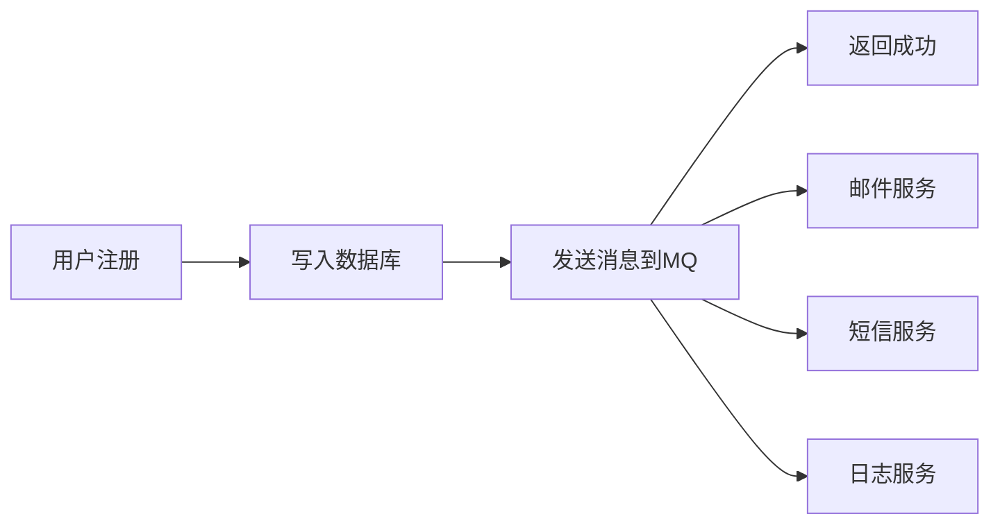

在我们的现在所制定的业务中，是**同步**完成请求**一条龙**的，这就会造成一定的延迟。

为了让业务的返回更加迅速，我们可以尝试**异步**完成**数据库的修改**，而在提交这个异步操作之前，我们只需要校验所需的几个条件是否满足即可，比如优惠券下单的：**库存超卖**，**一人一单**锁。对于这两个的校验，**后者**我们使用**分布式锁**的方式实现了并发的阻塞，**前者**我们也可以将库存数据放到redis中，借助redis的**单线程**保证数据安全：

库存：

| key         | value |
| ----------- | ----- |
| stock:vid:7 | 100   |

有些优惠券是限制**一人一个**的，那么我们也可以redis的**set**集合来完成权限的查询，只需将已使用过的用户id放入对应优惠券的对应set集合即可：

| key         | value |
| ----------- | ----- |
| order:vid:7 | 1,5,9 |

好的，现在我们就只需要对库存以及一人一单的权限做校验并得到最终的**订单id**，然后减扣redis库存并将所需信息传给**阻塞队列**，让其他线程去异步完成数据库的相应操作即可！

这也就是对请求反应速率的优化方案——**异步处理请求**了，而在这种情况下，数据库的压力也会暴增，我们同样需要一种方式来实现数据压力的缓解，也即准备一个**阻塞队列**来作为缓冲区，使用固定的线程池/单线程获取其中数据来完成对数据库的操作。

> 实际架构中常常提到的**消息队列MQ**是指在**微服务架构**下，作为多个服务之间相互调用的协调**中间件**，作为一个**缓冲区**会针对各个服务的负载情况进行调节。当然，两者都是起到了一个**缓冲区**，**异步执行传入操作以不阻塞主线程**的作用，但是阻塞队列倾向于作为一个缓冲区**专门**完成某一项任务，如这里的数据库操作（新建一个线程池/线程执行相应操作，不阻塞主线程）；而后者更倾向于协调**多个服务**之间的**相互调用**。


## 基于redis实现秒杀

我们需要一些redis判断操作，比如判断库存，一人一单的问题，这些操作的数据准确性要求比较高，先前是使用了**锁**的方式来确保数据在并发下准确，而现在我们改为使用redis来判断后，就完全可以将所有操作写为lua脚本，redis执行lua就具有原子性以及互斥性了（单线程）

```lua
local voucherId = ARGV[1]
local userId = ARGV[2]
-- 库存 key
local stockKey = "seckill:stock:" .. voucherId
-- 订单 key
local orderKey = "seckill:order:" .. voucherId

-- 判断库存是否充足
if (tonumber(redis.call("get", stockKey)) <= 0) then
    -- 库存不足
    return 1
end

-- 判断用户是否重复下单
if (redis.call("sismember", orderKey, userId) == 1) then
    -- 用户重复下单
    return 2
end

-- 扣减库存
redis.call("incr", stockKey, -1)
-- 将用户记录到 set 集合中
redis.call("sadd", orderKey, userId)

return 0
```

完成这样的一个**检验+修改**的脚本以后，我们就可以通过判断执行完lua脚本得到的返回值来确定是否写入数据库了

**假如**我们真的**本地**搓一个队列来完成对应的数据库操作的话（实际部署不会自己搓队列来充当完成异步操作的缓冲区的），我们可以这么干：

```java
/**
 * 秒杀优惠券
 *
 * @param voucherId 优惠券id
 * @return 订单id
 */
@Override
public Result seckillVoucher(Long voucherId) throws BusinessException {
    // 执行lua
    Long userId = UserHolder.getUser().getId();
    Long result = stringRedisTemplate.execute(
            SECKILL_SCRIPT,
            Collections.emptyList(),
            userId.toString(),
            voucherId.toString()
    );
    if (result != 0) {
        if (result == 1)
            throw new BusinessException(400, "库存不足");
        if (result == 2)
            throw new BusinessException(400, "请勿重复下单");
    }
    Long id = redisIdWorker.nextId("order");

    VoucherOrder order = new VoucherOrder();
    order.setId(id);
    order.setUserId(userId);
    order.setVoucherId(voucherId);

    queue.add(order);

    return Result.ok(id);
}
```

其中script设置:

```java
public static final DefaultRedisScript<Long> SECKILL_SCRIPT;

static {
    SECKILL_SCRIPT = new DefaultRedisScript<>();
    SECKILL_SCRIPT.setLocation(new ClassPathResource("seckill.lua"));
    SECKILL_SCRIPT.setResultType(Long.class);
}
```

对于**阻塞队列**，我们可以这样设计：

```java
// 秒杀订单队列
private BlockingQueue<VoucherOrder> queue = new ArrayBlockingQueue<>(1024 * 1024);

// 秒杀订单线程
public static final ExecutorService SECKILL_ORDER_EXECUTOR = Executors.newSingleThreadExecutor();

// 秒杀订单初始化
@PostConstruct
public void init() {
    SECKILL_ORDER_EXECUTOR.submit(new VoucherOrderHandler());
}

// 秒杀订单处理线程
private class VoucherOrderHandler implements Runnable {
    @Override
    public void run() {
        while (true) {
            try {
                // 获取队列中的订单信息
                VoucherOrder order = queue.take();
                // 创建订单
                handleVoucherOrder(order);
            } catch (Exception e) {
                log.error("处理订单异常", e);
            }
        }
    }
}

private void handleVoucherOrder(VoucherOrder order) throws BusinessException {
    Long userId = order.getUserId();
    // 创建锁对象
    RLock lock = redissonClient.getLock("lock:order:" + userId);
    // 获取锁
    boolean isLock = lock.tryLock();
    // 判断是否获取锁成功
    if (!isLock) {
        log.error("不允许重复下单");
        return;
    }
    try {
        // 创建订单
        self.createVoucherOrder(order);
    }catch (Exception e){
        log.error("处理订单异常", e);
    }
}
```

可以看到我们使用`BlockingQueue`阻塞队列存储voucher信息，并配备了一个线程（在类加载完成时装载循环执行任务），其会循环尝试获取队列中的信息并完成写入以及修改操作（注意如果使用self自注入以解决代理绕过导致的事务失效的话，需要把createVoucherOrder放到interface接口里）

**当然实际业务中是不会进行如上操作的！以上仅做样例展示！**为什么这么说呢？

实际上我们可以一眼就发现以上操作将所有的阻塞操作都放到**本地的jvm**中执行，假如并发量比较大，那么就会非常鸡肋！不仅会存在**爆栈**的问题，还有可能会**内存泄漏**，而且对**异常**的处理也非常草率。

那么，我们要用什么成熟的组件来实现这么一个异步的阻塞队列呢？


----


## 消息队列

消息队列（Message Queue，简称 **MQ**）是现代分布式系统中实现**异步通信、解耦、流量削峰、可靠传递**的核心中间件。它像一个“**缓冲区**”或“邮局”，让生产者和消费者无需直接通信，就能安全、高效地交换数据。



- **问题**：用户注册后要发邮件、短信、写日志……若同步执行，响应慢。
- **解决**：注册成功后，只写 DB + 发消息到 MQ，立即返回。其他操作由消费者异步完成。
- **效果**：**响应时间从秒级降到毫秒级**，用户体验提升。

同时还可以实现**应用解耦**

- **问题**：订单系统直接调用库存、积分、通知服务 → 耦合高，任一服务故障导致订单失败。
- **解决**：订单系统只发消息到 MQ，各服务自行订阅。
- **效果**：**服务独立演进，故障隔离**。

也可以实现**流量削峰**

- **问题**：秒杀活动瞬间百万请求，压垮数据库。
- **解决**：请求先入 MQ，后端按自身处理能力匀速消费。
- **效果**：**系统不崩溃，请求不丢失**（类似“水龙头”控制流速）。

### **核心机制与问题**

 **🔐 1.** **消息可靠性（如何不丢消息？）**

- **生产者**：开启 **Confirm 机制**（RabbitMQ）或 **事务/幂等**（Kafka）
- **Broker**：消息**持久化到磁盘**（非仅内存）
- **消费者**：**手动 ACK**，处理成功后再确认（避免自动 ACK 导致丢失）

**🔁 2.** **消息重复（如何幂等？）**

- 原因：网络超时重试、消费者重启等

- 解决方案：

  - 数据库唯一索引（如订单号）
  - Redis 记录已处理 ID（带过期时间）
  - 业务状态机（如“待支付”→“已支付”）

 **🔄 3.** **顺序消费**

- Kafka/RocketMQ 支持 **单分区（Partition/Queue）内有序**
- 实现：相同 key 的消息路由到同一分区（如 `orderId % 分区数`）

 **🗑️ 4.** **死信队列（DLQ）**

- 消息多次消费失败后，转入 DLQ 供人工排查
- 避免阻塞正常队列
