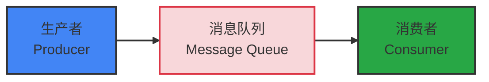
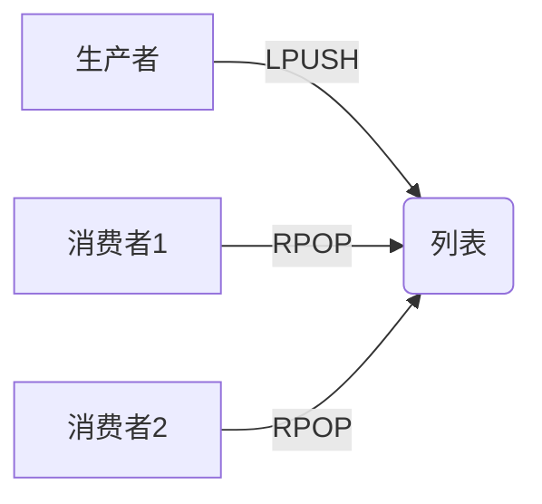
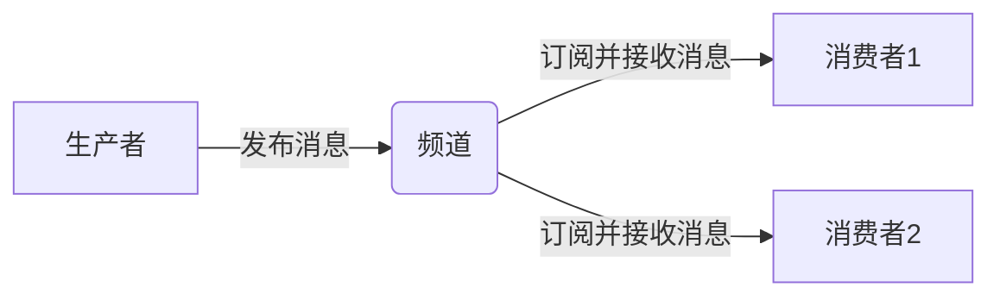
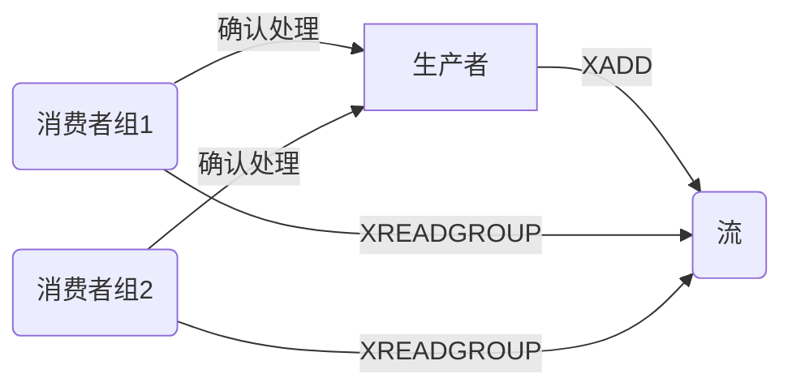
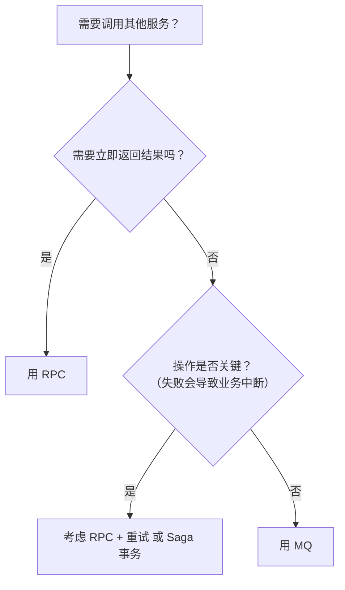

## 消息队列

针对我们先前提到的一些问题，比如**异步**提交任务的队列中，怎么去记录**异常信息**，假如后续需要去获取异步操作（两路并行执行）的**结果**。那该怎么办？

那么我们就可以去考虑使用**消息队列**了：

**消息队列**（Message Queue）是一种**异步通信机制**，用于在分布式系统中实现**生产者**与**消费者**之间的解耦。它通过一个中间层（消息代理缓冲区）**存储**和**转发**消息，确保数据的可靠传递。

| 角色                                   | 说明                                                         |
| :------------------------------------- | :----------------------------------------------------------- |
| **生产者（Producer）**                 | 负责创建并发送消息到消息队列。例如：订单服务在用户下单后发送“订单创建”事件。 |
| **消息队列（Message Queue / Broker）** | 存储、管理消息的中间件，也称为**消息代理**（Message Broker）。负责接收来自生产者的消息，并按规则分发给消费者。 |
| **消费者（Consumer）**                 | 从消息队列中获取消息并进行处理。例如：库存服务监听“订单创建”事件，扣减库存。 |



在微服务架构下，我们会使用一些成熟的组件：

| 产品         | 特点           | 典型用途             |
| :----------- | :------------- | :------------------- |
| **RabbitMQ** | 可靠、灵活路由 | 企业级应用、任务调度 |
| **Kafka**    | 高吞吐、日志流 | 日志收集、大数据管道 |
| **RocketMQ** | 高性能、金融级 | 电商、支付、交易系统 |
| **Pulsar**   | 多租户、云原生 | 云计算、微服务       |

> 真到了微服务层级，Redis提供的Redis Stream是不够用的，还是使用成熟的MQ中间件更合适（链路追踪等方面做的好得多）这里看看就行
>

Redis的三种消息队列：

| 模型        | 是否持久化 | 是否支持消费者组 | 是否支持 ACK | 适用场景                 |
| :---------- | :--------- | :--------------- | :----------- | :----------------------- |
| **Pub/Sub** | ❌ 否       | ❌ 否             | ❌ 否         | 实时通知、广播事件       |
| **LIST**    | ❌ 否       | ❌ 否             | ❌ 否         | 简单任务分发（允许丢失） |
| **STREAM**  | ✅ 是       | ✅ 是             | ✅ 是         | 可靠消息队列、事件溯源   |


## List类型的Redis消息队列

List类型消息队列就是基于Redis本身提供的List**双向链表**实现的一个消息队列，结合Lpush以及Rpop（或者倒过来）来实现消息队列的，这里为了保证阻塞效果（阻塞/循环等待数据并提取交给消费者），会使用BRpop（**阻塞**泵出，当有数据时泵出，无数据时**阻塞等待**）获取数据/操作消息。

这样的队列支持单对单/多的消息传递，同时消息丢失无法避免（内存汰换，业务失败消息丢失）




## PubSub类型的Redis消息队列

这种类型的消息队列支持消费者订阅一个或多个channel，当生产者向channel发送消息，所有订阅了该channel的消费者都能获取到消息。Redission的**RTopic**就是基于该消息队列实现的，这种消息队列适用于**广播**的场景。

当然，也还是无法实现消息丢失的问题。



## Stream类型的Redis消息队列

Redis中的这种消息队列是作为数据类型的，也即其可以被持久化，会将消息存储到Redis中。同时也是Redis专门为消息队列设计的一种数据类型，相比前面两个类型，其更加完整，提供了诸多MQ的基础功能，如是否阻塞等待，等待时间等。

stream存储生产者提供的消息（stream内的消息不会删除），多个消费者组共享消息（订阅该stream），组内将该消息分流到一个消费者（xreadgroup）将数据放到pending-list（组内共享，每组一个）中，消费者完成后xack确认已完成并从pending-list中删除该消息



| 特性                            | 说明                                                         |
| :------------------------------ | :----------------------------------------------------------- |
| **持久化存储**                  | 消息写入内存 + 可选持久化到磁盘（AOF/RDB），**不会因客户端离线丢失** |
| **消息 ID 自动生成**            | 每条消息有唯一 ID（如 `1678901234567-0`），支持按 ID 范围查询 |
| **消费者组（Consumer Groups）** | 类似 Kafka：多个消费者分组协作消费，**每条消息只被组内一个消费者处理** |
| **ACK 机制**                    | 消费者处理成功后需手动确认（`XACK`），失败可重试或进入死信队列 |
| **消息回溯**                    | 可从任意 ID 开始读取历史消息（适合故障恢复、重放）           |

**基本命令示例**

```bash
# 1. 生产消息（自动分配ID）
XADD mystream * event "user_login" user_id 1001

# 2. 创建消费者组
XGROUP CREATE mystream mygroup $

# 3. 消费者读取消息（> 表示只读新消息）
XREADGROUP GROUP mygroup consumer1 COUNT 1 STREAMS mystream >

# 4. 确认消息已处理
XACK mystream mygroup 1678901234567-0
```

与其他两种类型的区别：

| 模式        | 是否持久化 | 消费模型           | ACK  | 适用场景                   |
| :---------- | :--------- | :----------------- | :--- | :------------------------- |
| **Pub/Sub** | ❌ 否       | 广播（所有订阅者） | ❌    | 实时通知（允许丢失）       |
| **LIST**    | ❌ 否       | 点对点（竞争消费） | ❌    | 简单任务队列               |
| **Stream**  | ✅ 是       | 消费者组 + 单播    | ✅    | **可靠消息队列、事件溯源** |

对于非消费组读**XREAD**，有几个特性：

- 消息可回溯（消息不会删除）
- 一个消息可被多个消费者读取（非破坏式读取）
- 可以阻塞读取（比BLPOP更加完整完善）

但是存在消息漏读的可能，所以Redis就提供了另外一种方式来防止这种情况的出现。


## Redis Stream的消费者组

**消息分流**：多个消费者分组协作消费，**每条消息只被组内一个消费者处理**，也即消息会分流给组内不同消费者（当然需要被多个消费者共同获取的话，加多个消费者组即可）。

**消息标识**：**消息不会被删除**，消费的记录是通过组内维护一个**标识**来决定下一次读取的消息。

**消息确认**：消费者在获取到消息后，消息处于pending状态，并存入pending-list中，处理完成后需要获取xack以标记为已处理，并从pending-list中删除（宕机时消息状态会被持久化到本地中而非直接丢失）

### **从消费者组读取消息：**`XREADGROUP`

**命令格式：**

```bash
XREADGROUP GROUP group consumer [COUNT count] [BLOCK milliseconds] [NOACK] STREAMS key [key ...] ID [ID ...]
```

**参数详解：**

| 参数                 | 说明                                                         |
| :------------------- | :----------------------------------------------------------- |
| `group`              | 消费组名称                                                   |
| `consumer`           | 消费者名称，若不存在会自动创建                               |
| `COUNT count`        | 最多返回的消息数量，默认为 1                                 |
| `BLOCK milliseconds` | 当无新消息时阻塞等待的时间（毫秒），如 `BLOCK 1000` 表示最多等 1 秒；设为 `0` 则无限等待 |
| `NOACK`              | 如果设置，获取消息后不会标记为“已确认”，适用于无需手动 ACK 的场景（一般不用，以防万一） |
| `STREAMS key ...`    | 要读取的 Stream 名称列表                                     |
| `ID`                 | 从哪个消息 ID 开始读取                                       |

| ID 值               | 含义                                                       |
| :------------------ | :--------------------------------------------------------- |
| `">"`               | 从下一个未被消费的消息开始（推荐用于正常消费）             |
| `"0"`               | 从 pending-list 中第一个**未确认**的消息开始（常用于重试） |
| `"1642738912000-0"` | 指定某个具体的 ID 开始读取                                 |

> 💡 使用 `">"` 是最常见的方式，表示“给我下一条还没消费的消息”。

读取后消息被放入组内pending-list。

### XACK确认消息已处理

```bash
XACK mystream mygroup <message_id>
```

- 将指定消息从 pending list 中移除，表示已成功处理
- 若不 ACK，则消息会一直留在 pending list，可用于监控未完成任务

### 从pending-list中获取未确认消息

```bash
XPENDING mystream mygroup
```

- 显示当前组中所有未确认的消息
- 可查看哪些消费者卡住了、哪些消息需要重试

后续的业务需要用到stream的消息队列的话，流程就是：

1. 生产者xadd消息到stream
2. 消费者xreadgroup读取消息（>读取最新**未接收**消息），消息放入组内pending-list，尝试完成相应操作
3. 消费者xack确认消息已经完成，组内pending-list删除该消息
4. 消费者再次读取消息（0读取**未完成**消息），尝试完成

> MQ一般用于处理异步**无需返回值**业务，所以RedisStream本身不提供生产者结果获取，需要**自行设计**，如消费者将结果再次存入Redis的一条新的流或是String中，生产者阻塞/轮询读取存入结果。
>


## 在业务中使用Stream实现异步执行

首先我们需要将消息存入消息队列，那么我们可以利用先前完成的lua脚本，在其中加入xadd完成将消息存入队列的操作：

```lua
local voucherId = ARGV[1]
local userId = ARGV[2]
local orderId = ARGV[3]
-- 库存 key
local stockKey = "seckill:stock:" .. voucherId
-- 订单 key
local orderKey = "seckill:order:" .. voucherId

-- 判断库存是否充足
if (tonumber(redis.call("get", stockKey)) <= 0) then
    -- 库存不足
    return 1
end

-- 判断用户是否重复下单
if (redis.call("sismember", orderKey, userId) == 1) then
    -- 用户重复下单
    return 2
end

-- 扣减库存
redis.call("incr", stockKey, -1)
-- 将用户记录到 set 集合中
redis.call("sadd", orderKey, userId)
-- 发送消息
redis.call("xadd", "stream.orders", "*", "userId", userId, "voucherId", voucherId, "id", orderId)

return 0
```

现在将lua放入业务中执行：

```java
/**
 * 秒杀优惠券
 *
 * @param voucherId 优惠券id
 * @return 订单id
 */
@Override
public Result seckillVoucher(Long voucherId) throws BusinessException {
    // 执行lua
    Long userId = UserHolder.getUser().getId();
    Long id = redisIdWorker.nextId("order");
    // 创建订单
    Long result = stringRedisTemplate.execute(
            SECKILL_SCRIPT,
            Collections.emptyList(),
            userId.toString(),
            voucherId.toString(),
            id.toString()
    );
    if (result != 0) {
        if (result == 1)
            throw new BusinessException(400, "库存不足");
        if (result == 2)
            throw new BusinessException(400, "请勿重复下单");
    }
    return Result.ok(id);
}
```

我们在lua中完成校验并将消息放入消息队列中，那么这时候就已经完成redis层的操作了，就可以直接返回结果了。

之后就只要**异步**完成数据库的修改，也即将传入消息队列的数据写入数据库并完成更新即可！

而现在，我们需要一个线程去循环等待redis中消息队列的消息并执行：

```java
// 秒杀订单线程
public static final ExecutorService SECKILL_ORDER_EXECUTOR = Executors.newSingleThreadExecutor();

// 秒杀订单初始化
@PostConstruct
public void init() {
    SECKILL_ORDER_EXECUTOR.submit(new VoucherOrderHandler());
}
```

对应消息队列循环处理方法：

```java
// 秒杀订单处理线程
private class VoucherOrderHandler implements Runnable {
    private String queueName = "stream.orders";
    @Override
    public void run() {
        while (true) {
            try {
                // 获取消息队列中的订单信息 对应命令为 XREADGROUP GROUP g1 c1 COUNT 1 BLOCK 2000 STREAMS stream.orders >
                List<MapRecord<String, Object, Object>> read = stringRedisTemplate.opsForStream().read(
                        Consumer.from("g1", "c1"),                                        // 消费者组
                        StreamReadOptions.empty().count(1).block(Duration.ofSeconds(2)),  // 数量
                        StreamOffset.create(queueName, ReadOffset.lastConsumed())         // 消费的队列
                );
                // 判断是否获取到消息
                if (read == null || read.isEmpty()){
                    continue;
                }
                // 成功，创建订单
                MapRecord<String, Object, Object> record = read.get(0); // MapRecord是键值对: key : Map（map嵌套map）
                Map<Object, Object> values = record.getValue();
                VoucherOrder order = BeanUtil.fillBeanWithMap(values, new VoucherOrder(), true);
                handleVoucherOrder(order);
                // ack确认 对应命令为 XACK stream.orders g1 id
                stringRedisTemplate.opsForStream().acknowledge(queueName, "g1",record.getId());
            } catch (Exception e) {
                log.error("处理订单异常", e);
                // 处理pending-list中的订单
                handlePendingOrder();
            }
        }
    }

    // 处理pending-list中的订单
    private void handlePendingOrder() {
        while (true) {
            try {
                // 获取消息队列中的订单信息 对应命令为 XREADGROUP GROUP g1 c1 COUNT 1 STREAMS stream.orders 0
                List<MapRecord<String, Object, Object>> read = stringRedisTemplate.opsForStream().read(
                        Consumer.from("g1", "c1"),                                      // 消费者组
                        StreamReadOptions.empty().count(1),                             // 数量
                        StreamOffset.create(queueName, ReadOffset.from("0"))            // 消费的队列
                );
                // 判断是否获取到消息
                if (read == null || read.isEmpty()){
                    // 无异常，则返回
                    break;
                }
                // 成功，创建订单
                MapRecord<String, Object, Object> record = read.get(0); // MapRecord是键值对: S : Map（map嵌套map）
                Map<Object, Object> values = record.getValue();
                VoucherOrder voucherOrder = BeanUtil.fillBeanWithMap(values, new VoucherOrder(), true);
                handleVoucherOrder(voucherOrder);
                // ack确认 对应命令为 XACK stream.orders g1 id
                stringRedisTemplate.opsForStream().acknowledge(queueName, "g1",record.getId());
            } catch (Exception e) {
                log.error("处理pending-list订单异常", e);
                try {
                    Thread.sleep(50);
                } catch (InterruptedException exception) {
                    throw new RuntimeException(exception);
                }
            }
            
        }
    }
    
    
}
```

可以看到我们就是使用这个线程来**循环read** Redis中的对应消息队列的数据，倘若存在数据则**获取数据**，消息存入**pending-list**并完成数据库**相关操作**，如果中途发生**异常**导致消息处理失败，就会去处理挂起的消息（**pending-list**中的消息），在完成相应操作后会去**ack**消息，将之从pending-list中取出，确认已完成。

后续如果需要去更进一步，那就需要考虑加入线程池等方面了，那么这时候对于异常的处理，以及阻塞的安排（对pending-list中消息的处理可能存在竞争）就需要额外设计了。


----


## 为什么在微服务中使用RabbitMQ等MQ，而不是直接使用Redis提供的MQ？

**Redis 不是为高可靠、持久化、复杂路由的消息传递而设计的；它是一个内存数据库，消息能力只是“附带功能”。**
而 RabbitMQ/Kafka 是**专为消息传递场景打造的中间件**，在可靠性、一致性、扩展性、运维等方面远胜 Redis。

| 维度                 | **Redis（作为 MQ）**                                         | **RabbitMQ / Kafka（专业 MQ）**                              |
| :------------------- | :----------------------------------------------------------- | :----------------------------------------------------------- |
| **1. 消息可靠性**    | ❌ 弱 • `LIST`/`PUBSUB` 默认**不持久化** • 即使开启 AOF/RDB，仍可能丢消息（如宕机时缓冲区未刷盘） | ✅ 强 • 消息默认**持久化到磁盘** • 支持 **生产者确认（Confirm） + 消费者手动 ACK** • 可配置同步刷盘（如 RocketMQ） |
| **2. 消息堆积能力**  | ❌ 差 • 所有数据在内存中 → 堆积大量消息会**耗尽内存** • 需手动管理内存淘汰策略（如 LRU） | ✅ 强 • 消息存储在**磁盘**，可堆积 TB 级数据 • 内存仅作缓存，不影响稳定性 |
| **3. 消费模型**      | ⚠️ 有限 • `LIST`：点对点，但无 ACK 机制 → 消费失败即丢失 • `PUB/SUB`：广播，但**不支持持久订阅**（客户端断开即丢消息） • `Streams`：较新，支持消费者组，但生态弱 | ✅ 完善 • 支持 **点对点 + 发布/订阅** • **消费者组（Consumer Group）** • **死信队列（DLQ）** • **延迟队列、优先级队列**等高级特性 |
| **4. 消息顺序**      | ⚠️ 仅单流有序 • `LIST` 或 `Stream` 单 key 内有序，但无法跨 key 保证 | ✅ 可控 • Kafka：分区（Partition）内严格有序 • RabbitMQ：单队列有序（需单消费者） |
| **5. 运维与监控**    | ❌ 弱 • 无内置消息追踪、积压监控 • 需自行开发管理界面         | ✅ 强 • 提供 Web UI（如 RabbitMQ Management） • 集成 Prometheus/Grafana 监控 • 支持消息轨迹、重试、回溯 |
| **6. 协议与生态**    | ❌ 封闭 • 仅支持 Redis 协议 • 客户端需处理底层命令（如 `XREADGROUP`） | ✅ 开放 • 标准协议（AMQP、MQTT、Kafka 协议） • 丰富客户端库（Java/Python/Go/Node.js 等） • 与 Spring Cloud Stream、Flink、Spark 等无缝集成 |
| **7. 高可用 & 扩展** | ⚠️ 依赖 Redis 集群 • 主从复制延迟可能导致消息不一致 • 扩容需重新分片（复杂） | ✅ 原生支持 • RabbitMQ：镜像队列 / Quorum Queue • Kafka：副本机制 + 自动 Leader 选举 • 水平扩展简单 |

**场景：订单创建后发送邮件**

- 用 Redis LIST：
  - 订单服务 `LPUSH order_queue {orderId}`
  - 邮件服务 `BRPOP order_queue`
  - **风险**：邮件服务处理中宕机 → 消息永久丢失（无 ACK）
- 用 RabbitMQ：
  - 订单服务发送消息到 `order.created` 队列
  - 邮件服务消费后**手动 ACK**
  - 失败时自动重回队列或进入 DLQ → **消息不丢**

**场景：高并发日志收集**

- **Redis**：内存迅速耗尽，触发淘汰策略 → 日志**丢失**
- **Kafka**：写入磁盘，可堆积数 TB 数据，消费者按需拉取

**Redis 适合做 MQ 的场景（少数）**

| 场景                           | 说明                                              |
| :----------------------------- | :------------------------------------------------ |
| **轻量级任务队列**             | 如后台图片压缩、缓存预热，允许少量丢失            |
| **实时通知（非关键）**         | 如在线用户状态广播（用 PUB/SUB）                  |
| **已有 Redis，不想引入新组件** | 快速原型验证（PoC），但**不建议用于生产核心链路** |

简单一句总结，Redis毕竟还是专门用于做**缓存**的内存数据库，Redis Streams只能算是添头，面对高并发场景还是选择专门的MQ更好。


## 什么场景使用RPC？什么场景使用MQ？区别在哪？

RPC（远程过程调用）和 MQ（消息队列）都是服务间通信的手段，但它们的**适用场景、设计理念和系统影响截然不同**。

> **✅ 一句话总结区别**
> **RPC 是“同步调用”，追求**即时响应**；
> MQ 是“异步通信”，追求**解耦与可靠传递**。**

> 💡 **黄金法则**：
>
> - **要结果 → 用 RPC**
> - **发事件 → 用 MQ**

**一、RPC（Remote Procedure Call）—— 同步、强依赖**

 **🔧 典型代表**

- gRPC、Dubbo、Spring Cloud OpenFeign、Thrift

 **🎯 核心特点**

| 特性           | 说明                                       |
| :------------- | :----------------------------------------- |
| **同步阻塞**   | 调用方等待被调用方返回结果（如 HTTP 请求） |
| **实时性高**   | 适合需要立即得到结果的场景                 |
| **强耦合**     | 调用方必须知道被调用方的地址、接口、协议   |
| **失败即中断** | 被调用方宕机 → 调用方直接报错              |

**✅ 适用场景（用 RPC）**

1. 需要立即返回结果
   - 用户登录：调用认证服务验证密码 → 立即返回 token
   - 查询商品详情：前端请求 → 聚合服务调用商品、库存、评价服务 → 拼装后返回
2. 事务性强的操作
   - 支付前检查余额（必须同步确认）
3. 低延迟要求
   - 实时风控、实时推荐

**❌ 不适用场景**

- 被调用方处理慢（如生成报表）
- 被调用方不稳定（会导致调用方雪崩）
- 不关心结果（如发通知）

------

**二、MQ（Message Queue）—— 异步、弱依赖**

**🔧 典型代表**

- RabbitMQ、Kafka、RocketMQ

**🎯 核心特点**

| 特性           | 说明                             |
| :------------- | :------------------------------- |
| **异步非阻塞** | 发完消息就返回，不等消费者处理   |
| **解耦**       | 生产者不知道消费者是否存在       |
| **削峰填谷**   | 高峰期消息堆积，消费者按能力消费 |
| **最终一致性** | 不保证实时，但保证最终会处理     |

**✅ 适用场景（用 MQ）**

1. 不需要立即响应
   - 用户注册 → 发欢迎邮件/短信（用户不关心是否成功）
2. 流量削峰
   - 秒杀下单 → 先入队列，订单服务匀速处理
3. 广播通知
   - 商品价格变更 → 通知搜索、推荐、缓存服务更新
4. 跨系统集成
   - 订单系统 → 财务系统（不同团队、不同技术栈）
5. 日志/监控数据收集
   - 应用埋点 → Kafka → Flink 实时分析

**❌ 不适用场景**

- 需要返回计算结果（如“计算用户积分”）
- 强一致性要求（如银行转账）

------

**三、对比表格：RPC vs MQ**

| 维度           | **RPC**                 | **MQ**                           |
| :------------- | :---------------------- | :------------------------------- |
| **通信模式**   | 同步（请求-响应）       | 异步（发布-订阅 / 点对点）       |
| **耦合度**     | 高（需知道对方接口）    | 低（只需约定消息格式）           |
| **可靠性**     | 依赖网络和对方可用性    | 消息持久化，可重试，不丢         |
| **延迟**       | 低（ms 级）             | 较高（可能秒级，取决于消费速度） |
| **吞吐量**     | 受限于被调用方处理能力  | 高（生产快，消费可慢）           |
| **错误处理**   | 直接抛异常              | 可重试、死信队列、人工干预       |
| **典型协议**   | HTTP/2, TCP, Dubbo 协议 | AMQP, Kafka 协议, 自定义         |
| **系统复杂度** | 低（像本地调用）        | 高（需管理消息格式、幂等、积压） |

**✅ 总结**

| 场景                           | 推荐                             |
| :----------------------------- | :------------------------------- |
| **查数据、做决策、强一致性**   | ✅ RPC                            |
| **发通知、记日志、削峰、广播** | ✅ MQ                             |
| **核心交易链路**               | RPC（同步校验） + MQ（异步后续） |
| **跨团队/跨语言系统集成**      | 优先 MQ（解耦）                  |




## 新开线程内调用Bean对象的动态代理，其的增强会生效吗？

是可以的，但是比如`@Transactional`就是可以在**线程内部**正常开启的，但是由于和外部线程不是一个上下文，事务是无法传播到外部合成一个的。


## StringRedisTemplate的opsForStream的相关操作

```java
// 获取消息队列中的订单信息 对应命令为 XREADGROUP GROUP g1 c1 COUNT 1 BLOCK 2000 STREAMS stream.orders >
                List<MapRecord<String, Object, Object>> read = stringRedisTemplate.opsForStream().read(
                        Consumer.from("g1", "c1"),                                      	// 消费者组
                        StreamReadOptions.empty().count(1).block(Duration.ofSeconds(2)),    // 数量
                        StreamOffset.create(queueName, ReadOffset.lastConsumed())           // 消费的队列
                );
```

| 功能         | 方法                                                 |
| :----------- | :--------------------------------------------------- |
| 写入消息     | `add(StreamRecords)`                                 |
| 消费者组读取 | `read(Consumer, StreamReadOptions, StreamOffset...)` |
| 普通读取     | `read(StreamReadOptions, StreamOffset...)`           |
| 确认消息     | `acknowledge(String group, Record)`                  |
| 查看 Pending | `pending(String key, String group)`                  |
| 转移消息     | `claim(...)`                                         |
| 创建组       | `createGroup(...)`                                   |
| 删除消息     | `delete(...)`                                        |
| 裁剪 Stream  | `trim(...)`                                          |

### **1.** **写入消息（XADD）**

**方法：**

```java
String id = streamOps.add(
    StreamRecords.newRecord()
        .ofObject(orderMap)           // 消息内容（Map<String, ?>）
        .withStreamKey("stream.orders")
);
```

**更精细控制：**

```java
String id = streamOps.add(
    StreamRecords.string("stream.orders")
        .ofEntries("orderId", "1001", "amount", "99.9")
);
```

> ✅ 支持指定 ID（如 `"*"` 自动生成）、设置 `MAXLEN` 自动裁剪：

```java
streamOps.add(StreamRecords.newRecord()
    .ofObject(data)
    .withStreamKey(key)
    .withMaxLen(1000)  // XADD ... MAXLEN ～ 1000
);
```

------

### **2.** **读取消息（XREAD / XREADGROUP）**

**(1) 普通读取（无消费者组）**

```java
List<MapRecord<String, Object, Object>> records = streamOps.read(
    StreamReadOptions.empty().count(10).block(Duration.ofSeconds(5)),
    StreamOffset.fromStart("mystream")   // 从开头读
    // 或 StreamOffset.latest("mystream")  // 从最新
);
```

**(2)** **消费者组读取**

```java
List<MapRecord<String, Object, Object>> read = streamOps.read(
    Consumer.from("g1", "c1"),                          // 消费者组 g1，消费者 c1
    StreamReadOptions.empty().count(1).block(Duration.ofSeconds(2)),
    StreamOffset.create("stream.orders", ReadOffset.lastConsumed()) // 相当于 ">"
);
```

> 🔍 `ReadOffset.lastConsumed()` 对应 Redis 的 `">"`，表示“读取下一个未消费的消息”。

**(3) 从 Pending List 重试（对应 ID = "0"）**

```java
List<MapRecord<String, Object, Object>> pending = streamOps.read(
    Consumer.from("g1", "c1"),
    StreamReadOptions.empty().count(10),
    StreamOffset.create("stream.orders", ReadOffset.from("0")) // 从 pending 开始
);
```

------

### **3.** **确认消息（XACK）**

```java
Long ackCount = streamOps.acknowledge(
    "stream.orders",     // Stream key
    "g1",                // 消费者组
    "1642738912000-0"    // 消息 ID（可传多个）
);

// 或从 Record 中直接 ACK
if (!read.isEmpty()) {
    MapRecord<String, Object, Object> record = read.get(0);
    streamOps.acknowledge("g1", record); // 自动提取 key + id
}
```

> ✅ 推荐使用 `acknowledge(group, record)`，更安全。

------

### **4.** **查看 Pending 信息（XPENDING）**

**(1) 获取组级别统计**

```java
PendingMessagesSummary pendingSummary = streamOps.pending(
    "stream.orders",
    "g1"
);

System.out.println("Total pending: " + pendingSummary.getTotalPendingMessages());
System.out.println("Earliest ID: " + pendingSummary.getEarliestMessageId());
```

**(2) 获取具体 Pending 消息详情（含消费者、重试次数）**

```java
List<PendingMessages> pendingDetails = streamOps.pending(
    "stream.orders",
    Consumer.from("g1", "c1"),  // 可指定消费者
    Range.unbounded(),          // ID 范围，如 Range.closed("0", "+")
    10                          // 最多返回条数
);
```

> 返回的 `PendingMessages` 包含：
>
> - `getId()`
> - `getConsumerName()`
> - `getElapsedTimeSinceLastDelivery()`（毫秒）
> - `getDeliveryCount()`

------

### **5.** **转移消息所有权（XCLAIM）**

用于将长时间未处理的 Pending 消息转移给其他消费者（实现“死信处理”）：

```java
List<MapRecord<String, Object, Object>> claimed = streamOps.claim(
    "stream.orders",
    "g1",
    "new-consumer",             // 新消费者
    Duration.ofMinutes(5),      // min-idle-time：至少空闲 5 分钟才转移
    "1642738912000-0"           // 消息 ID
);
```

> ⚠️ 通常配合 `XPENDING` 使用：先查出高 `deliveryCount` 的消息，再 `XCLAIM` 转移。

------

### **6.** **创建/删除消费者组（XGROUP CREATE / DESTROY）**

```java
// 创建消费者组（从最新开始）
streamOps.createGroup("stream.orders", ReadOffset.lastConsumed(), "g1");

// 从开头创建
streamOps.createGroup("stream.orders", ReadOffset.from("0"), "g1");

// 删除消费者组
streamOps.destroyGroup("stream.orders", "g1");
```

> 💡 如果组已存在，`createGroup` 会抛异常。可先用 `XINFO GROUPS` 检查（但 Spring Data Redis 未直接暴露）。

------

### **7.** **其他实用操作**

| 操作            | 方法                                                  | 说明                                       |
| :-------------- | :---------------------------------------------------- | :----------------------------------------- |
| **删除消息**    | `streamOps.delete("stream.orders", "id1", "id2")`     | 对应 `XDEL`                                |
| **裁剪 Stream** | `streamOps.trim("stream.orders", 1000)`               | 保留最近 1000 条（`XTRIM MAXLEN ～ 1000`） |
| **获取长度**    | `streamOps.size("stream.orders")`                     | 对应 `XLEN`                                |
| **读取范围**    | `streamOps.range("stream.orders", Range.unbounded())` | 对应 `XRANGE`                              |
