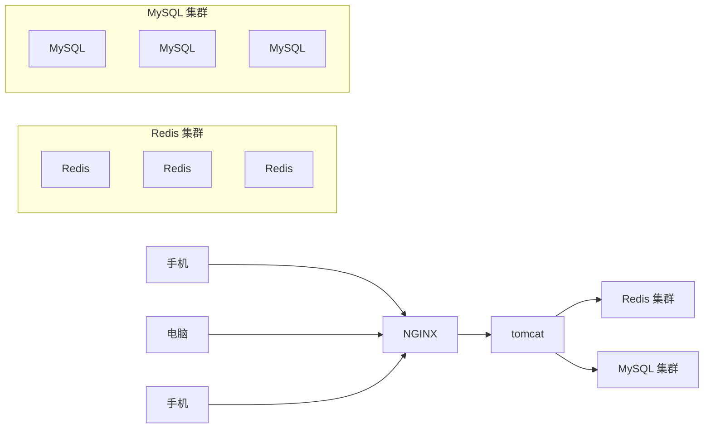

## 项目重点：

利用redis解决常见业务场景以及技术问题：

### 🔹 1. **短信登录：Redis 共享 Session 应用**

- **技术问题**：
  多台服务器集群环境下，用户登录状态（Session）无法共享，导致跨服务器登录失效。

- **解决方案**：

  使用 Redis 存储用户的 Session 信息，实现分布式 Session 共享。

  - 用户登录后将 Session 写入 Redis，设置过期时间。
- 后续请求通过 Token 或 Cookie 获取 Session ID，从 Redis 中读取会话数据。

------

### 🔹 2. **达人探店：基于 List 和 SortedSet 的点赞功能**

- **技术问题**：
  如何高效实现“点赞列表”和“点赞排行榜”？

- **解决方案**：
- **点赞列表**：使用 `List` 数据结构存储用户点赞记录，支持顺序查看。
  - **点赞排行榜**：使用 `SortedSet`（ZSet），以点赞数为分数排序，支持快速查询 Top N。
- 支持去重（避免重复点赞）、实时更新排名。

------

### 🔹 3. **好友关注：基于 Set 集合的社交关系管理**

- **技术问题**：
  如何高效处理用户之间的关注、取关、共同关注等操作？

- **解决方案**：
  - 使用 `Set` 存储用户关注列表（如 `follow:user:1`）。
  - 利用 `SINTER`（交集）计算共同关注用户。
  - 支持消息推送（如“XXX 关注了你”）。
  - 可结合 Redis 消息队列或 Pub/Sub 实现异步通知。

------

### 🔹 4. **优惠券秒杀：高并发下的库存控制与防超卖**

- **技术问题**：
  秒杀场景下，高并发请求可能导致库存超卖、系统压力过大。

- **解决方案**：
- **Redis 计数器**：用 `INCR`/`DECR` 原子操作控制库存，避免超卖。
  
- **Lua 脚本**：保证“减库存 + 下单”操作的原子性，防止并发问题。
  
- **分布式锁**：使用 Redis 实现分布式锁（如 `SETNX` + 过期时间），防止重复下单。
  
- 三种消息队列：
  
  - 使用 Redis 的 `List`、`Pub/Sub`、`Stream` 实现异步处理订单，削峰填谷。

------

### 🔹 5. **附近的商户：GeoHash 定位查询**

- **技术问题**：
  如何快速查找用户附近的商家？传统数据库查询效率低。

- **解决方案**：
  - 使用 Redis 的 `GEO` 功能（基于 GeoHash）。
  - 将商户位置（经纬度）存入 Redis 的 Geo 索引。
  - 使用 `GEORADIUS` 或 `GEORADIUSBYMEMBER` 快速查询指定范围内的商户。
  - 支持按距离排序、限制返回数量。

### 🔹 6. **用户签到：BitMap 数据统计**

- **技术问题**：
  如何高效统计用户每日签到情况？传统方式存储成本高。
- **解决方案**：
  - 使用 Redis 的 `BitMap`，每个用户每天一个 bit 表示是否签到。
  - 例如：`BITMAP:user:1:20240501`，bit 位置表示日期。
  - 支持快速统计连续签到天数、签到率等。
  - 空间占用极小，适合海量用户场景。

------

### 🔹 7. **UV 统计：HyperLogLog 去重统计**

- **技术问题**：
  如何准确统计网站日活用户（UV）？传统集合存储内存消耗大。
- **解决方案**：
  - 使用 Redis 的 `HyperLogLog` 数据结构。
  - 以极小的内存（约 12KB）估算海量数据的基数（唯一值数量）。
  - 支持 `PFADD` 添加用户 ID，`PFCOUNT` 统计 UV。
  - 误差率小于 0.8%，适用于大数据量的近似统计。

------

### 🔹 8. **商户查询缓存：企业级缓存策略**

- **技术问题**：
  - 缓存雪崩（大量缓存同时过期）
  - 缓存穿透（查询不存在的数据，打穿缓存）
  - 缓存击穿（热点 key 过期瞬间被大量请求击穿）
- **解决方案**：
  - **缓存雪崩**：设置缓存过期时间随机化（如 ±10s）。
  - **缓存穿透**：布隆过滤器（Bloom Filter）预判不存在的 key。
  - **缓存击穿**：使用互斥锁（如 Redis 分布式锁）或“互斥键”策略。
  - 使用本地缓存 + 分布式缓存双层架构提升性能。

## 架构框架图：

