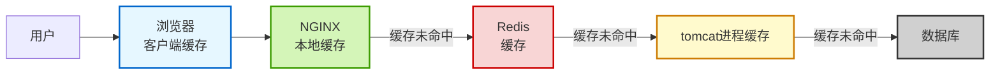

在我们先前学习的缓存结构中，我们是**在后端服务器中完成对缓存层的调用**，那么这里就存在一个性能瓶颈：假如Spring的**tomcat达到上限**了，那么就会导致后面的缓存以及数据库的优化得不到发挥，限制了项目整体的性能。

因此，一般我们会对后端服务也做抗并发以及性能的优化，比如通过Redission等方式构建**分布式后端**，将服务拆分为多个子服务从而构建**微服务**。

但抛开后端自己，我们其实还可以向前看，在更前面的**nginx**反向代理就加入数据缓存，**提前处理掉一些简单的请求**，从而达到更好的高并发性能。甚至我们还可以将一些数据直接缓存在前端本地如浏览器的storage等，当用户需要时直接从本地获取。



> Redis为什么会tomcat前面？不应该交由tomcat的业务处理调用吗？
> 其实Nginx也可以做一些业务处理，我们在完成Nginx的集群搭建后，也可以将一定的业务交由Nginx处理。

我们通过这样的多级缓存来保证数据压力的缓解。

其中**nginx**，redis，tomcat都可以做成**集群**的方式来实现更加强大的并发处理能力。

那么接下来我们就要开始实现在这个多级缓存链路上实现各个模块了

> 寻常业务还是推荐redis和数据库够用就行，对于多级缓存的维护以保证数据一致是个大工程，每开发一个业务都要考虑到
>
> 当然简单的还是可以放到nginx里面的


### JVM进程缓存(Caffeine )

“JVM 进程本地缓存”通常是指**运行在单个 JVM 进程内部、仅对该进程可见的缓存机制**，它不涉及跨进程或分布式共享（如 Redis、Memcached），而是利用 JVM 堆内存（或堆外内存）来存储临时数据，以加速应用逻辑、减少重复计算或 IO 开销。

这类缓存广泛应用于 Java 应用中，是**应用层缓存**的一种形式，但因其生命周期和作用域限定在单个 JVM 进程内，常被称为 **“本地缓存”（Local Cache）** 或 **“进程内缓存”（In-Process Cache）**。

> **相比分布式缓存**如Redis等，没有通信开销，但是无法支持**多机之间的通信**，需要自己实现，而且可靠性比较差，宕机了就没了。

我们的Java最好的特性就是封装好且生态好，当我们想到某一方面时，去找找是否有前人做过往往都能够获得一个已经大致完成的框架，而对于我们现在要完成的进程缓存，我们也有这样一个工具，那就是**Caffeine**：

> 使用谨慎，crud都要带上对于这一部分的数据更新，后续维护也好，资源开销也好，都需要提前准备好
> **单机**下用的多，多机尤其是分布式下维护麻烦，基本不用

| 特性                 | 说明                                                         |
| :------------------- | :----------------------------------------------------------- |
| ✅ **高性能**         | 基于 **Window TinyLFU** 淘汰算法，在命中率和内存效率上优于 LRU/LFU。 |
| ✅ **线程安全**       | 所有操作天然线程安全，无需额外同步。                         |
| ✅ **自动加载/刷新**  | 支持 `get(key, mappingFunction)` 自动加载，以及基于时间的异步刷新。 |
| ✅ **灵活的过期策略** | 支持基于写入时间（TTL）、访问时间（TTI）、弱/软引用等。      |
| ✅ **异步 API**       | 提供 `AsyncLoadingCache`，支持非阻塞式缓存操作。             |
| ✅ **统计监控**       | 内置命中率、加载次数、平均加载时间等指标，便于可观测性。     |

**Maven配置：**

```xml
<dependency>
    <groupId>com.github.ben-manes.caffeine</groupId>
    <artifactId>caffeine</artifactId>
    <version>3.1.8</version> <!-- 推荐使用最新版 -->
</dependency>
```

> 详细见jdk版本对应表

**示例：**

手动加载缓存：

```java
import com.github.benmanes.caffeine.cache.Cache;
import com.github.benmanes.caffeine.cache.Caffeine;

Cache<String, String> cache = Caffeine.newBuilder()
    .maximumSize(1000)               // 最多缓存 1000 项
    .expireAfterWrite(10, TimeUnit.MINUTES) // 写入后 10 分钟过期
    .build();

cache.put("key1", "value1");
String value = cache.getIfPresent("key1"); // 若不存在返回 null
```

自动加载缓存：

```java
import com.github.benmanes.caffeine.cache.LoadingCache;

LoadingCache<String, User> userCache = Caffeine.newBuilder()
    .maximumSize(10_000)
    .expireAfterWrite(5, TimeUnit.MINUTES)
    .build(key -> loadUserFromDatabase(key)); // 自动加载函数

User user = userCache.get("userId123"); // 若缓存无，则调用 loadUserFromDatabase
```

异步提交缓存：

```java
AsyncLoadingCache<String, User> asyncCache = Caffeine.newBuilder()
    .maximumSize(10_000)
    .expireAfterWrite(5, TimeUnit.MINUTES)
    .buildAsync(key -> CompletableFuture.supplyAsync(() -> loadUserFromDB(key)));

CompletableFuture<User> future = asyncCache.get("userId123");
User user = future.join(); // 或通过 thenApply 处理
```

| 配置方法                      | 作用                                               |
| :---------------------------- | :------------------------------------------------- |
| `maximumSize(long)`           | 设置缓存最大条目数（基于权重可配 `maximumWeight`） |
| `expireAfterAccess(duration)` | 最后一次读/写后多久过期（TTI）                     |
| `expireAfterWrite(duration)`  | 写入后多久过期（TTL）                              |
| `refreshAfterWrite(duration)` | 写入后多久**异步刷新**（不会阻塞读）               |
| `weakKeys()` / `weakValues()` | 使用弱引用（GC 可回收）                            |
| `softValues()`                | 使用软引用（内存不足时回收）⚠️ 不推荐，行为不可控   |
| `recordStats()`               | 启用统计信息（可通过 `cache.stats()` 查看）        |

> 💡 注意：`expireAfterWrite` 和 `refreshAfterWrite` 可同时使用。
>
> - 过期后下次访问会触发加载；
> - 刷新则是在后台异步更新，旧值仍可读。

**项目中利用Bean注入实现多线程之间数据一致：**

```java
@Configuration
@EnableCaching // 启用 Spring Cache（可选，如果你也用 @Cacheable）
public class CacheConfig {

    /**
     * 创建全局 UserInfo 缓存 Bean
     */
    @Bean
    public LoadingCache<String, UserInfo> userInfoCache() {
        return Caffeine.newBuilder()
                .maximumSize(10_000)                          // 最多缓存 1 万个用户
                .expireAfterWrite(10, TimeUnit.MINUTES)       // 写入后 10 分钟过期
                .recordStats()                                // 启用统计（用于监控）
                .build(this::loadUserInfoFromSource);         // 自动加载函数
    }

    /**
     * 模拟从数据库/远程服务加载 UserInfo
     * 实际项目中替换为你的 UserService 或 FeignClient 调用
     */
    private UserInfo loadUserInfoFromSource(String userId) {
        // TODO: 替换为真实逻辑，例如：
        // return userService.getUserById(userId);
        // 如果查不到，可抛出异常或返回 null（Caffeine 不会缓存 null）

        if ("invalid".equals(userId)) {
            throw new IllegalArgumentException("User not found: " + userId);
        }
        return new UserInfo(userId, "Name-" + userId, userId + "@example.com");
    }
}
```

然后在Service中使用：

```java
@Service
public class UserService {

    @Autowired
    private LoadingCache<String, UserInfo> userInfoCache;

    // ...
}
```

但是这样做常常会遇到注入失败的问题：**存在多个** `LoadingCache<...>` **Bean，注入时类型冲突**

```java
@Bean LoadingCache<String, UserInfo> userInfoCache() { ... }
@Bean LoadingCache<Long, Product> productCache() { ... }
```

虽然泛型不同，但**Java 泛型在运行时会被擦除**，Spring 看到的都是 `LoadingCache`，可能无法区分。

✅ **解决方案**：使用 **`@Qualifier`** 指定 Bean 名称

```java
// 定义时（Bean 名称为方法名 "userInfoCache"）
@Bean
public LoadingCache<String, UserInfo> userInfoCache() { ... }

// 注入时
@Service
public class UserService {

    @Autowired
    @Qualifier("userInfoCache") // 显式指定
    private LoadingCache<String, UserInfo> cache;
}
```

> 💡 更优雅的方式：**封装为自定义类型**（见下文）。

```java
// 自定义缓存类型，继承或包装
@Component
public class UserInfoCache {
    private final LoadingCache<String, UserInfo> cache;

    public UserInfoCache() {
        this.cache = Caffeine.newBuilder()
                .maximumSize(1000)
                .expireAfterWrite(10, TimeUnit.MINUTES)
                .build(this::loadUser);
    }

    public UserInfo get(String userId) {
        return cache.get(userId);
    }

    public void invalidate(String userId) {
        cache.invalidate(userId);
    }

    private UserInfo loadUser(String userId) {
        // ...
    }
}
```

最后注意多个服务（线程之间通过Bean注入保证一致）之间的数据一致性，**不要将可能会在多机集群中产生变化的数据放到jvm线程缓存里！**还是推荐在**单机后端服务项目中使用**，多机项目下谨慎使用！


### lua简单认识

#### 数据结构

| 类型       | 示例                 | 说明                                        |
| :--------- | :------------------- | :------------------------------------------ |
| `nil`      | `x = nil`            | 表示“空”或“未初始化”                        |
| `boolean`  | `true`, `false`      | 布尔值                                      |
| `number`   | `3.14`, `-42`        | **统一为双精度浮点数**（没有整型/浮点之分） |
| `string`   | `"hello"`, `'world'` | 不可变字符串，支持多行 `[[...]]`            |
| `function` | `function() end`     | 一等公民，可赋值、传参                      |
| `table`    | `{}`                 | **唯一复合数据结构！万能！**                |
| `thread`   | ——                   | 协程（coroutine），不是 OS 线程             |
| `userdata` | ——                   | 用于 C 扩展，存储 C 指针                    |

> 🔍 用 `type(x)` 查看变量类型：

```lua
print(type(42))        --> number
print(type("hi"))      --> string
print(type({}))        --> table
```


Lua 是动态类型语言，变量不需要提前声明类型，赋值即定义：

```lua
x = 10          -- number（数字）
name = "Lua"    -- string（字符串）
ok = true       -- boolean（布尔）
nothing = nil   -- nil（表示“无”或“未定义”）
```

> ✅ 所有变量默认是 **全局变量**！
> ❌ 这容易造成污染，**强烈建议用 `local` 声明局部变量**：

```lua
local age = 25   -- 推荐！作用域仅限当前块
```


#### **核心数据结构：Table（表）**

> 💡 **Table 是 Lua 中唯一的数据结构，但它能模拟几乎所有你需要的结构！**

 **1.** ***\*本质：关联数组（哈希表 + 数组混合）\****

- 键（key）可以是 **除 `nil` 和 `NaN` 外的任意类型**（包括函数、表）；
- 值（value）可以是任意类型；
- 自动扩容，无需预定义大小。

------

 **2.** ***\*两种常见用法\****

 **✅ (1) 当作** ***\*数组（Array）\****

- 使用**正整数索引**（注意：**从 1 开始！不是 0**）

```lua
local fruits = {"apple", "banana", "cherry"}
print(fruits[1]) --> "apple"
print(#fruits)   --> 3（获取数组长度）
```

 **✅ (2) 当作** ***\*字典 / 对象（Dictionary / Map）\****

- 使用字符串或其他类型作为 key

```lua
local person = {
    name = "Alice",
    age = 30,
    is_admin = true
}
print(person.name)      --> "Alice"
print(person["age"])    --> 30
```

 **✅ (3) 混合使用（完全合法！）**

```lua
local mixed = {
    "first",           -- [1] = "first"
    key = "value",     -- ["key"] = "value"
    42,                -- [2] = 42
    {nested = true}    -- [3] = {nested=true}
}
```

------

 **3.** ***\*Table 是引用类型\****

- 赋值是**复制引用**，不是深拷贝：

```lua
local a = {x = 1}
local b = a
b.x = 99
print(a.x) --> 99（a 和 b 指向同一个表！）
```

------

 **4.** ***\*Table 可以当“对象”用（模拟 OOP）\****

```lua
-- 定义“类”
local Dog = {}
function Dog:new(name)
    local obj = {name = name}
    setmetatable(obj, self)
    self.__index = self
    return obj
end

function Dog:bark()
    print(self.name .. " says woof!")
end

-- 使用
local my_dog = Dog:new("Buddy")
my_dog:bark() --> "Buddy says woof!"
```

------


#### **其他“伪”数据结构（都基于 Table 实现）**

| 需求                 | Lua 实现方式                                                 |
| :------------------- | :----------------------------------------------------------- |
| **列表 / 栈 / 队列** | 用数组式 table + `table.insert()` / `table.remove()`         |
| **集合（Set）**      | 用字典式 table，值设为 `true`： `set = {apple=true, banana=true}` |
| **模块（Module）**   | 返回一个 table： `return { func1 = ..., func2 = ... }`       |


#### 循环遍历

| 迭代方式        | 用途        | 是否有序 | 能否跳过 nil                      | 典型场景       |
| :-------------- | :---------- | :------- | :-------------------------------- | :------------- |
| `for i = 1, #t` | 数组遍历    | ✅ 有序   | ❌ 遇 nil 不停（但 `#t` 可能不准） | 确定是连续数组 |
| `ipairs(t)`     | 数组遍历    | ✅ 有序   | ✅ 遇 nil 停止                     | 安全遍历数组   |
| `pairs(t)`      | 字典/混合表 | ❌ 无序   | ✅ 跳过 nil                        | 遍历所有字段   |

> 💡 **最佳实践**：
>
> - 如果是**纯数组** → 用 `ipairs`
> - 如果是**对象/字典** → 用 `pairs`
> - 如果需要**严格按索引 1～n** 且知道长度 → 用数值 for

**数组：**

```lua
local fruits = {"apple", "banana", "cherry"}
for i = 1, #fruits do
    print(i, fruits[i])
end
-- 输出:
-- 1    apple
-- 2    banana
-- 3    cherry
```


**数组（遇到nil就停）：**

```lua
local colors = {"red", "green", "blue"}

for index, value in ipairs(colors) do
    print(index, value)
end
-- 输出:
-- 1    red
-- 2    green
-- 3    blue
```


**字典：**

```lua
local person = {
    name = "Alice",
    age = 30,
    city = "Beijing"
}

for key, value in pairs(person) do
    print(key, value)
end
-- 可能输出（顺序不定）:
-- name    Alice
-- age     30
-- city    Beijing
```


#### 函数与条件

| 特性            | Lua 写法                         | 关键点                  |
| :-------------- | :------------------------------- | :---------------------- |
| **函数定义**    | `function name(...) ... end`     | 支持多返回值、可变参数  |
| **匿名函数**    | `function(...) ... end`          | 可赋值、传参            |
| **条件判断**    | `if ... elseif ... else ... end` | 只有 `false`/`nil` 为假 |
| **没有 switch** | 用 `if-elseif` 或表分发          | 表分发性能高、可扩展    |

**函数：**（单变量传的是虚参**出来不变**，table传引用**出来会变**）

```lua
function 函数名(参数1, 参数2, ...)
    -- 函数体
    return 返回值  -- 可选，可返回多个值
end
```


**条件：**

```lua
if 条件1 then
    -- 条件1为真时执行
elseif 条件2 then
    -- 条件2为真时执行
else
    -- 都不满足时执行
end
```

> ✅ **只有 `false` 和 `nil` 是“假”，其他一切（包括 0、空字符串 ""）都是“真”！**

逻辑运算符：

| 运算符    | 行为   | 返回值                     |
| :-------- | :----- | :------------------------- |
| `not x`   | 取反   | **总是 `true`/`false`**    |
| `a and b` | 短路与 | `a`（若 a 为假），否则 `b` |
| `a or b`  | 短路或 | `a`（若 a 为真），否则 `b` |


### OpenResty

**OpenResty** 是一个基于 **Nginx + Lua** 的高性能 Web 平台，让你能用 **Lua 脚本直接在 Nginx 内部编写业务逻辑**，实现超高性能的动态网关、API 服务、反向代理等。

#### 安装与配置

```bash
# 添加官方源（Ubuntu/Debian）
wget -O - https://openresty.org/package/pubkey.gpg | sudo gpg --dearmor -o /usr/share/keyrings/openresty.gpg
echo "deb [signed-by=/usr/share/keyrings/openresty.gpg] http://openresty.org/package/debian  $ (lsb_release -sc) openresty" | sudo tee /etc/apt/sources.list.d/openresty.list

sudo apt update
sudo apt install openresty

# 安装openresty的maven/npm
sudo apt openresty-opm
```

conf配置样例：

```nginx
# /usr/local/openresty/nginx/conf/nginx.conf

worker_processes auto;
error_log logs/error.log warn;
pid logs/nginx.pid;

events {
    worker_connections 1024;
    use epoll;  # Linux 高性能网络模型
}

http {
    include       mime.types;
    default_type  application/octet-stream;

    log_format main ' $ remote_addr -  $ remote_user [ $ time_local] '
                    '" $ request"  $ status  $ body_bytes_sent '
                    '" $ http_referer" " $ http_user_agent" '
                    'rt= $ request_time uct=" $ upstream_connect_time" '
                    'uht=" $ upstream_header_time" urt=" $ upstream_response_time"';

    access_log logs/access.log main;

    # ========================
    # 全局共享内存字典（用于限流、缓存）
    # ========================
    lua_shared_dict rate_limit_store 10m;   # 限流计数器
    lua_shared_dict user_cache 50m;         # 用户信息缓存（可选）

    # ========================
    # 后端服务 upstream（带健康检查）
    # ========================
    upstream backend_servers {
        server backend1:8080 max_fails=2 fail_timeout=10s;
        server backend2:8080 max_fails=2 fail_timeout=10s;
        server backend3:8080 max_fails=2 fail_timeout=10s;
        keepalive 32;  # 长连接池
    }

    # ========================
    # 全局 Lua 包路径
    # ========================
    lua_package_path "/usr/local/openresty/lualib/?.lua;;";

    server {
        listen 80;
        server_name api.example.com;

        # ========================
        # 全局限流：每 IP 每秒 100 请求
        # ========================
        access_by_lua_block {
            local limit_req = require "resty.limit.req"
            local lim, err = limit_req.new("rate_limit_store", 100, 1) -- 100 req/sec
            if not lim then
                ngx.log(ngx.ERR, "failed to instantiate a limit_req object: ", err)
                return ngx.exit(500)
            end

            local key = ngx.var.binary_remote_addr
            local delay, err = lim:incoming(key, true)
            if not delay then
                if err == "rejected" then
                    ngx.log(ngx.WARN, "rate limit rejected for ", key)
                    return ngx.exit(429)
                end
                ngx.log(ngx.ERR, "failed to limit req: ", err)
                return ngx.exit(500)
            end

            if delay > 0 then
                ngx.sleep(delay)  -- 平滑限流（可选）
            end
        }

        # ========================
        # JWT 鉴权（假设 Authorization: Bearer <token>）
        # ========================
        location /api/ {
            access_by_lua_block {
                local cjson = require "cjson.safe"
                local jwt = require "resty.jwt"

                local auth_header = ngx.req.get_headers()["Authorization"]
                if not auth_header or not string.find(auth_header, "Bearer ") then
                    ngx.status = 401
                    ngx.say('{"error": "Missing or invalid Authorization header"}')
                    return ngx.exit(401)
                end

                local token = string.sub(auth_header, 8)  -- remove "Bearer "
                local verified = jwt:verify("your-secret-key", token)

                if not verified.verified then
                    ngx.status = 401
                    ngx.say('{"error": "Invalid token"}')
                    return ngx.exit(401)
                end

                -- 可选：将用户 ID 注入请求头给后端
                local payload = verified.payload
                if payload and payload.user_id then
                    ngx.req.set_header("X-User-ID", payload.user_id)
                end
            }

            # ========================
            # 代理到后端
            # ========================
            location ～ ^/api/(.*) $  {
                proxy_pass http://backend_servers/ $ 1 $ is_args $ args;
                proxy_set_header Host  $ host;
                proxy_set_header X-Real-IP  $ remote_addr;
                proxy_set_header X-Forwarded-For  $ proxy_add_x_forwarded_for;
                proxy_http_version 1.1;
                proxy_set_header Connection "";
            }
        }

        # ========================
        # 健康检查接口（供外部 LB 使用）
        # ========================
        location /health {
            access_log off;
            default_type 'text/plain';
            content_by_lua_block {
                ngx.say("OK")
                ngx.exit(200)
            }
        }

        # ========================
        # 错误页面统一处理
        # ========================
        error_page 404 /404.json;
        location = /404.json {
            internal;
            default_type application/json;
            content_by_lua_block {
                ngx.say('{"code":404,"message":"Not Found"}')
            }
        }

        error_page 500 502 503 504 /5xx.json;
        location = /5xx.json {
            internal;
            default_type application/json;
            content_by_lua_block {
                ngx.say('{"code":500,"message":"Internal Server Error"}')
            }
        }
    }
}
```


#### 请求解析流程

**Nginx 在收到 HTTP 请求后，会自动解析请求行中的 URI（路径），然后逐个匹配 `server` 块中的 `location` 指令，找到最匹配的一个来处理该请求。**

 **第一步：接收请求**

客户端发送：

```http
GET /api/user/123?debug=true HTTP/1.1
Host: example.com
```

Nginx 解析出：

- **Host**: `example.com`
- **URI（路径）**: `/api/user/123`
- **Query String**: `?debug=true`

------

 **第二步：选择** `server` **块（基于** `Host` **和端口）**

```nginx
server {
    listen 80;
    server_name example.com;  # ← 匹配 Host 头
    ...
}
```

> ✅ 只有 `server_name` 匹配的 `server` 块才会被选中。

------

 **第三步：在选中的** `server` **中匹配** `location`

Nginx 拿到 URI `/api/user/123`，开始**按规则匹配 `location`**：

```nginx
server {
    location / {
        # 所有请求都匹配（前缀匹配）
    }

    location /api/ {
        # 更精确：以 /api/ 开头的请求
    }

    location = /health {
        # 精确匹配 /health
    }

    location ～ /user/(\d+) {
        # 正则匹配，捕获数字
    }
}
```

> 🎯 Nginx 会选择**最匹配**的 `location`（遵循优先级规则，见下文）。

| 类型                           | 示例                      | 说明                                        |
| :----------------------------- | :------------------------ | :------------------------------------------ |
| **`=` 精确匹配**               | `location = /status`      | 完全相等才匹配（最高优先级）                |
| **`^～` 前缀匹配（禁止正则）** | `location ^～ /static/`   | 匹配前缀，且不再检查正则                    |
| **`～` / `～\*` 正则匹配**     | `location ～ /user/(\d+)` | `～` 区分大小写，`～*` 不区分               |
| **普通前缀匹配**               | `location /api/`          | 最长前缀匹配（如 `/api/v2` 比 `/api` 更优） |

> ✅ **一旦匹配成功，Nginx 就在这个 `location` 块中执行指令（如 `proxy_pass`, `content_by_lua_block`）**。


#### 获取请求参数

**1. 路径占位符（Path Parameters）**

> @PathVariable

| 参数格式   | 示例         | 代码                              |
| :--------- | :----------- | :-------------------------------- |
| 路径占位符 | `/item/1001` | `location ～ /item/(\d+) { ... }` |


- 使用正则表达式捕获路径中的数字；
- 匹配到的内容会自动存入 `ngx.var[1]`, `ngx.var[2]`...；
- 可以用 `ngx.var[1]` 获取第一个括号内的值。

```nginx
# 使用命名捕获（可读性更强）
location ～ ^/item/(?<id>\d+) $  {
    content_by_lua_file lua/item.lua;
}
```

在 Lua 文件中：

```nginx
local id = ngx.var.id  -- 直接用名字获取
```

> 💡 **优势**：避免 `ngx.var[1]` 的“黑盒”感，更易维护。

**🔹 2. 请求头（Headers）**

| 参数   | 示例       | 代码                                    |
| :----- | :--------- | :-------------------------------------- |
| 请求头 | `id: 1001` | `local headers = ngx.req.get_headers()` |


- `ngx.req.get_headers()` 返回一个 table，键为 header 名（小写）；
- 多值 header（如多个 `Set-Cookie`）会返回数组。

**🧩 示例：**

```nginx
local headers = ngx.req.get_headers()
local auth_token = headers["authorization"]
local user_agent = headers["user-agent"]

-- 如果有多个 Cookie
local cookies = headers["cookie"]
if type(cookies) == "table" then
    for _, c in ipairs(cookies) do
        print(c)
    end
end
```

------

**🔹 3. GET 请求参数（Query String）**

> RequestParam

| 参数     | 示例       | 代码                                       |
| :------- | :--------- | :----------------------------------------- |
| GET 参数 | `?id=1001` | `local getParams = ngx.req.get_uri_args()` |


- `ngx.req.get_uri_args()` 是标准方法；
- 返回值是 table，key 是参数名，value 是字符串或字符串数组；
- 自动解码 URL 编码（如 `%20` → 空格）。

**⚠️ 注意事项：**

```nginx
local args = ngx.req.get_uri_args()

-- 单个值
local id = args.id

-- 多个同名参数
local tags = args.tag
if type(tags) == "table" then
    for i, v in ipairs(tags) do
        print("Tag ", i, ": ", v)
    end
else
    print("Tag: ", tags)
end
```

> ❌ 不要直接用 `ngx.var.arg_id`，它只能取第一个值且不支持复杂场景。

------

**🔹 4. POST 表单参数（Form Data）**

> RequestBody

| 参数      | 示例      | 代码                                                         |
| :-------- | :-------- | :----------------------------------------------------------- |
| POST 表单 | `id=1001` | `ngx.req.read_body(); local postParams = ngx.req.get_post_args()` |


- 必须先调用 `ngx.req.read_body()` 读取 body；
- `get_post_args()` 解析 `application/x-www-form-urlencoded`；
- 返回值是 table，与 `get_uri_args()` 类似。

 **⚠️ 注意：**

```nginx
ngx.req.read_body()  -- 必须放在前面！

local post_args = ngx.req.get_post_args(1000)  -- 最多解析 1000 个参数
```

> ❌ 如果没调用 `read_body()`，会报错或返回空。

------

**🔹 5. JSON 参数**

| 参数      | 示例           | 代码                                                         |
| :-------- | :------------- | :----------------------------------------------------------- |
| JSON Body | `{"id": 1001}` | `ngx.req.read_body(); local jsonBody = ngx.req.get_body_data()` |


- `ngx.req.get_body_data()` 返回原始 body 字符串（string 类型）；
- 需要手动用 `cjson` 解析。

**✅ 完整示例：**

```nginx
ngx.req.read_body()
local body_data = ngx.req.get_body_data()

if not body_data then
    return ngx.exit(400)
end

local cjson = require "cjson.safe"
local json_data, err = cjson.decode(body_data)

if not json_data then
    ngx.log(ngx.ERR, "Invalid JSON: ", err)
    return ngx.exit(400)
end

local id = json_data.id
ngx.say("ID: ", id)
```

> ⚠️ `get_body_data()` 仅适用于小 body；大文件会保存在临时文件中，需用 `ngx.req.get_body_file()`。


#### 直接响应

在 OpenResty 中，通过 `content_by_lua_block`（或 `content_by_lua_file`）可以直接生成 HTTP 响应，**无需代理到后端服务**。这是构建 API 网关、健康检查、Mock 服务等场景的核心能力。

 **1.** **输出内容：`ngx.say()`  `ngx.print()`**

```nginx
content_by_lua_block {
    ngx.say("Hello")        -- 输出 + 换行
    ngx.print("World")      -- 输出（无换行）
}
-- 响应体: "Hello\nWorld"
```

> 💡 `ngx.say()` = `ngx.print(str, "\n")`

------

 **2.** **设置状态码：`ngx.exit(code)`**

```nginx
content_by_lua_block {
    if not valid_user then
        ngx.status = 403
        ngx.say('{"error": "Forbidden"}')
        ngx.exit(403)  -- 终止执行
    end
}
```

> ⚠️ `ngx.exit()` 会**立即终止当前请求处理**，后续代码不执行。

------

 **3.** **设置响应头：`ngx.header["Header-Name"]`**

```nginx
content_by_lua_block {
    ngx.header["Content-Type"] = "application/json"
    ngx.header["Cache-Control"] = "no-cache"
    ngx.say('{"status": "ok"}')
}
```

> ✅ 可以设置多个同名 header（如 `Set-Cookie`）：

```nginx
ngx.header["Set-Cookie"] = {"session=abc", "lang=en"}
```

 **4.** **返回 JSON（推荐用 `cjson`）**

```nginx
content_by_lua_block {
    local cjson = require "cjson"
    ngx.header["Content-Type"] = "application/json"

    local data = {
        id = 123,
        name = "Alice",
        tags = {"lua", "openresty"}
    }

    ngx.say(cjson.encode(data))
}
-- 响应: {"id":123,"name":"Alice","tags":["lua","openresty"]}
```

> 🔒 安全建议：用 `cjson.safe` 避免崩溃：

```nginx
local cjson = require "cjson.safe"
local json_str = cjson.encode(data)
if not json_str then
    ngx.status = 500
    ngx.say('{"error": "JSON encode failed"}')
    ngx.exit(500)
end
```

------

 **5.** **返回 HTML / XML / 自定义格式**

```nginx
content_by_lua_block {
    ngx.header["Content-Type"] = "text/html; charset=utf-8"
    ngx.say("<h1>Welcome to OpenResty!</h1>")
}
```

------

 **6.** **重定向：301 / 302**

```nginx
content_by_lua_block {
    ngx.header["Location"] = "https://example.com/new-path"
    ngx.exit(302)  -- 或 301
}
```

------

 **7.** **下载文件（设置 Content-Disposition）**

```nginx
content_by_lua_block {
    local filename = "report.pdf"
    ngx.header["Content-Type"] = "application/pdf"
    ngx.header["Content-Disposition"] = 'attachment; filename="' .. filename .. '"'

    -- 从文件读取（小文件）
    local file = io.open("/path/to/report.pdf", "rb")
    if file then
        ngx.print(file:read("*a"))
        file:close()
    else
        ngx.exit(404)
    end
}
```

> ⚠️ 大文件建议用 `ngx.req.socket()` 流式发送，避免内存溢出。

**8. 额外配置lua脚本文件content_by_lua_file**

```nginx
content_by_lua_file /path/to/lua/user.lua;
```

lua脚本：

```nginx
-- /usr/local/openresty/nginx/lua/user.lua

-- 获取请求参数
local args = ngx.req.get_uri_args()
local user_id = args.id

-- 参数校验
if not user_id then
    ngx.status = 400
    ngx.header["Content-Type"] = "application/json"
    ngx.say('{"error": "Missing id parameter"}')
    return ngx.exit(400)
end

-- 模拟业务逻辑
local user = {
    id = tonumber(user_id),
    name = "Alice",
    email = "alice@example.com"
}

-- 返回 JSON
local cjson = require "cjson"
ngx.header["Content-Type"] = "application/json"
ngx.say(cjson.encode(user))
```

| 特性              | `content_by_lua_block`    | `content_by_lua_file`            |
| :---------------- | :------------------------ | :------------------------------- |
| **代码复用**      | ❌ 难以复用                | ✅ 可被多个 location 引用         |
| **语法高亮/调试** | ❌ 字符串内嵌，无 IDE 支持 | ✅ 标准 `.lua` 文件，支持 LSP     |
| **热更新**        | ⚠️ 需 reload Nginx         | ✅ **默认缓存，需关闭才能热更新** |
| **复杂逻辑**      | ❌ 难以维护                | ✅ 可分模块、写函数               |
| **版本控制**      | ❌ 混在配置中              | ✅ 独立文件，Git 友好             |

还可以通过全局配置lua脚本做一些通用的函数加载到conf文件中直接使用：

```nginx
lua_package_path "/usr/local/openresty/lualib/?.lua;;";
```

这样lib下的所有文件就会被加载到conf文件中（类比js的import）

```lua
-- 封装函数：发送 HTTP GET 请求，并返回响应体
local function read_http(path, params)
    -- 使用 ngx.location.capture 发起内部请求
    local resp = ngx.location.capture(path, {
        method = ngx.HTTP_GET,  -- 请求方法：GET
        args = params           -- 查询参数（如 ?id=123）
    })

    -- 检查请求是否成功
    if not resp then
        -- 记录错误日志
        ngx.log(ngx.ERR, "http not found, path: ", path, ", args: ", params)
        ngx.exit(404)  -- 返回 404 错误
    end

    -- 返回响应体（字符串类型）
    return resp.body
end

-- 将函数导出为模块，供其他文件使用 就像js的export一样
local _M = {
    read_http = read_http
}

return _M
```


#### 代理配置

先来看看需要代理的请求处理流程：

 **第 1 步：客户端发起请求**

```http
GET /item/1001?debug=true HTTP/1.1
Host: api.example.com
Authorization: Bearer xxx
```

------

 **第 2 步：Nginx 选择 `server` 块**

根据 `Host: api.example.com` 和监听端口（如 80），匹配到对应的 `server`：

```nginx
server {
    listen 80;
    server_name api.example.com;  // ← 匹配成功
    ...
}
```

------

 **第 3 步：Nginx 匹配** `location`

在 `server` 块中，查找能匹配 URI `/item/1001` 的 `location`。

你配置了：

```nginx
location /item/ {
    proxy_pass http://backend-service:8080;
}
```

> ✅ **匹配规则**：
> `location /item/` 是**前缀匹配**，只要 URI 以 `/item/` 开头就命中（包括 `/item/1001`、`/item/list` 等）。

------

 **第 4 步：Nginx 构造转发请求**

Nginx 默认会**保留原始 URI 和 Query String**，向后端发起新请求：

```http
GET /item/1001?debug=true HTTP/1.1
Host: backend-service:8080          // ← 注意：Host 变了！
Authorization: Bearer xxx
X-Real-IP: 203.0.113.10             // ← 如果你设置了
...
```

> 🔑 关键点：
> **`proxy_pass` 后面如果** **不带 URI 路径**（即只写 `http://backend`），Nginx 会**原样转发原始 URI**。

------

 **第 5 步：后端处理并返回响应**

后端收到请求，处理 `/item/1001`，返回：

```http
HTTP/1.1 200 OK
Content-Type: application/json

{"id":1001,"name":"Book"}
```

------

 **第 6 步：Nginx 将响应返回给客户端**

Nginx 把后端的响应**原样（或稍作修改）返回给客户端**，完成整个流程。


**那么假如我的后端是集群呢？我要怎么配置proxy_pass？**

首先配置好集群的ip以及端口：

```nginx
# 在 http {} 块中定义（通常放在 nginx.conf 的 http 段）
upstream item_backend {
    server 192.168.1.10:8080;   # 后端节点1
    server 192.168.1.11:8080;   # 后端节点2
    server 192.168.1.12:8080;   # 后端节点3
}
```

随后在location接口使用proxy_pass调用：

```nginx
server {
    listen 80;
    server_name api.example.com;

    location /item/ {
        proxy_pass http://item_backend;  # ← 引用 upstream 名称
        proxy_set_header Host  $ host;
        proxy_set_header X-Real-IP  $ remote_addr;
        proxy_set_header X-Forwarded-For  $ proxy_add_x_forwarded_for;
    }
}
```

这里不做额外设置的话，nginx默认使用**轮询**的方式来负载均衡请求处理：

| 算法             | 配置方式      | 说明                                          |
| :--------------- | :------------ | :-------------------------------------------- |
| **轮询（默认）** | 不写任何指令  | 请求依次分发                                  |
| **加权轮询**     | `weight=5`    | 权重高的机器接收更多请求                      |
| **IP Hash**      | `ip_hash;`    | 同一客户端始终访问同一台（适合 session 保持） |
| **最少连接**     | `least_conn;` | 转发给当前连接数最少的节点                    |

**示例：加权 + 最少连接**

```nginx
upstream item_backend {
    least_conn;
    server backend1:8080 weight=5;
    server backend2:8080 weight=3;
    server backend3:8080 weight=2;
}
```

**示例：uri_hash**

```nginx
upstream image_backend {
    # 基于 URI 哈希，确保相同请求总由同一台机器处理
    hash  $ uri;
    server img1:8080 max_fails=2;
    server img2:8080 max_fails=2;
    server img3:8080 max_fails=2;
}
```

| 变量             | 示例请求                    | 值                      |
| :--------------- | :-------------------------- | :---------------------- |
| ` $ uri`         | `GET /item/1001?debug=true` | `/item/1001`            |
| ` $ request_uri` | `GET /item/1001?debug=true` | `/item/1001?debug=true` |

> 同时还可以配上长连接避免每次都建立tcp连接，降低后端压力：
>
> ```nginx
> upstream item_backend {
>     server backend1:8080;
>     server backend2:8080;
>     keepalive 32;  # 保持 32 个空闲长连接
> }
> 
> server {
>     location /item/ {
>         proxy_pass http://item_backend;
>         proxy_http_version 1.1;
>         proxy_set_header Connection "";
>     }
> }
> ```
>
> 🔥 **强烈建议开启 `keepalive`**，可显著降低后端压力。
>
> 再配上超时断连：
>
> ```nginx
> location /item/ {
>     proxy_pass http://item_backend;
> 
>     # 连接超时
>     proxy_connect_timeout 3s;
> 
>     # 发送请求超时
>     proxy_send_timeout 10s;
> 
>     # 接收响应超时
>     proxy_read_timeout 10s;
> 
>     # 缓冲区大小（防大响应拖垮内存）
>     proxy_buffering on;
>     proxy_buffer_size 4k;
>     proxy_buffers 8 4k;
> }
> ```


#### openresty的redis模块

lua中调用：

 **步骤 1：创建 Redis 对象**

```lua
local redis = require "resty.redis"
local red = redis:new()
```

 **步骤 2：设置超时（强烈建议）**

```lua
red:set_timeout(1000)  -- 1秒超时（毫秒）
```

 **步骤 3：连接 Redis**

```lua
local ok, err = red:connect("127.0.0.1", 6379)
if not ok then
    ngx.log(ngx.ERR, "Redis connect failed: ", err)
    return ngx.exit(500)
end
```

 **步骤 4：执行命令**

```lua
-- SET
local res, err = red:set("user:1001", "Alice")
if not res then
    ngx.log(ngx.ERR, "SET failed: ", err)
end

-- GET
local value, err = red:get("user:1001")
if err then
    ngx.log(ngx.ERR, "GET failed: ", err)
else
    ngx.say("Value: ", value or "nil")
end
```

 **步骤 5：释放连接（关键！）**

```lua
-- 方式1：放回连接池（推荐）
local ok, err = red:set_keepalive(10000, 100)  -- 10秒空闲超时，最多100个连接
if not ok then
    ngx.log(ngx.ERR, "set_keepalive failed: ", err)
end

-- 方式2：显式关闭（不推荐，浪费性能）
-- red:close()
```

> ✅ **必须调用 `set_keepalive()`**，否则每次请求都会新建 TCP 连接，导致性能暴跌！（一般会一直连接这个Redis服务）


#### openresty的本地缓存

 **步骤 1：在** `nginx.conf` **中定义共享内存区**

```nginx
http {
    # 定义一个 100MB 的共享内存字典，名为 'my_cache'
    lua_shared_dict my_cache 100m;

    server {
        location /item/ {
            content_by_lua_file lua/item.lua;
        }
    }
}
```

 **步骤 2：在 Lua 脚本中使用缓存**

```lua
-- lua/item.lua
local cache = ngx.shared.my_cache  -- 获取共享字典
local user_id = ngx.var.arg_id
local cache_key = "item:" .. user_id

-- 1. 尝试从缓存读取
local value, flags = cache:get(cache_key)
if value then
    ngx.header["X-Cache"] = "HIT"
    ngx.say(value)
    return
end

-- 2. 缓存未命中：调用后端（或数据库）
local cjson = require "cjson"
local item_data = {
    id = tonumber(user_id),
    name = "Sample Item",
    price = 99.9
}
local json_str = cjson.encode(item_data)

-- 3. 写入缓存（过期时间 300 秒）
local success, err = cache:set(cache_key, json_str, 300)
if not success then
    ngx.log(ngx.ERR, "Failed to set cache: ", err)
end

ngx.header["X-Cache"] = "MISS"
ngx.say(json_str)
```

- **微秒级读写**（比磁盘快 1000 倍+）；
- **支持 TTL（过期时间）**；
- **原子操作**（`incr`, `add`, `replace`）；
- **所有 worker 进程共享**（跨进程缓存）。


### 缓存同步（Canal）

常见的处理缓存数据一致性的方式有三种：

**有效时间**：设置超时时间，到时删除，再次查询时更新（Redis的ttl，ttl内会读到脏数据）

**同步双写**：数据库更新时更新所有缓存（业务内部处理，维护成本大）

**异步通知**：数据库更新时发送事件，所有服务接收到后更新缓存（MQ，时效性有要求）


#### canal监听数据库

如果采用异步通知的方式，那么我们就可以尝试比如业务修改数据库，完成后异步MQ修改缓存，这样的操作要求我们准备好一个MQ并设置好一个消费者时刻准备完成缓存修改任务，同时还需要数据库部分业务显式调用添加消息的接口，将消息存入MQ。

现在我们来尝试一种新的方式：准备一个服务来监听数据库的修改，当发生了关键信息的修改等操作，就会触发事件，开始修改缓存。而这个服务，就是canal：

> 相比MQ异步通知，这种监听的方式代码耦合度更小一点，但是后续维护起来复杂度更大

Canal 是阿里巴巴开源的一款**基于 MySQL 数据库增量日志（binlog）解析**的组件，主要用于**实时捕获数据库变更**（CDC, Change Data Capture），并将这些变更以事件流的形式提供给下游系统使用。

**主要机制**

MySQL 本身支持主从复制，其机制是：

- 主库将数据变更写入 **Binary Log（binlog）**
- 从库通过 I/O 线程连接主库，拉取 binlog 并重放（replay）

**Canal 正是模拟了 MySQL 的从库行为**：

- 它**伪装**成一个 MySQL slave
- 向 MySQL master 发送 dump 协议请求
- MySQL master 将 binlog 推送给 Canal
- Canal 解析 binlog 内容（如 insert / update / delete）
- 将结构化的变更数据暴露给客户端（如 Kafka、RocketMQ、应用程序等）

> 前提：MySQL 必须开启 binlog，并设置为 `ROW` 格式（推荐 `binlog_format=ROW`）


**主要组成**

1. Canal Server
   - 负责连接 MySQL、拉取并解析 binlog
   - 管理实例（instance），每个 instance 对应一个数据库或一组表
   - 支持 HA（高可用）部署，通常配合 ZooKeeper 实现
2. Canal Client（Adapter）
   - 消费 Canal Server 提供的变更数据
   - 可以是自定义 Java 应用，也可以使用内置的适配器（如写入 Kafka、Elasticsearch、HBase 等）
3. Canal Admin（可选）
   - Web 管理界面，用于配置和监控 Canal 实例（从 Canal 1.1.4 开始提供）


**应用场景**

| 场景           | 说明                                                         |
| :------------- | :----------------------------------------------------------- |
| **数据同步**   | **MySQL** → **Elasticsearch** / **HBase** / **Redis**，实现异构数据源同步 |
| **缓存更新**   | DB 变更后自动失效或更新缓存（如 Redis）                      |
| **业务解耦**   | 订单创建、用户注册等事件通过 Canal 捕获，触发下游微服务      |
| **审计与日志** | 记录所有数据变更用于合规或分析                               |
| **实时数仓**   | 将业务库变更实时导入数据湖或 OLAP 系统（如 Doris、ClickHouse） |


#### 安装配置canal

由于canal要求开启mysql的主从集群配置，我们在开启canal前需要先开启mysql的主从集群配置：

 **1. MySQL 配置（必须）**

确保你的 MySQL 满足以下要求：

```ini
# my.cnf 或 /etc/mysql/mysql.conf.d/mysqld.cnf
[mysqld]
# 开启 binlog
log-bin=mysql-bin

# 开启binlog的数据库名称
binlog-do-db=yourDBname

# binlog 格式必须为 ROW
binlog-format=ROW

# server-id 不能为 0，且每个 MySQL 实例唯一
server-id=1

# （可选）设置 binlog 过期时间，避免磁盘爆满
expire_logs_days=7
```

> 修改后重启 MySQL：`sudo systemctl restart mysql`

 **2. 创建 Canal 专用账号（推荐）**

```sql
-- 创建用户（IP 根据 Canal Server 所在机器调整）
CREATE USER canal@'%' IDENTIFIED BY 'canal123';

-- 授予复制权限（关键！）
GRANT SELECT, REPLICATION SLAVE, REPLICATION CLIENT ON *.* TO 'canal'@'%';

-- 刷新权限
FLUSH PRIVILEGES;
```

> 注意：`REPLICATION SLAVE` 和 `REPLICATION CLIENT` 是 Canal 模拟从库所必需的。

接下来完成canal的配置：

**全局配置：** `conf/canal.properties`

```properties
# 监听端口（客户端连接用）
canal.port = 11111

# 是否开启 TCP 模式（默认 true）
canal.tcp.mode = true

# 实例列表（默认 example）
canal.destinations = example

# HA 配置（单机可忽略）
# canal.zkServers = 
```

 **实例配置：**`conf/example/instance.properties`

```properties
# MySQL 主库地址
canal.instance.master.address=127.0.0.1:3306

# MySQL 账号密码（前面创建的）
canal.instance.dbUsername=canal
canal.instance.dbPassword=canal123

# 数据库表过滤（正则）
# 示例：只监听 test 库的 user 表
# canal.instance.filter.regex=test\\.user
# 默认监听所有库表：
canal.instance.filter.regex=.*\\..*

# binlog 文件名（可选，首次启动可不填，自动从最新位点开始）
# canal.instance.master.journal.name=
# canal.instance.master.position=

# 字符集
canal.instance.connectionCharset = UTF-8

# 是否启用 TSDB（表结构缓存，建议开启）
canal.instance.tsdb.enable=true
```

然后只要`sh bin/startup.sh`启动即可监听对应数据库。


#### canal客户端配置

pom引入依赖：

```xml
<dependency>
    <groupId>top.javatool</groupId>
    <artifactId>canal-spring-boot-starter</artifactId>
    <version>1.3.0</version> <!-- 请使用最新版本 -->
</dependency>
```

yml配置：

```yml
canal:
  destination: example                 # 对应 canal server 的 instance 名称
  server: 127.0.0.1:11111             # canal server 地址
  username: canal                     # 默认用户名（可选）
  password: canal                     # 默认密码（可选）
  batchSize: 1000                     # 每次获取消息的最大数量
  flatMessage: true                   # 是否使用扁平化消息格式（推荐 true）
```


#### 客户端的使用

 **方式1：监听特定表**

```java
@CanalEventListener
public class UserTableListener {

    @InsertEvent(destination = "example", database = "mydb", table = "user")
    public void onUserInsert(RowData rowData) {
        System.out.println("User inserted: " + rowData);
    }

    @UpdateEvent(destination = "example", database = "mydb", table = "user")
    public void onUserUpdate(RowData rowData) {
        System.out.println("User updated: " + rowData);
    }

    @DeleteEvent(destination = "example", database = "mydb", table = "user")
    public void onUserDelete(RowData rowData) {
        System.out.println("User deleted: " + rowData);
    }
}
```

> 注意：`@InsertEvent`、`@UpdateEvent` 等是 `canal-spring-boot-starter` 提供的便捷注解。

当然也可以直接在**类**上指定对应表：

```java
@Component
@CanalTable("tb_item")
public class ItemHandler implements EntryHandler<Item> {

    @Override
    public void insert(Item item) {
        System.out.println("新增商品：" + item);
        // 将数据写入 Redis
        // redisTemplate.opsForValue().set("item:" + item.getId(), item);
        // 清理本地缓存
    }

    @Override
    public void update(Item before, Item after) {
        System.out.println("更新商品：旧值=" + before + ", 新值=" + after);
        // 更新 Redis 数据
        // redisTemplate.opsForValue().set("item:" + after.getId(), after);
        // 清理本地缓存
    }

    @Override
    public void delete(Item item) {
        System.out.println("删除商品：" + item);
        // 删除 Redis 数据
        // redisTemplate.delete("item:" + item.getId());
        // 清理本地缓存
    }
}
```

| 注解                            | 作用                                          |
| :------------------------------ | :-------------------------------------------- |
| `@CanalTable("tb_item")`        | 指定监听的数据库表名（必须与 MySQL 表名一致） |
| `@Component`                    | Spring 管理该 Bean，自动注册到 Canal 监听器   |
| `implements EntryHandler<Item>` | 实现增删改三个方法，接收实体对象              |

其中对于Entity有一些要求：

```java
@Data
@TableName("tb_item")
public class Item {
    @TableId(type = IdType.AUTO)
    @Id
    private Long id;

    @Column(name = "name")
    private String name;

    private Date updateTime;

    @TableField(exist = false)
    @Transient
    private Integer stock;

    @TableField(exist = false)
    @Transient
    private Integer sold;
}
```

| 注解                                        | 作用             | 是否必须                   |
| :------------------------------------------ | :--------------- | :------------------------- |
| `@TableName("tb_item")`                     | 指定监听的表名   | 是（必须）                 |
| `@Id` / `@TableId(type = IdType.AUTO)`      | 标记主键字段     | 是（建议）                 |
| `@Column(name = "xxx")`                     | 映射数据库列名   | 非必需，但字段名不同则必须 |
| `@Transient` / `@TableField(exist = false)` | 标记非数据库字段 | 可选                       |

 **方式2：使用** `@CanalEventListener` **注解**

```java
@Component
public class BinlogListener {

    @CanalEventListener
    public void handleUpdate(Entry entry) {
        // 处理所有 DML 事件（INSERT/UPDATE/DELETE）
        if (entry.getEntryType() == EntryType.ROWDATA) {
            RowChange rowChange;
            try {
                row = RowChange.parseFrom(entry.getStoreValue());
            } catch (InvalidProtocolBufferException e) {
                throw new RuntimeException(e);
            }

            for (RowData rowData : rowChange.getRowDatasList()) {
                switch (rowChange.getEventType()) {
                    case INSERT:
                        handleInsert(rowData);
                        break;
                    case UPDATE:
                        handleUpdate(rowData);
                        break;
                    case DELETE:
                        handleDelete(rowData);
                        break;
                }
            }
        }
    }

    private void handleInsert(RowData rowData) {
        System.out.println("INSERT: " + rowData);
    }

    private void handleUpdate(RowData rowData) {
        System.out.println("UPDATE: " + rowData);
    }

    private void handleDelete(RowData rowData) {
        System.out.println("DELETE: " + rowData);
    }
}
```

